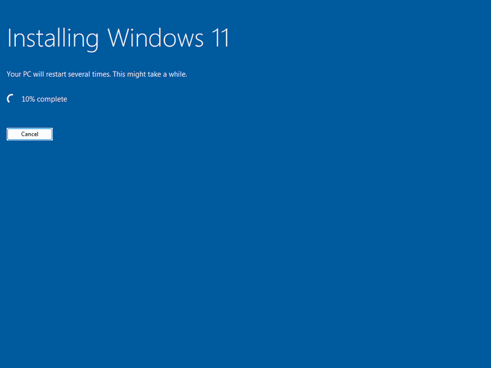

# Windows 11 TimeClock Plus Dev VM Builder



`build-vm.sh` builds a Windows 11 VirtualBox virtual machine and installs a complete
TimeClock Plus WebEdition development environment, hands-free, from a single command.

It runs as an orchestrator on a Linux host. By default it builds **directly on the host's own
VirtualBox** (no Docker); pass `--container` to build inside the `vmbuilder` Docker container
instead (see [Building in a container](#building-in-a-container)). From one command it pulls the
Windows 11 ISO and the server config from the registry, creates and boots the VM, installs Windows
unattended, and installs the full toolchain.

**By default the build stops there — just before cloning the repositories.** That gives you a
ready-to-use toolchain VM fast. Add `--stop-at all` to go the whole way: clone the private
repositories, build the server and client, restore a test database, apply the server config, and
start the runtime servers on every boot. You can also stop at any intermediate stage (see
[Build stages](#build-stages)). It can export the finished VM as a portable OVA appliance.

This file is the single source of truth; it replaces the older setup guides.

## Prerequisites (host)

- A Linux host with the VirtualBox kernel module loaded (`/dev/vboxdrv` present).
- For the default host build: the VirtualBox userland (`VBoxManage`) and the ISO-remaster tools
  (`oras`, `xorriso`, `wimlib-imagex`, `7z`). Docker is **not** needed.
- For a `--container` build: Docker (the container provides the VirtualBox userland and remaster
  tools instead).
- The GitHub CLI (`gh`) logged in, or a GitHub token — **only when the build clones** (`--stop-at
  clone` or later). The default toolchain-only run needs none. Credentials are auto-sourced from
  the `gh` login when present and are used for the private-repo clone and the GitHub NuGet source.
- Network access to GitHub Container Registry (`ghcr.io`).

The Windows ISO and server config are pulled automatically.

## Quick Start

```bash
# DEFAULT: install Windows + the full toolchain, then stop just before cloning. Host build (no
# Docker). GitHub credentials are taken from your gh login. (--unattended implies -y, so no prompt.)
./build-vm.sh --unattended

# Full build: clone the repos, build server + client, restore the DB, and start all four servers.
./build-vm.sh --unattended --stop-at all

# Full build inside the vmbuilder Docker container instead of on this host:
./build-vm.sh --unattended --stop-at all --container

# Supply credentials explicitly instead of relying on the gh login:
GH_TOKEN=ghp_xxxxxxxx GH_USER=you ./build-vm.sh --unattended --stop-at all

# Full build, then export a portable OVA appliance to a durable host folder:
./build-vm.sh --unattended --stop-at all --export /mnt/data/win11-ova

# Fast end-to-end dry run (dummy installs, ~minutes, no credentials needed) to verify the flow:
./build-vm.sh --unattended --stop-at all --dry-run

# Resume a half-finished build (just re-run with the same VM name; the in-guest install is idempotent):
./build-vm.sh --unattended --stop-at all
```

The default (toolchain only) finishes much faster; a full `--stop-at all` build takes roughly two
to three hours (Visual Studio and SQL Server dominate).

### Following the install (default) and detaching

By default the build **follows the in-guest install and waits for it to finish** before exiting. It
streams the high-level step (`[guest]`) and the installer's own log (`[log]`) so you can see what
each script is doing without running any commands by hand, and it **stops with an error** if the
installer reports one (or the clone fails, or the VM dies). Pass `--detach` (alias `--no-follow`)
to return as soon as the VM is started and let the install run unattended in the background.

```bash
./build-vm.sh --unattended                 # follows the toolchain install, waits, reports errors
./build-vm.sh --unattended --stop-at all    # follows the whole build through to all servers up
./build-vm.sh --unattended --detach         # start the VM and return immediately (old behavior)
```

### Live progress and a timelapse video

Add `--watch` for the live progress stream plus an annotated screenshot timelapse (it also follows
and waits, like the default):

```bash
./build-vm.sh --unattended --watch                              # build + annotated timelapse
./build-vm.sh --unattended --watch --dry-run                    # fast validation with video
./build-vm.sh --unattended --watch --export /mnt/data/win11-ova   # build, video, then export
```

With `--watch`, the run streams the in-guest install step (`[guest]`) and the raw installer
log (`[log]`) to the terminal and assembles an mp4 under `.logs/`. The timelapse frames are
captured **inside the guest** by `capture_screens.ps1`, which runs in the interactive `dev`
session, grabs the live desktop every 20 seconds, and burns the current step into each frame.
That avoids the headless-screenshot freeze: `VBoxManage screenshotpng` returns a frozen image
in headless mode because the SVGA framebuffer isn't refreshed without a display front-end (the
timelapse used to get stuck on the SQL step). Capture spans the whole run — the toolchain
(`N/8`), then the post-build phases (cloning, server/client build, database restore, and server
startup, each labeled in the caption) — and stops a few frames after all four servers are
listening. The in-guest capture can't see the pre-logon Windows install (it runs in the `dev`
desktop session, which doesn't exist until auto-logon), so the canned install-phase frames in
`assets/timelapse-install-frames/` are prepended to the video automatically. The host still
takes its own screenshots as a fallback if the in-guest capture didn't run. The whole host run
is tee'd to `.logs/build-vm-<timestamp>.log`. After each run, `.logs/latest.log` and
`.logs/latest-timelapse.mp4` symlink the newest log and video. ffmpeg is resolved automatically
(PATH, then `~/.local/bin`, then a one-time static download) with no `sudo` required.

## Options

| Flag | Meaning |
|---|---|
| `--unattended` | Hands-free install: auto C:/D: partitions, local admin `dev`/`dev`, Guest Additions, full toolchain. Implies `-y` (no confirmation prompt). By default stops before the clone; add `--stop-at all` for the full clone+build+run |
| `--iso PATH` | Windows 11 ISO. Optional; auto-pulled from `ghcr.io/tcp-software/win11-iso:25h2` if omitted |
| `--cfg PATH` | `cfg.zip` server config. Optional; auto-pulled from `ghcr.io/tcp-software/we-cfg:latest` if omitted |
| `--gh-token TOKEN` / `--gh-user USER` | GitHub credentials for the clone and NuGet source. Required only when the build clones (`--stop-at clone` or later); auto-sourced from the `gh` login or `$GH_TOKEN`/`$GH_USER` |
| `--aws-access-key KEY` / `--aws-secret-key SECRET` | Optional. Set as guest environment variables only. Not needed to build or run the dev server (AWS is used only by runtime features such as S3 and SES) |
| `--watch` | Follow the install live (`[guest]`/`[log]`) and build an annotated screenshot timelapse under `.logs/`. Also waits for the build to finish |
| `--detach` / `--no-follow` | Return as soon as the VM is started, instead of following the install. By default the build follows the in-guest install, waits for the `--stop-at` target to finish, and stops with an error if the installer reports one |
| `--export DIR` | After the build, power off and export a portable OVA into host directory `DIR` |
| `--export-only DIR` | Skip the build; export the already-built VM into `DIR` (host VM by default, or the container's VM with `--container`) |
| `--container` | Build inside the `vmbuilder` Docker container instead of on this host (needs Docker). The container uses **NAT** (no bridged DHCP inside it). The default host build uses **bridged** networking (real DHCP, so the VM is device-reachable). See [Building in a container](#building-in-a-container) |
| `--no-container` / `--host-build` | Force the default host build explicitly (a no-op unless you also passed `--container`) |
| `--dry-run` | Stage a marker so the in-guest tool install runs dummy steps (each sleeps a few seconds) to verify the whole flow in minutes; no credentials needed |
| `--clean` | Remove an existing same-named VM (and leftover VM files) before building, instead of resuming it. Without it, an existing VM resumes and leftover files abort creation with a clear message telling you to pass `--clean` |
| `--stop-at STAGE` | Stop the build after `STAGE` (**default `tools`** — stop just before the clone). Pass `all` for the full pipeline. In order: `tools` (toolchain only, before any clone), `clone` (+ repo clone), `server`, `client`, `db` (DB restore + SQL logins + nginx), `cfg` (per-server cfg + firewall), `start-servers` (start them = `all`). Stopping before `start-servers` starts none. See [Build stages](#build-stages) |
| `--servers SPEC` | Which WebEdition servers to start, comma-separated (default `all`): `app`, `adm`, `terminal`, `workstation`, `linclock` (= `app`+`terminal`), `all`. e.g. `--servers app,terminal`. Persisted so the boot task starts the same set on every boot |
| `--cpus N` | vCPUs. Default: host cores / 4 (minimum 1) |
| `--memory MB` / `--vram MB` | Guest RAM / video RAM. Defaults: 8192 / 128 |
| `--disk-size MB` / `--disk-type fixed\|dynamic` | Disk size and allocation. Defaults: 262144 (256 GB) / dynamic |
| `--nat` / `--bridge-adapter NAME` | Networking. The default host build uses bridged (auto-detected adapter) so a clock device can reach the VM; `--container` uses NAT. Force either explicitly here |
| `--cache-dir PATH` | In-guest download cache (build-time only). Defaults to a durable host folder so cached installers survive the container and speed up rebuilds |
| `--shared-folder PATH` | Share a host folder into the guest at `G:` |
| `--host-iocache on\|off` | Force the VirtualBox host I/O cache. Default: auto (on for overlay, union, and ZFS filesystems) |
| `--log-file PATH` | Tee the in-guest build transcript here. The host run is also logged to `.logs/build-vm-<timestamp>.log` |
| `--vm-name NAME` / `--base-folder PATH` | VM name and parent directory |
| `--skip-install` | Do not create a VM; only ensure VirtualBox is installed |
| `-y`, `--yes` | Do not prompt for confirmation. Already implied by `--unattended`, so it's only needed for a non-unattended run |
| `-h`, `--help` | Full description, all options, and examples |

## What Gets Installed, Built, and Run

This describes a full `--stop-at all` build. The default build stops after the toolchain, so the
source/build, database, per-server config, and servers below apply only when you go past `tools`
(see [Build stages](#build-stages)).

**Windows and accounts:** Windows 11 Pro, installed unattended; the disk is partitioned into
`C:` (Windows) and `D:` (Work); local administrator `dev` / `dev` with auto-logon; Guest
Additions.

**Toolchain:** Cygwin (with `wget` and `nano`) at `D:\Tools\cygwin`; the .NET Framework 3.5;
the .NET SDKs 5, 6, and 10; Visual Studio 2026 Professional (ASP.NET and web, Node.js, .NET
desktop, and Desktop C++ workloads); SQL Server 2022 Developer with SQL Server Management
Studio and the SQL Package (DacFx); OpenJDK 11; Git; Node.js; and Python. The environment
variables `MSBUILD_PATH`, `NANT_BIN`, and `AWS_DEFAULT_REGION` are set.

**Source and build:** the private repositories are cloned to `D:\Work` over HTTPS; the
GitHub NuGet source is added; the server config from `cfg.zip` is applied (`TCPCONN.XML` with
`Integrated` set to true, the hub configs, and the trimmed `company-connection-map.xml`); the
server and client are built; a test database is restored; the SQL logins are created; and
nginx is installed as a Windows service. Git and `sqlcmd` are placed on the PATH for the build
and restore steps (they land on the machine PATH only after their installers finish, so a
shell that started earlier won't otherwise see them).

**Per-server config:** each launcher reads config from a per-server directory
(`server\Src\Interface\<Server>\cfg`), not the shared `cfg` where `cfg.zip` is applied, so
`setup_server_cfg.sh` copies the applied config into each per-server directory. Without this,
every server falls back to a default that uses port 8008 and they collide. It runs after the
build (the build's `nant clean` would otherwise wipe the directories) in the elevated
post-build context, recreates each directory fresh, strips the `xsd`/`xsi` XML namespaces from
`AppServerApi.config` (AppServerApi targets .NET 10, whose config loader rejects XML
namespaces; the .NET Framework servers tolerate them), and clears read-only and grants the
`dev` account access so AppServerApi can open its config (it reads and writes the file, and the
`cfg.zip` source can carry restrictive permissions that otherwise cause a startup
`UnauthorizedAccessException`).

**Developer shell:** the `dev` Cygwin user gets the guide's convenience config — a curated
`~/.bashrc` (git-branch prompt colored by repo state, `dircolors`/`LESS`/history tweaks) and
`~/.bash_aliases` (git shortcuts, `wk='cd /cygdrive/d/Work'`, `make -j$(nproc)`, etc.; the stock
`.bashrc` is kept as `.bashrc.orig`). Two Windows Terminal profiles are added — **Cygwin** (set
as the default profile) and **Cygwin as Admin** (elevated) — both launching the Cygwin login
shell. The branch-switch helper `select_we.sh` is placed on the PATH (in `D:\scripts`).

**Servers:** all four WebEdition servers start on every boot through a scheduled task
(`TCPStartServers`), so the full stack is up after the build, after a reboot, and in an
exported OVA. Server logs are written to `D:\Tools\serverlogs`.

| Server | Port | Role |
|---|---|---|
| `AppServerApi` | 8008 | Employee, manager, and webclock backend (targets .NET 10). Web UI at `http://localhost:8081/app/manager` |
| `TerminalHubApi` | 8010 | Hub that networked clock devices (linclock, winclock, RDTg, POS) connect to |
| `AdmServerApi` | 8012 | Administration. Web UI at `http://localhost:8018/app/admin` |
| `WorkstationHubApi` | 8014 | Hub for workstation-attached terminals and biometric readers |

The staged credentials are deleted from the guest after use, so an exported OVA carries none.

## Running the Servers and Connecting a Clock Device

The servers start automatically on boot. To start or restart a subset by hand, run in Cygwin:

```bash
C:\Setup\start_servers.sh all          # all four servers
C:\Setup\start_servers.sh linclock     # AppServerApi + TerminalHubApi (what a clock needs)
# also: app | adm | terminal | workstation
```

A clock device such as a **linclock** connects to `TerminalHubApi` (which in turn uses
`AppServerApi` and SQL Server). To point a device at this VM, set its NetworkSettings
`serverUrl` to the VM's IP address. The device must be able to reach the VM on the network,
the default host build already uses a **bridged** adapter, so it's device-reachable; a
`--container` build uses NAT (host-only) because the container has no bridged DHCP. The
build opens inbound TCP for the server ports (8008/8010/8012/8014) so a bridged device can
reach the hub — otherwise Windows Firewall silently drops the connection (it blocks inbound by
default and only port 22 for SSH would be open). All four servers bind every interface
(`0.0.0.0`): `cfg.zip` ships `AppServerApi`, `TerminalHubApi`, and `WorkstationHubApi` with
`ApiServerHost` set to `127.0.0.1` (localhost only — only `AdmServerApi` ships `0.0.0.0`), so
the build rewrites the other three to `0.0.0.0` so a device can reach any of them directly.
Devices normally connect through `TerminalHubApi` (8010).

## Exporting an OVA Appliance

Add `--export DIR` to a build, or export a VM that is already built without rebuilding:

```bash
./build-vm.sh --unattended --stop-at all --export /mnt/data/win11-ova   # build, then export
./build-vm.sh --export-only /mnt/data/win11-ova                         # export the existing VM, no rebuild
```

Export powers the VM off (the servers restart on the next boot) and writes the OVA to the host
folder. For the default host build that's a direct export; a `--container` build exports inside the
container and stream-copies the OVA out. The OVA imports into any VirtualBox through
File > Import Appliance.

## Launching the VM (bridged, hardened)

The default host build already runs bridged. `launch-vm.sh` is for *running* a VM registered on
this host that isn't already configured that way — e.g. one imported from an exported OVA, or a
`--container`-built VM. Run it on the host:

```bash
./launch-vm.sh                      # bridged (auto-detected adapter), L1D flush on, nested paging on
./launch-vm.sh --adapter eth0       # pick the bridged host adapter explicitly
./launch-vm.sh --vm Win11 --force   # power off a running/saved VM first, then re-launch
./launch-vm.sh --strict-l1tf        # stricter L1TF posture: also disable EPT (nested paging off)
```

It sets the VM to **bridged** networking (adapter from `--adapter`, else the host's default-route
interface — skipping `docker0`/`veth*`), no NAT, **`--l1d-flush-on-vm-entry on`**, and
**`--nested-paging on`**, then starts it. The VM must be powered off to apply these (pass `--force`
to power it off first).

`--l1d-flush-on-vm-entry on` is the primary L1TF mitigation. Nested paging stays **on** by default
because disabling EPT starves the guest so badly that the three .NET Framework servers
(`TerminalHubApi`, `AdmServerApi`, `WorkstationHubApi`) die during startup and never bind — only
`AppServerApi` survives. Pass `--strict-l1tf` for the stricter disable-EPT posture, but expect only
`AppServerApi` (8008) to stay up.

## Build stages

The build is an ordered pipeline. `--stop-at STAGE` stops after a stage; each stage includes all
earlier ones. The **default is `tools`** — the build stops just before the clone, giving you a
toolchain-only VM fast. Pass `--stop-at all` (an alias for `start-servers`) for the full pipeline,
or stop at any stage in between.

| Stage | Adds |
|---|---|
| `tools` | The full toolchain (Cygwin, Git, Node.js, Python, OpenJDK 11, the .NET SDKs, Visual Studio 2026, SQL Server 2022). **Default** — stops here, before the clone; `D:\Work` is empty |
| `clone` | Clone the private repos to `D:\Work` |
| `server` | Compile the server solution (`nant build` of `tcp-we-7.sln`) — the four .NET API servers |
| `client` | Build the browser client (npm) — the manager/admin/webclock UI assets nginx serves |
| `db` | Restore the `Tcp70ProdTest` test database, create the SQL logins, install nginx as a service |
| `cfg` | Write each server's per-instance config and open the firewall ports (configured, not started) |
| `start-servers` | Start the selected servers and install the boot task (this is what `all` resolves to) |

The order is fixed by real dependencies, so clone/server always precede db/cfg:

- `db` and `cfg` both need the **cloned** tree — the DB restore runs the repo's `nant`
  `__restore-db-prod-test` target, and `nant` itself ships inside the cloned `tcp-we-thirdparty`
  repo. Without the clone there is nothing to run.
- `cfg` must run **after** the `server` build, because the build's `nant clean` would otherwise
  wipe the per-server config directories.

## Building in a container

By default `build-vm.sh` builds on the host's own VirtualBox. Pass `--container` to build inside the
`vmbuilder` Docker container instead — useful on a host that lacks the VirtualBox userland or the
ISO-remaster tools, or in CI.

The container uses **NAT** (it has no bridged DHCP), so a `--container` VM isn't reachable from
other devices on the LAN — use the default host build (bridged) for real-device testing. The
`--export` step exports inside the container and stream-copies the OVA to the host folder.

### Host build resources (the default)

- Point `--base-folder` at a volume with **100 GB+** free — VirtualBox's default machine folder is
  often too small.
- The build needs a writable temp dir with **~15 GB** free to split `install.wim` into `.swm`
  parts; it auto-picks one next to the cache folder, avoiding a small `/tmp`.
- If a from-scratch build aborts early during boot, check for a stale, orphaned `VBoxHeadless`
  process holding RAM (an out-of-memory abort); free that memory first.

## Networking, Server Config, and Cache

- **Networking:** the default host build uses **bridged** networking (the host has real DHCP), so
  the VM is device-reachable without extra flags. A `--container` build has no bridged DHCP, so it
  uses **NAT** for outbound internet; pass `--bridge-adapter NAME` only if you have a working
  bridged setup there.
- **Server config (`cfg.zip`):** auto-pulled from ghcr and applied during the build. Provide
  a local copy with `--cfg PATH` to override.
- **Cache:** the download cache defaults to a durable host folder
  (`/mnt/data/win11vbox-cache`, override with `$CACHE_HOST_DIR`) that the orchestrator
  bind-mounts in, so cached installers survive the container and speed up rebuilds. The
  finished VM does not need the cache to run.

## Still Manual

These need a human because they require an interactive sign-in or a deliberate choice:

1. Set a real password for the `dev` account and turn off auto-logon.
2. Sign in to Visual Studio 2026 with a Professional license (Visual Studio installs and
   builds unactivated; sign-in is only for license compliance and cannot be scripted).
3. Optional: use SSH instead of HTTPS for git (`C:\Setup\setup_cygwin_ssh.sh` plus
   `ssh-keygen`, then add the key to GitHub).
4. Optional: add the Cygwin and "Cygwin as Admin" Windows Terminal profiles and the
   `~/.bashrc` / `~/.bash_aliases` convenience configuration.
5. Take a VM snapshot once everything builds and runs.

To try a different release branch later, run `C:\Setup\select_we.sh` in Cygwin (no argument
for an interactive menu of `release/7.x` branches, or pass a branch name). It checks out the
branch and rebuilds the server, the client, and the test database for that version; then
restart the servers with `C:\Setup\start_servers.sh all`.

## Watching Progress and Troubleshooting

- **Progress (headless build):** once Guest Additions are up, read the status file. For the
  default host build, run `VBoxManage` directly:
  ```bash
  VBoxManage guestcontrol Win11 --username dev --password dev \
    run --exe 'C:\Windows\System32\cmd.exe' -- cmd.exe /c "type D:\Tools\install_status.txt"
  ```
  For a `--container` build, prefix it with `docker exec vmbuilder_run`. The status protocol in
  `install_status.txt` is `N/8 <step>`, `WAIT <msg>`, `ERROR <msg>`, or `8/8 Setup complete`. The
  host run is logged to `.logs/build-vm-<timestamp>.log`; the full in-guest install log is
  `D:\Tools\install_tools.log`.
- **`WAIT Network unavailable`** means the guest has no internet. The default host build uses
  bridged (real DHCP), so this is rare; inside a `--container` build it means a bridged NIC with no
  DHCP — use NAT. A running VM can be switched live with `VBoxManage controlvm Win11 nic1 nat`.
- **Screen recording is not used.** VirtualBox's built-in recorder destabilized the guest, so
  the timelapse is built from periodic screenshots instead. These are captured **inside the
  guest** (`capture_screens.ps1`, interactive session) rather than via host `screenshotpng`,
  which freezes on one frame in headless mode (the SVGA framebuffer isn't refreshed without a
  display front-end).
- **`l1d-flush-on-vm-entry` is forced off.** Turning it on cripples VM speed and aborts the
  guest during early boot, so it is intentionally not an option.
- **Resume:** if a VM with the same name exists, the build resumes the idempotent in-guest
  install rather than recreating the VM. To force a clean rebuild, remove it first:
  ```bash
  VBoxManage controlvm Win11 poweroff; VBoxManage unregistervm Win11 --delete
  ```

## Security Note

The GitHub token and any AWS keys are staged in plain text onto the install media and into
`C:\Setup` during the build, then deleted from the guest after use. Treat any credentials
that appeared in the older guides as compromised and rotate them.
