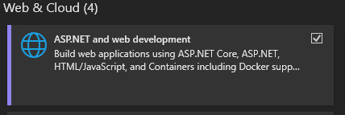

# Rollout Plan for .NET 10 - for Dev

<!-- Page 1 -->

## 1. Download and Install .NET 10 SDK

winget option:

```
winget install Microsoft.DotNet.SDK.10
```

chocolatey option:

```
choco install dotnet-10.0-sdk -y --force
```

## 2. Download Visual Studio 2026

Note: Visual Studio 2022 cannot target .NET 10 projects; upgrading to Visual Studio 2026 is required.

## 3. Select Relevant Workloads

During the Visual Studio 2026 installation, click Modify on the Visual Studio 2026 entry, then select the relevant workloads, specifically Web development build tools. This one is required.

Note: To see which other workloads are currently installed, locate the Visual Studio 2022 entry in the installer, click Modify, and review the selected workloads in the configuration window.

## 4. Update MSBuild in Your System PATH

Open the Environment Variables window. You can either search for "edit system environment variables," or you can use a shortcut.

a. Press Win + R and run the following command:

```
rundll32.exe sysdm.cpl,EditEnvironmentVariables
```

b. Run the same command from a terminal of your choice (PowerShell, Git Bash, Cygwin).

Verify the location of your msbuild.exe:

```
C:\Program Files\Microsoft Visual Studio\18\Professional\MSBuild\Current\Bin
```

or

```
C:\Program Files (x86)\Microsoft Visual Studio\18\Professional\MSBuild\Current\Bin
```

<!-- Page 2 -->

Under the System variables, change the MSBUILD_PATH.

Note: If you don't have the MSBUILD_PATH variable, double-click Path, find the old MSBuild entry (most likely C:\Program Files (x86)\Microsoft Visual Studio\2022\Professional\MSBuild\Current\Bin), and set it to the new value.

I do recommend using the MSBUILD_PATH variable in the main window under System variables and then including it in the Path like %MSBUILD_PATH% for ease of future updates.



## 5. Final Sanity Check

If your terminal is running, restart it. Then run the following nant command in D:\Work\tcp-we-71\server:

```
nant __clean-obj-bin restore build
```

Verify that everything is restored and built properly, then open Visual Studio 2026 and start all services. Ensure that they launch successfully.

If the build fails, use the following checks to diagnose the issue.

First, verify the MSBuild version:

```
MSBuild -version
```

The MSBuild version rolled out with Visual Studio 2026 should be 18.x. If it still shows 17.x, the system is still using Visual Studio 2022. Either your path wasn't properly updated, or a terminal needs to be restarted.

If the MSBuild version is correct, check if you can restore and build the solution with an actual MSBuild command:

```
MSBuild /t:Restore,Build ./tcp-we-7.sln /v:quiet
```

If this command succeeds, it means that MSBuild is configured correctly, and any remaining failures are likely related to nant invoking MSBuild, not MSBuild itself.
