# VE-TimeClock Plus Server on a Windows 11 VM-110626-171548

<!-- Page 1 -->

TimeClock Plus Server on a Windows 11 VM
This guide starts with virtual machine creation and concludes with running the server. Some
sections feature terminal commands, that are intended to be copied and pasted to avoid
mistakes, so it is recommended to enable “Shared Clipboard” once this becomes relevant.
When finished, we will be able to build and run any version of the server that we need. It is
recommended to create snapshots after completing major sections as available disk space
allows.
Machine Creation
VirtualBox Settings
l1d-flush-on-vm-entry
System → Processor
System → Acceleration
Storage
Network Adapter
Windows 11 Installation
Bypass*Check Registry Entries
Partitioning
Post Installation Tasks
Detatch The Installation Media
Windows Update
Guest Additions
Shared Folder
Working Partition
Cygwin
Windows Terminal
Cygwin Profile
Cygwin as Admin Profile
When To Use Which Profile
Startup Settings
Bash
Aliases
~/.bashrc
.NET
Version 3.5
Microsoft’s Documentation
Version 5
Version 6
Visual Studio 2022 Professional
SQL Server 2022 Developer
Enable Protocols
SQL Package
SQL Server Management Studio (SSMS)
OpenJDK 11
Git for Windows

<!-- Page 2 -->

Cygwin SSH Configuration
SSH Key Generation
Clone Repositories
Running clone_repos.sh
Cygwin Example
Git Bash Example
Set NAnt Environment Variable
Set AWS Environment Variables
Alter “ExecutionPolicy”
Add NuGet Package Source
Generate New Token
Use Generated Token to Add Package Source
Build The Server
Server Config Files
TCPCONN.XML
Start with TCPCONN.PROD.XML
Edit TCPCONN.XML
company-connection-map.xml
Restore a test DB
Create Logins
Node
Dependencies
Node’s Dependency Documentation
Installation
Building The Client
Dependencies
Run The “build-js.prod-env.sh” Script
Run The “build-ss.prod-env.sh” Script
Nginx
Who Owns Tools?
Download and Extract
Root Directory Symlink
Configuration Files
Windows Service For Nginx
Prepare nginxservice.exe
Prepare nginxservice.xml
Installing The Service
Starting The Service
Troubleshooting
Create app symlink
Starting the App Server
Starting the Admin Server
Switching Versions
Conclusion
See also
Machine Creation
Open VirtualBox and choose Machine → New. Create your machine with something like:

<!-- Page 3 -->

“Dynamically allocated” disks are fine, but we can optionally create a larger “Fixed size” as well
for more speed:
VirtualBox Settings
Before starting the VM for the first time, there are some settings to review.
l1d-flush-on-vm-entry
To protect the host system, we enable the “l1d-flush-on-vm-entry” using VBoxManage. Feel
free to skip this step if you trust Microsoft. Otherwise, open a terminal and enter:
1
VBoxManage modifyvm "Win11" --l1d-flush-on-vm-entry on

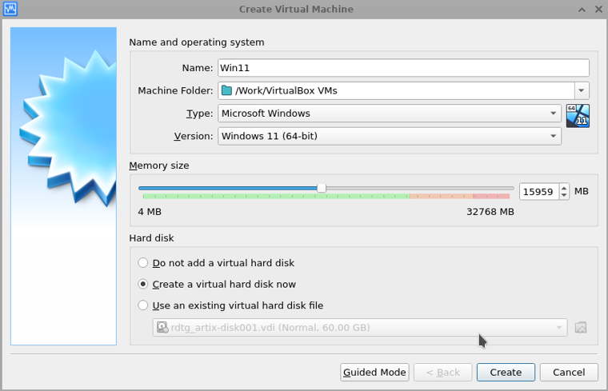

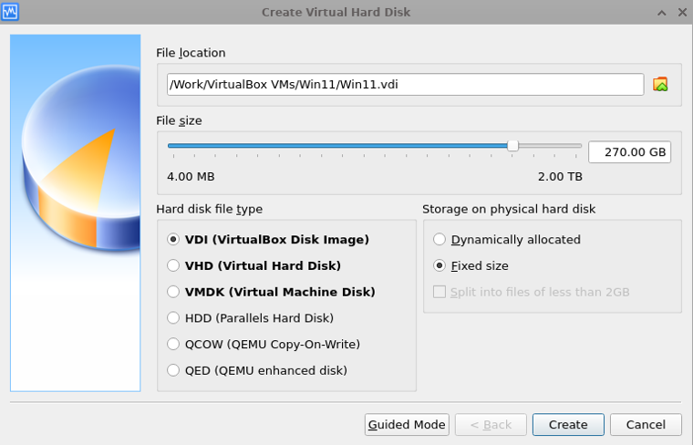

<!-- Page 4 -->

System → Processor
Select the # of processors for the VM. For our setup we choose 8.
System → Acceleration
Unfortunately, the installer will not work unless we “Enable Nested Paging”.

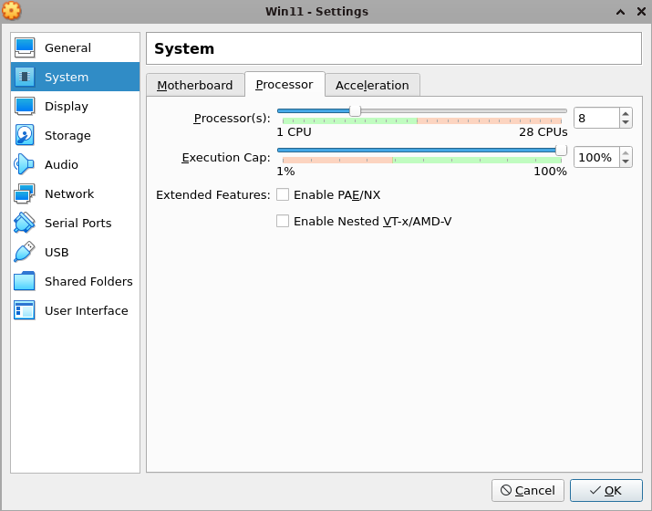

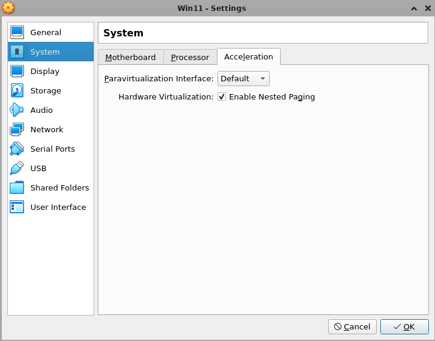

<!-- Page 5 -->

Storage
Under “Storage” we add an optical drive for the install media.
We add the install media using the “Add” button before selecting and clicking “Choose”.
Finally, we are using an SSD so we click “Solid-state Drive” for the hard disk attachment.

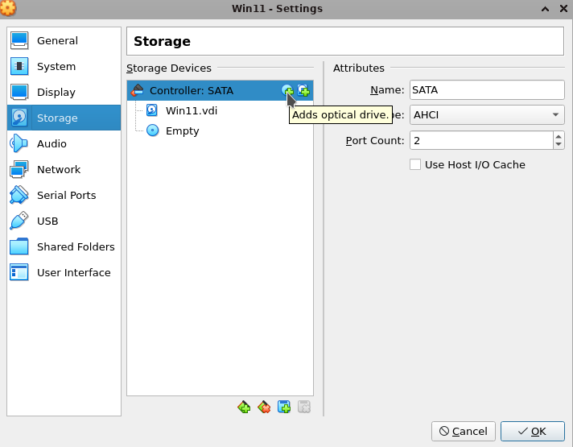

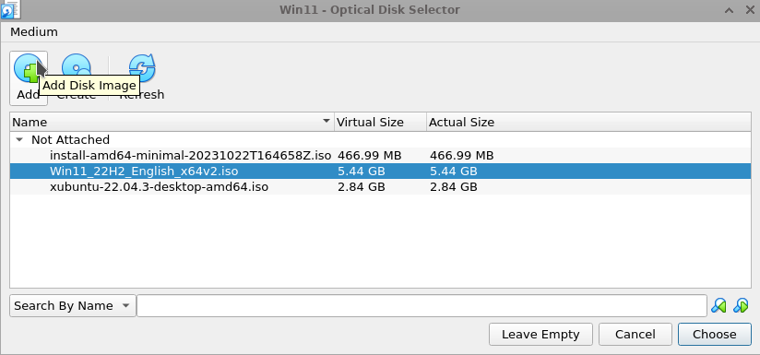

<!-- Page 6 -->

Network Adapter
Since our VM will have a server running, we choose a “Bridged” network adapter:

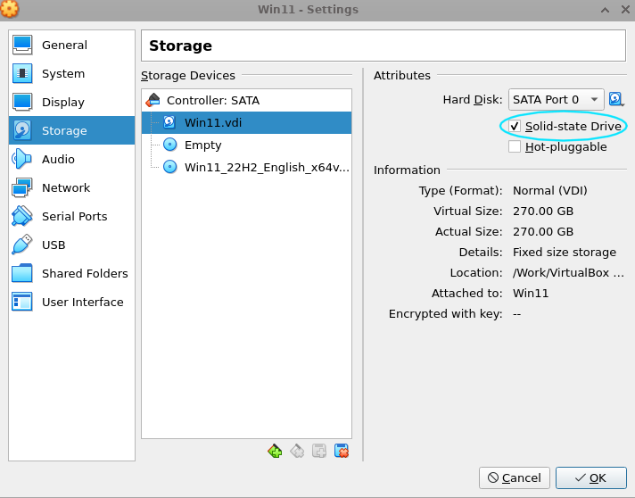

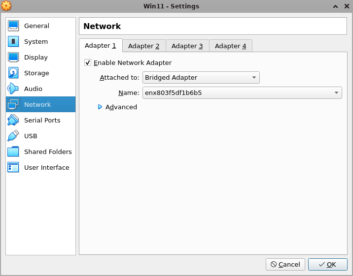

<!-- Page 7 -->

Windows 11 Installation
We start the VM for the first time and press any key to boot the install media and start the
installation. When asked about activation we choose: “I don’t have a product key”. After
selecting the Windows 11 version we encounter an error.
Bypass*Check Registry Entries
The installer complains with: “This computer does not meet the minimum system requirements
to install this version of Windows”.
To work around this, we need to add some registry entries that bypass the minimum
requirement checks. We press Shift+F10 to get a prompt. Then we enter, “regedit” and then use
regedit to create “DWORD (32-bit) Value” entries with values set to 1 for “BypassTPMCheck”,
“BypassSecureBootCheck”, “BypassRAMCheck” and “BypassCPUCheck” under
HKEY_LOCAL_MACHINE\System\Setup\LabConfig.
To create “LabConfig” just right click on “Setup” and choose New → Key.

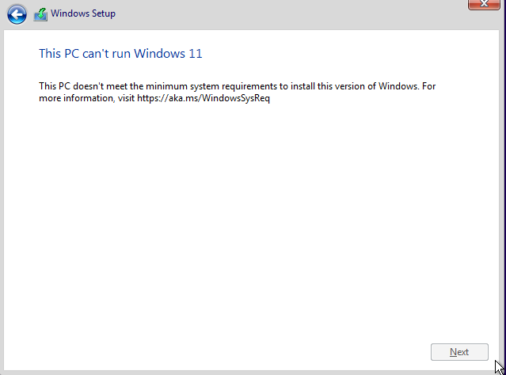

<!-- Page 8 -->

The 4 new entries should look like this:
For more information on this, reference: 
How to fix Windows 11 ‘does not meet the requiremen
ts’ error on VirtualBox

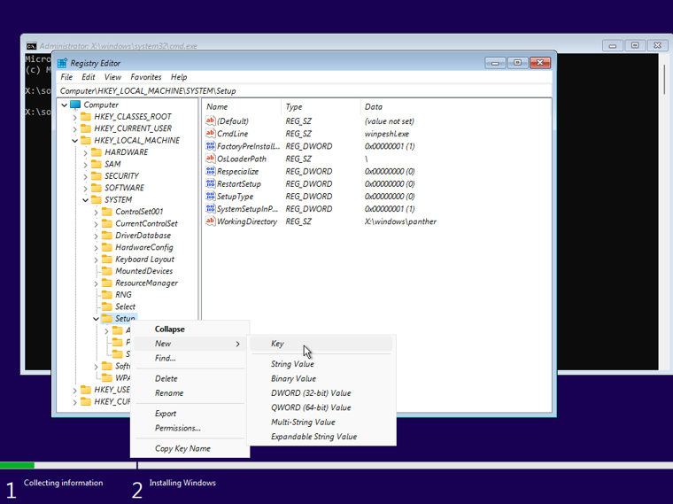

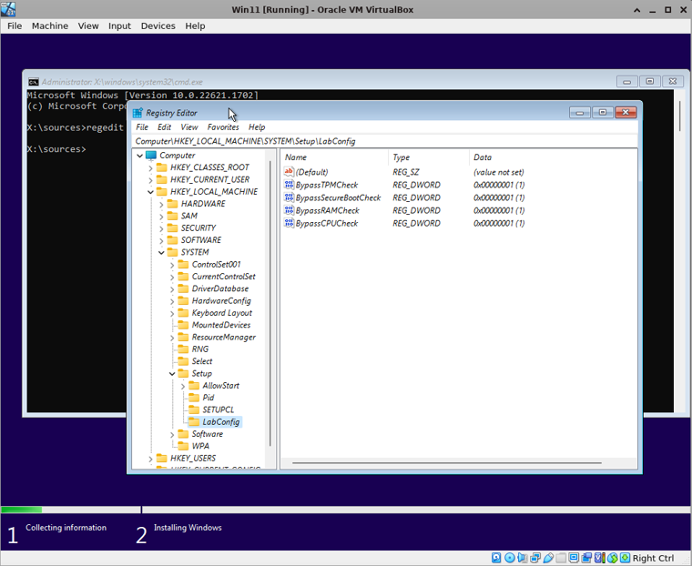

<!-- Page 9 -->

We close regedit and the command prompt to return to the installer. Using the back button on
the top left of the window we return to the Windows 11 version selection where we again click
Next. This time it should succeed without the error.
Partitioning
When asked, “Which type of installation do you want?” we choose “Custom” and are then
greeted by the partitioner:
At the partitioner we click “New” to create the “C” partition with about 90GB of Space.

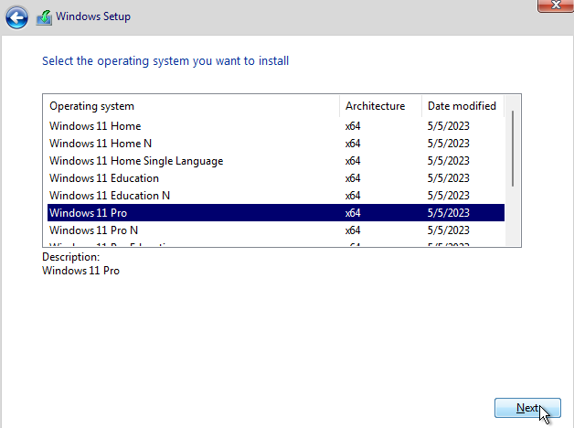

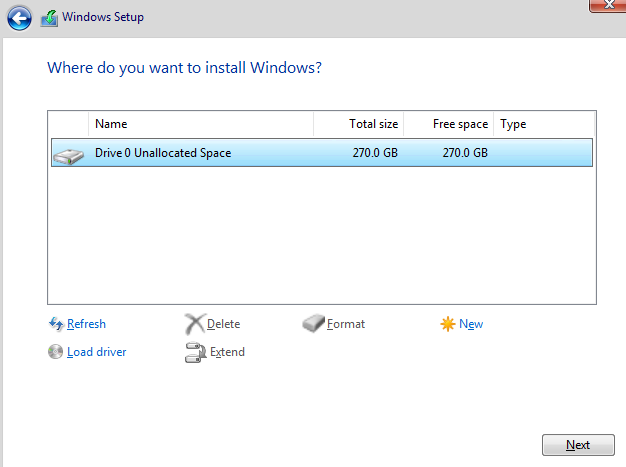

<!-- Page 10 -->

The Installer will then create additional partitions, moving our new partition to “Partition 3”.
We click the “Unallocated Space” and then again on “New” to create partition 4 and give it the
remaining space. We format partition 4, reselect partition 3, and then click “Next” to procede
with the installation.

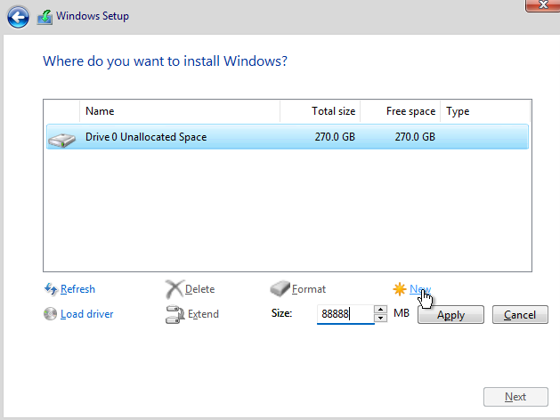

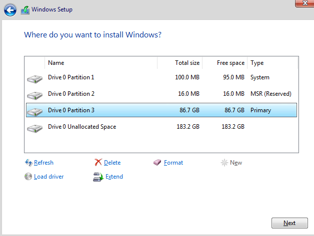

<!-- Page 11 -->

Post Installation Tasks
After finishing the installation we need to perform various tasks to fully setup the system.
Detatch The Installation Media
Windows Update
To update Windows we hit the windows key and enter “update” in the search.

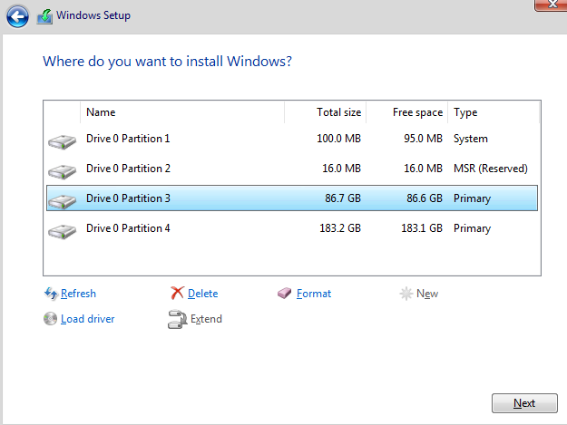

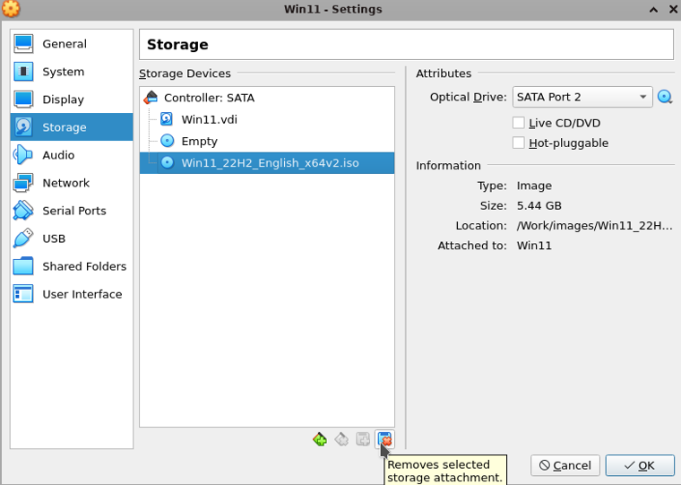

<!-- Page 12 -->

we continue updating and rebooting until it looks like:

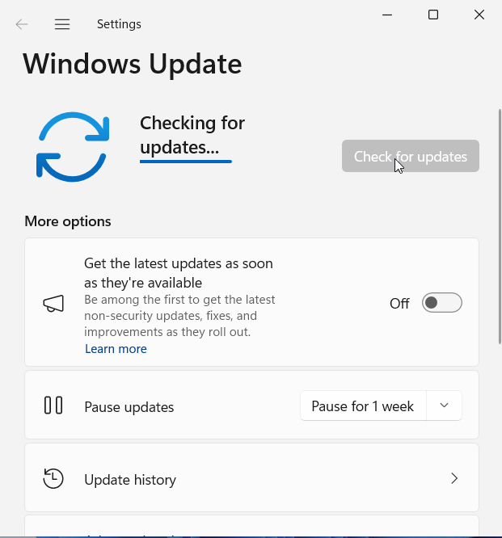

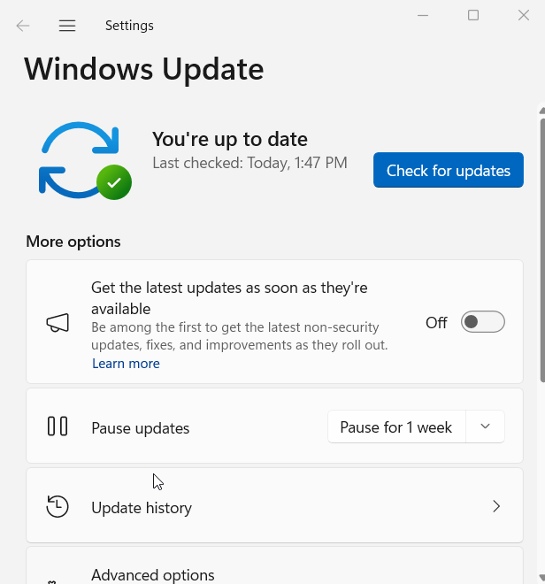

<!-- Page 13 -->

Guest Additions
We can insert the guest additions image by choosing “Insert Guest Additions CD image…” from
the machine’s “Devices” menu. Then we can use explorer to find and launch the appropriate
installer.
After the installer finishes we shutdown instead of reboot and then remove the attachment:

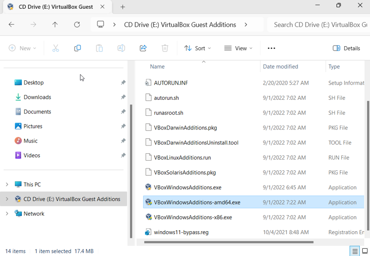

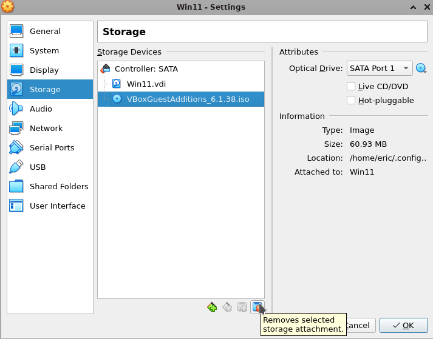

<!-- Page 14 -->

Shared Folder
Before starting the VM again, we setup the shared folder to use the mount point: “G:”.
Working Partition
The working partition at “D:” should have been created and formatted during installation. If all
went well, “This PC” will look like:
If something went wrong, use the partitioner to fix it. To open the partitioner, hit the “Windows”
key (or click the menu button) and enter, “disk partitions”.

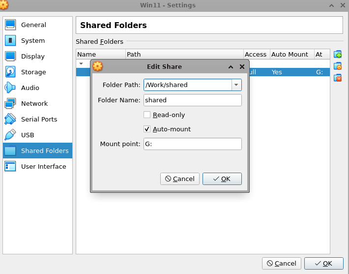

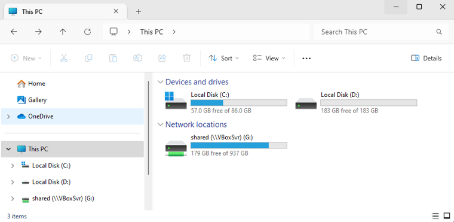

<!-- Page 15 -->

To create a partition, right click on the “Unallocated” space and choose “New Simple Volume…”.

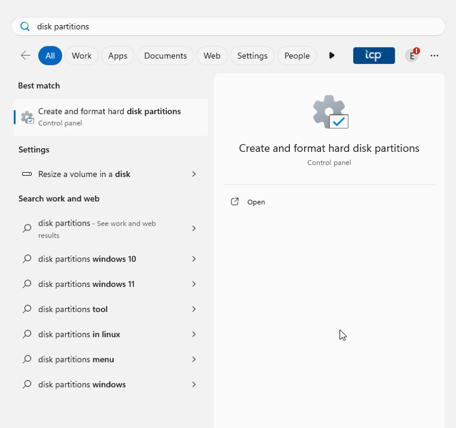

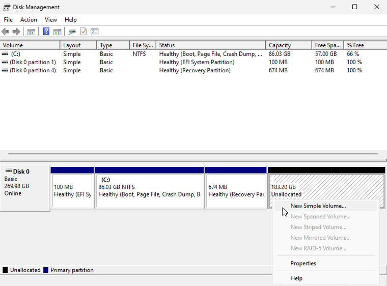

<!-- Page 16 -->

To reassign drive letters, right click on a partition and choose, “Change Drive Letter and
Paths…”.
After verifying the working area at “D:” we shutdown the VM and create a snapshot.

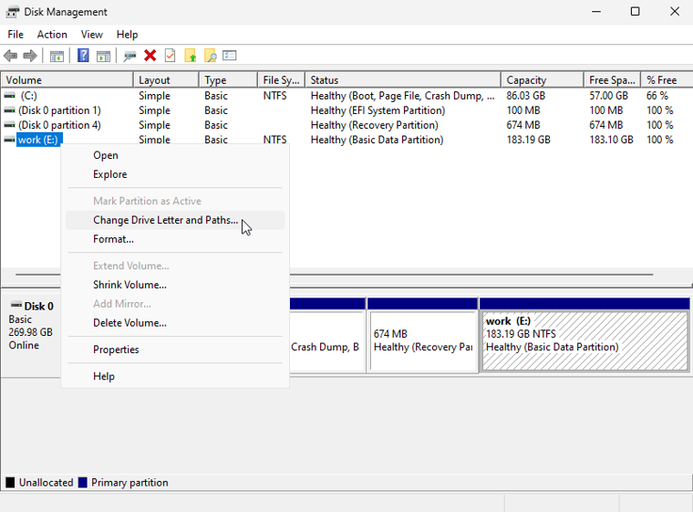

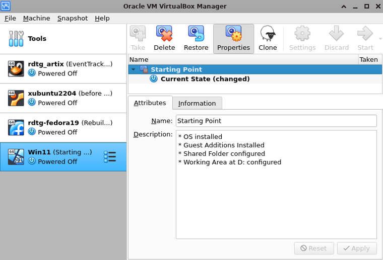

<!-- Page 17 -->

Cygwin
We use Cygwin for many tasks, so we’ll want to get it installed and configured first. The installer
can be found at 
. For “Root Directory” we use: D:\Tools\cygwin
However, If the Cygwin installer creates “D:\Tools” with elevated priviledges (which it will do if it
does not exist), then it will cause problems for us later when setting up the nginx service! To
avoid this, make sure to create the D:\Tools folder first using explorer before launching the
installer.
After the installer finishes, we run it again to install some additional packages. The fields are
auto filled in from last time. When selecting packages, we change View to “Full” and search for
“wget”, and then select the latest wget version:
https://cygwin.com

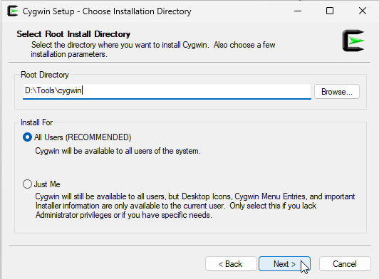

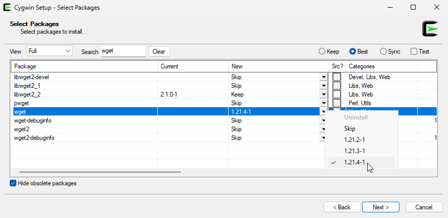

<!-- Page 18 -->

We also search for and select our favorite editor, “nano”, before clicking “Next” a couple of times
to finish the installer.
Windows Terminal
Windows Terminal should have been installed with Windows 11. However, the “Run this profile as
Administrator” option might be missing when configuring profiles. To check for this, first choose
“Settings” from the downdown menu. Then on the left side scroll down and click one of the
profiles like “Command Prompt” and verify that the “Run this profile as Admin” option appears
between the options, “Tab title”, and “Hide profile from dropdown”.
If the option is missing it might look like this:

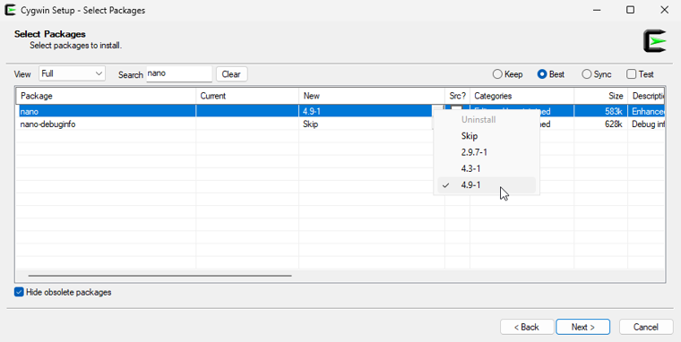

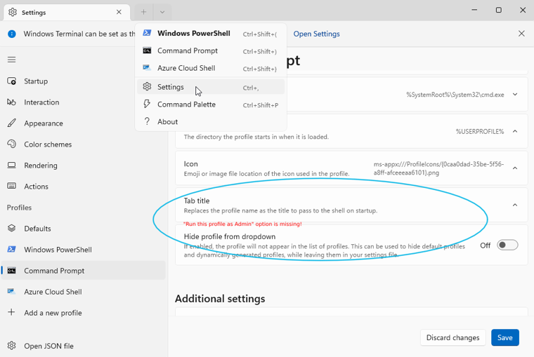

<!-- Page 19 -->

If the option is missing then repeatedly reinstall or update the terminal until it appears.
With the option properly installed, we can continue with creating two new cygwin profiles. As
perhaps expected, we will be enabling that option in one of our new profiles. Before starting
though, is a good time to set any inherited “Defaults”,
so we click “Defaults” and choose our favorite “Color scheme” before clicking, “Add a new
profile”.

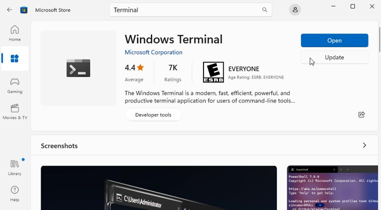

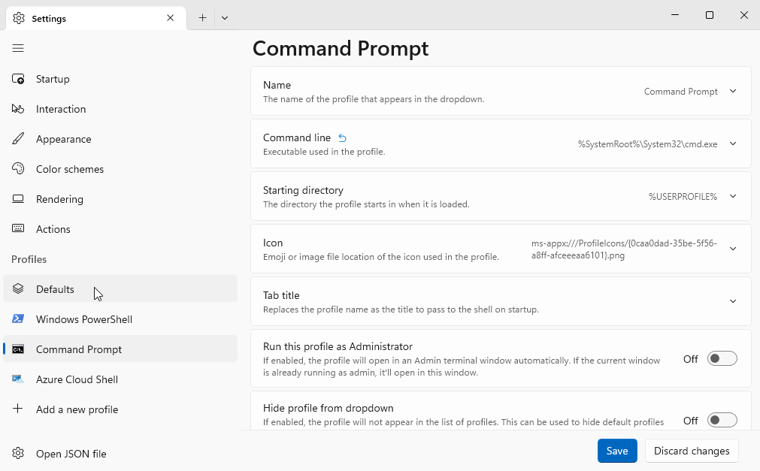

<!-- Page 20 -->

Cygwin Profile
After clicking, “Add a new profile”, we click “New empty profile” and then configure it with:
Name: Cygwin
Command Line: D:\Tools\cygwin\bin\bash.exe -i -l
Icon: D:\Tools\cygwin\Cygwin.ico
Run as Administrator: Off
Note that the Icon path line edit is buggy and that mysteriously bad things happen when saving
after a pasted path as been put there. It is recommended instead to manually use the “Browse”
button for setting the Icon path and to treat the line edit as read only. Make sure to click “Save”
after verifying that It looks like:

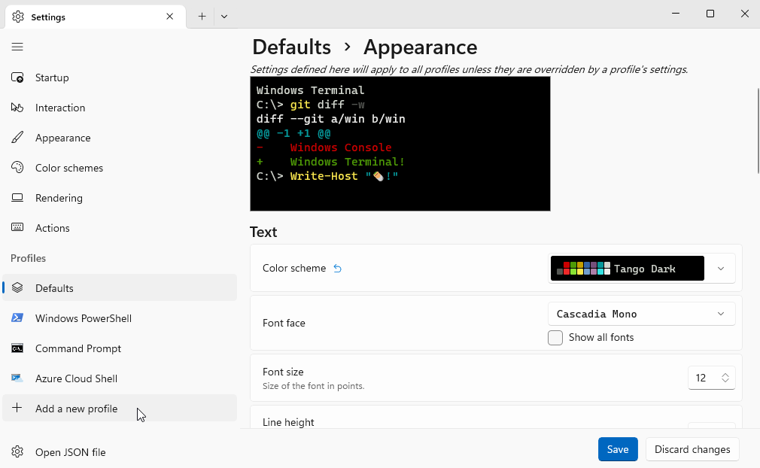

<!-- Page 21 -->

Cygwin as Admin Profile
For the second profile, we will clone from the first but then enable “Run this profile as
Administrator”. To easily identify the profile, we use this new icon, saving it to:
D:\Tools\cygwin\CygwinAsAdmin.png
Now we click “Add a new profile” again, but this time we duplicate from the Cygwin profile.
CygwinAsAdmin.pn
g

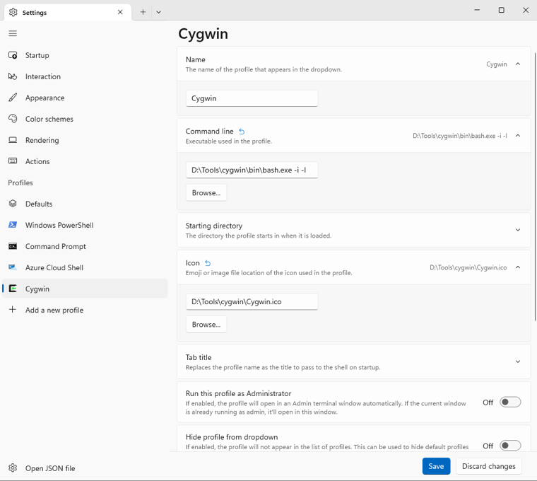

<!-- Page 22 -->

We rename the duplicated profile to “Cygwin as Admin”, update the icon path and enable “Run
this profile as Administrator”. After saving it looks like:
When To Use Which Profile
As a general guideline, we will try to use the “Cygwin” profile whenever we can, and the
“Cygwin as Admin” profile if needed.
Startup Settings
We optionally choose “Cygwin” as our default profile and “Windows Terminal” for the default
terminal application.

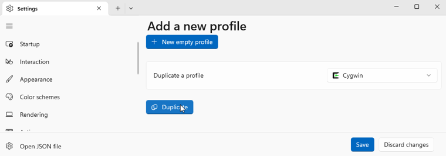

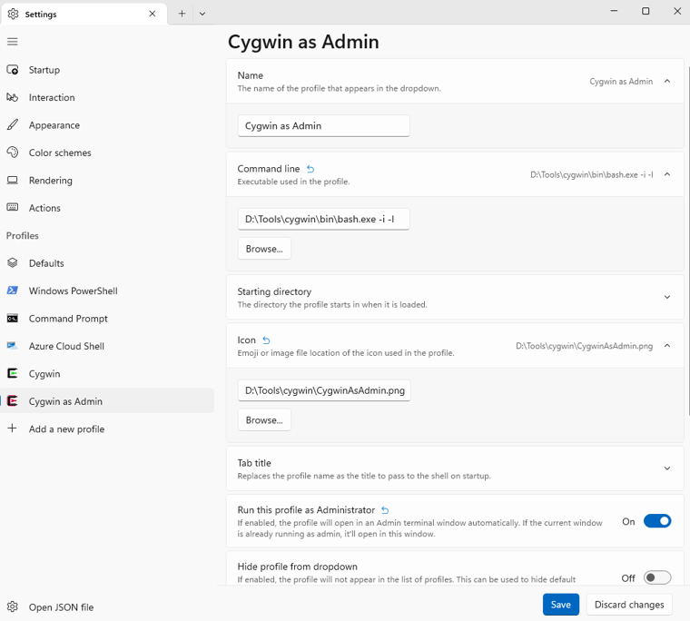

<!-- Page 23 -->

Bash
With the default profile set, new tabs should open with the Cygwin profile. We open a new tab
and are greeted with something like:
Aliases
Aliases are best defined in ~/.bash_aliases so we create it using our favorite editor
and then paste or enter in some aliases like these:
1
nano .bash_aliases
1
alias df='df -h'
2
alias free='free -m'
3
alias grep='grep --color=auto'
4
5
alias ls='ls --group-directories-first --time-style=+"%d.%m.%Y %H:%M" --color=auto -F'
6
alias l='ls -lh'
7
alias la='ls -lha'
8
9
alias auth='git blame -CCC --color-lines --color-by-age --'
10
alias ia='git add'
11
alias ib='git branch'
12
alias ic='git commit'
13
alias ica='git commit --amend'
14
alias idi='git diff'
15
alias idic='git diff --cached'
16
alias il='git log'
17
alias io='git checkout'
18
alias ipull='git pull --rebase'

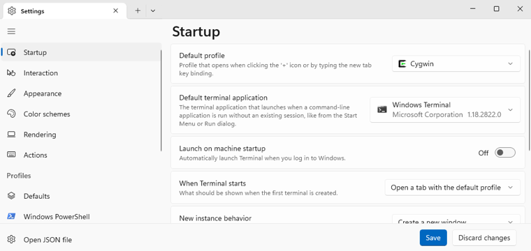

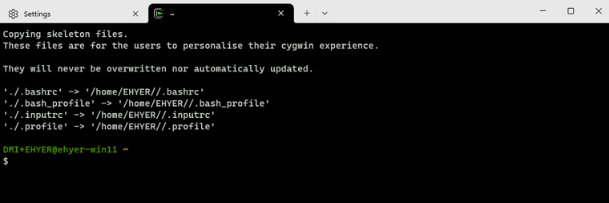

<!-- Page 24 -->

To save we use Ctrl+O and then Enter to accept the file name.
Then we exit nano with Ctrl+X
~/.bashrc
The default file is heavily commented so we back it up as a useful reference before recreating it
with nano
and then paste in the following content:
19
alias ir='git rebase'
20
alias iri='git rebase -i'
21
alias is='git status'
22
alias ist='git stash'
23
alias isuir='git submodule update --init --recursive'
24
alias popcomhard='git reset --hard HEAD^'
25
alias popcomsoft='git reset HEAD^'
26
27
alias make="make -j$(nproc)"
28
alias wk='cd /cygdrive/d/Work'
1
mv ~/.bashrc ~/.bashrc.orig
2
nano ~/.bashrc
1
# If not running interactively, don't do anything
2
[[ "$-" != *i* ]] && return
3
4
# Make bash append rather than overwrite the history on disk
5
shopt -s histappend
6
7
# check the window size after each command and, if necessary,
8
# update the values of LINES and COLUMNS.
9
shopt -s checkwinsize
10
11
# helper function for git branch in prompt
12
git_branch() {
13
branch=$(git branch 2>/dev/null | grep '^*' | colrm 1 2)
14
if [ ! -z "$branch" ]; then

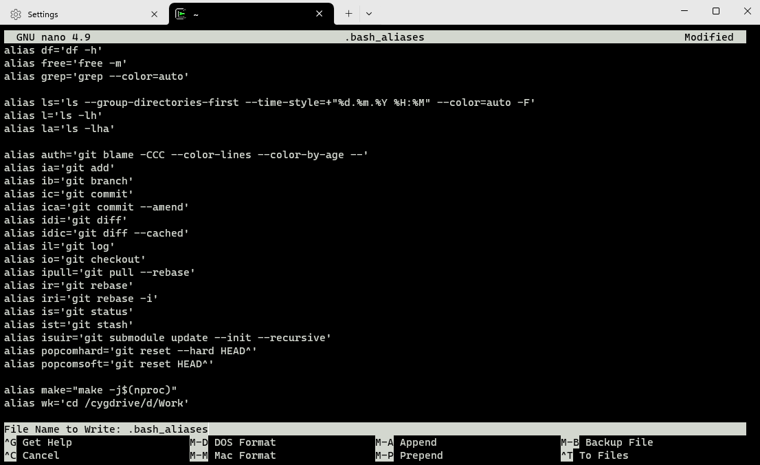

<!-- Page 25 -->

Finally, we reload the config file with:
15
if [ -n "$(git status --porcelain)" ]; then
16
color="31"  # Red for changes
17
elif [ "$(git stash list)" ]; then
18
color="33"  # Yellow for stashed changes
19
else
20
color="32"  # Green for a clean state
21
fi
22
echo -e "\\e[0;${color}m${branch}\\e[0m"
23
fi
24
}
25
26
# Prompt with git branch
27
#PS1="\u@\h \w \$(git_branch)\$ "
28
29
# Color prompt with git branch
30
#PS1="\[\e[1;34m\]\w\[\e[m\] \$(git_branch)\[\e[m\] \[\e[1;32m\]\$ \[\e[m\]\[\e[0m\] "
31
32
# Color prompt with user
33
#PS1="\[\e[1;36m\]\u\[\e[1;35m\] \[\e[1;34m\]\w\[\e[m\] \[\e[m\] \[\e[1;32m\]\$ \[\e[m\]\
[\e[0m\] "
34
35
# Color prompt with user and git branch
36
#PS1="\[\e[1;36m\]\u\[\e[1;35m\] \[\e[1;34m\]\w\[\e[m\] \$(git_branch)\[\e[m\] \
[\e[1;32m\]\$ \[\e[m\]\[\e[0m\] "
37
38
# Color prompt without user or git branch
39
PS1="\[\e[1;34m\]\w\[\e[m\] \[\e[m\] \[\e[1;32m\]\$ \[\e[m\]\[\e[0m\] "
40
41
42
# set LS_COLORS
43
eval `dircolors -b`
44
45
# grep colorization
46
export GREP_COLORS="mt=1;33"
47
48
# Default parameter to send to the "less" command
49
# -R: show ANSI colors correctly
50
# -i: case insensitive search
51
# -X: leave text on exit (don't notify the terminal to clear)
52
# -F: no pager if text fits on one screen
53
export LESS="-R -i -X -F"
54
55
# No double entries in the shell history.
56
export HISTCONTROL="$HISTCONTROL erasedups:ignoreboth"
57
58
# disable send stats to microsoft
59
export DOTNET_CLI_TELEMETRY_OPTOUT=1
60
61
# colored man pages
62
export LESS_TERMCAP_mb=$(printf "\e[1;37m")
63
export LESS_TERMCAP_md=$(printf "\e[1;37m")
64
export LESS_TERMCAP_me=$(printf "\e[0m")
65
export LESS_TERMCAP_se=$(printf "\e[0m")
66
export LESS_TERMCAP_so=$(printf "\e[1;47;30m")
67
export LESS_TERMCAP_ue=$(printf "\e[0m")
68
export LESS_TERMCAP_us=$(printf "\e[0;36m")
69
export GROFF_NO_SGR=1
70
71
# source the aliases
72
if [ -f ~/.bash_aliases ]
73
then
74
. ~/.bash_aliases
75
fi

<!-- Page 26 -->

.NET
Version 3.5
We follow Microsoft’s documentation and check the parent item but not its children.
Microsoft’s Documentation
You can enable the .NET Framework 3.5 through the Windows Control Panel. This option
requires an Internet connection.
1. Press the Windows key on your keyboard, type "Windows Features", and press Enter. The
Turn Windows features on or off dialog box appears.
2. Select the .NET Framework 3.5 (includes .NET 2.0 and 3.0) check box, select OK, and
reboot your computer if prompted.
You don't need to select the child items for Windows Communication Foundation (WCF)
HTTP Activation and Windows Communication Foundation (WCF) Non-HTTP Activation
unless you're a developer or server administrator who requires this functionality.
source: 
Install .NET Framework 3.5 on Windows 10 - .NET Framework
When the installation finishes, we reboot even if not prompted to do so.
Version 5
To download version 5, we open a Cygwin terminal and do:
1
. ~/.bashrc
1
mkdir /cygdrive/d/downloads
2
cd /cygdrive/d/downloads
3
wget https://download.visualstudio.microsoft.com/download/pr/14ccbee3-e812-4068-af47-
1631444310d1/3b8da657b99d28f1ae754294c9a8f426/dotnet-sdk-5.0.408-win-x64.exe

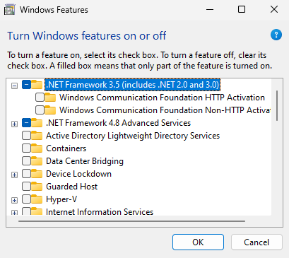

<!-- Page 27 -->

To install version 5, we open a Cygwin as Admin terminal and launch the installer with:
Once the installation finishes we reboot.
Version 6
Version 6 of the SDK can be found on the official site: 
Download .NET (Linux, macOS, and Wi
ndows) | .NET
Using a Cygwin terminal we can download the installer with:
Using a Cygwin as Admin terminal we can launch the installer with:
Once the installation finishes we reboot.
Visual Studio 2022 Professional
Visual Studio is available for download at: 
A license for VS 2022 Professional should already exist. Contact IT if it does not.
During the installation of Visual Studio, we optionally install to “D:” instead of “C:”
We want to make sure to install the following “Workloads”:
1
chmod +x /cygdrive/d/downloads/dotnet-sdk-5.0.408-win-x64.exe
2
/cygdrive/d/downloads/dotnet-sdk-5.0.408-win-x64.exe
1
cd /cygdrive/d/downloads
2
wget https://download.visualstudio.microsoft.com/download/pr/bf047319-5b65-4630-b0f1-
e7a8a7d40724/6c98f5732611a6ded7a9e62dc7bb2be1/dotnet-sdk-6.0.416-win-x64.exe
1
chmod +x /cygdrive/d/downloads/dotnet-sdk-6.0.416-win-x64.exe
2
/cygdrive/d/downloads/dotnet-sdk-6.0.416-win-x64.exe
http://my.visualstudio.com

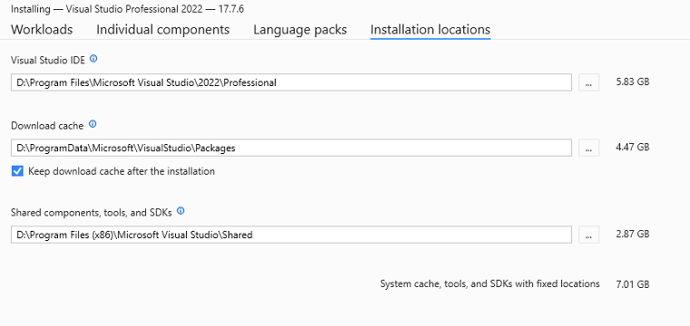

<!-- Page 28 -->

After the installation, we create a new “System” environment variable called “MSBUILD_PATH”
and give it a value of: D:\Program Files\Microsoft Visual
Studio\2022\Professional\MSBuild\Current\Bin
Then we append “%MSBUILD_PATH%” to the “Path” variable

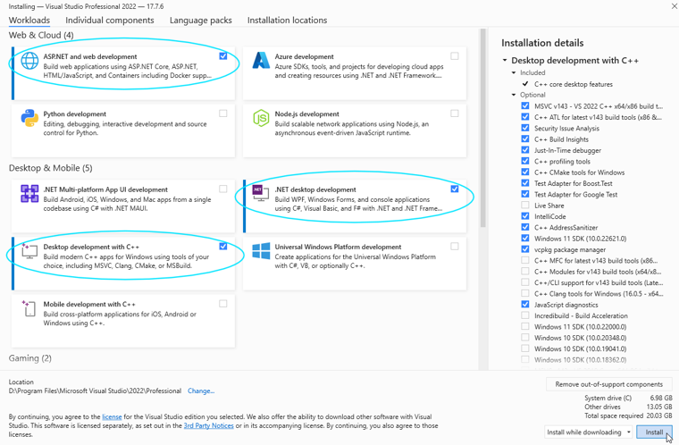

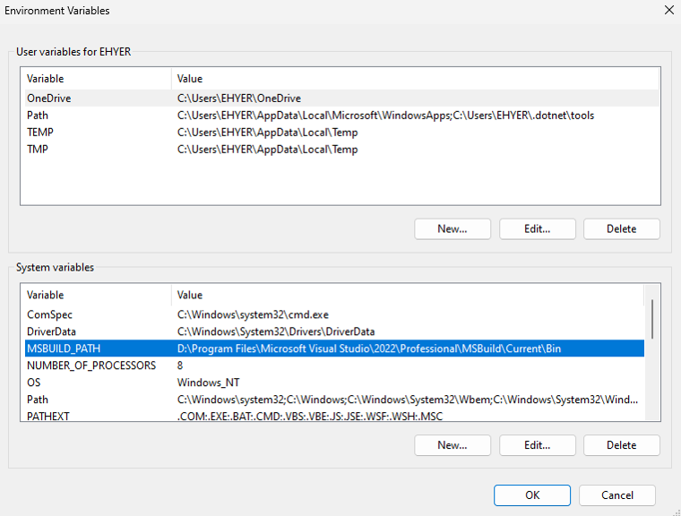

<!-- Page 29 -->

After the installation and environment variable configurations we reboot before moving on to
SQL Server installation.
SQL Server 2022 Developer
Here are multiple links for “SQL Server 2022 Developer” in case the direct link changes:
Download page: 
Download button: 
Direct link: 
Using a Cygwin terminal we can download the installer with:
Using a Cygwin as Admin terminal we run the installer with:
For the installation type we choose “Custom”
https://www.microsoft.com/en-us/sql-server/sql-server-downloads
https://go.microsoft.com/fwlink/p/?
linkid=2215158&clcid=0x409&culture=en-us&country=us
https://download.microsoft.com/download/c/c/9/cc9c6797-383c-4b24-8920-
dc057c1de9d3/SQL2022-SSEI-Dev.exe
1
cd /cygdrive/d/downloads
2
wget https://download.microsoft.com/download/c/c/9/cc9c6797-383c-4b24-8920-
dc057c1de9d3/SQL2022-SSEI-Dev.exe
1
chmod +x /cygdrive/d/downloads/SQL2022-SSEI-Dev.exe
2
/cygdrive/d/downloads/SQL2022-SSEI-Dev.exe

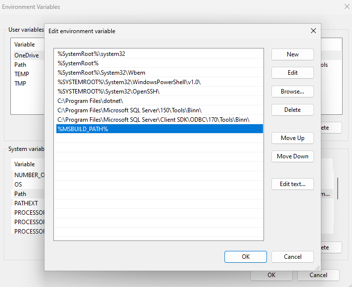

<!-- Page 30 -->

Next we choose our media location:
In the SQL Server Installation Center we click “Installation” followed by “New SQL Server
standalone installation or add features to an existing installation”

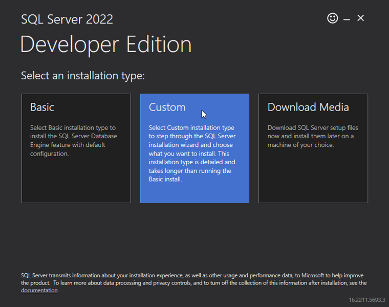

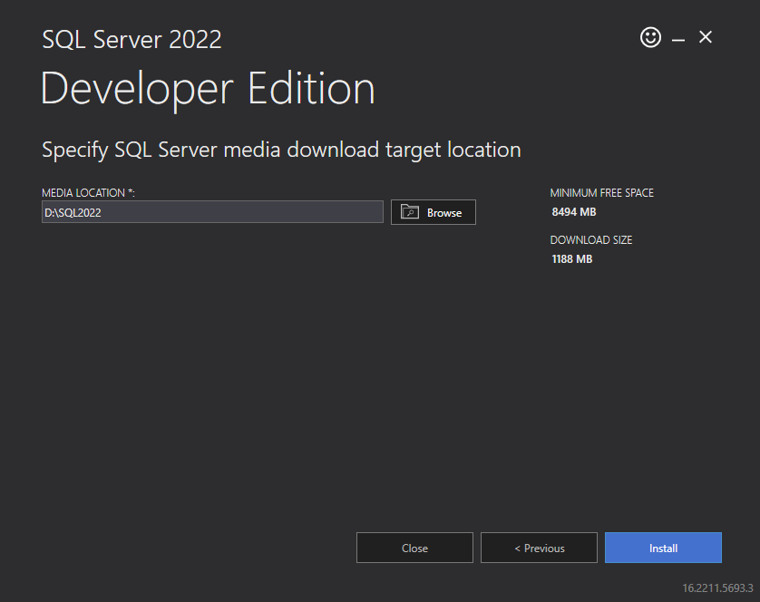

<!-- Page 31 -->

The installer launches and we see that the “Developer” edition is already selected so we just
click “Next”.

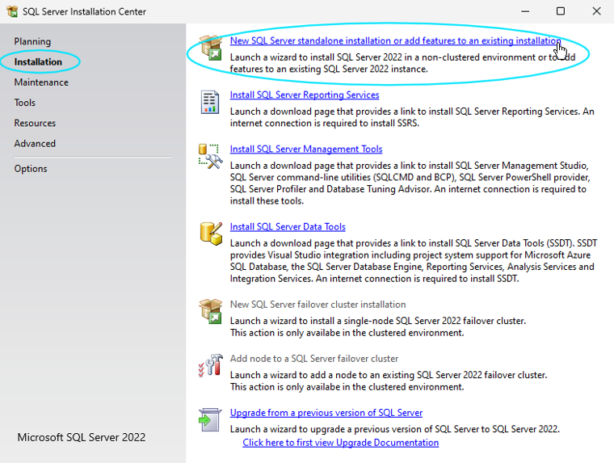

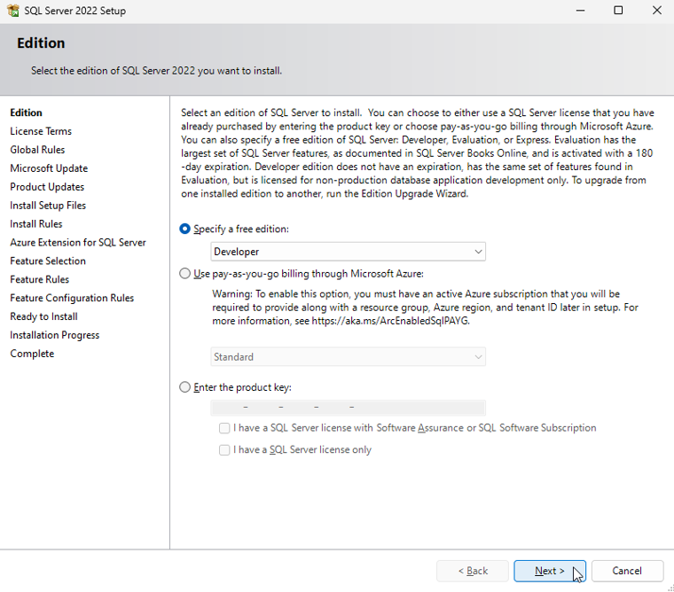

<!-- Page 32 -->

We accept the license and follow Microsoft’s recommendation regarding updates.
We don’t need the Azure Extension:

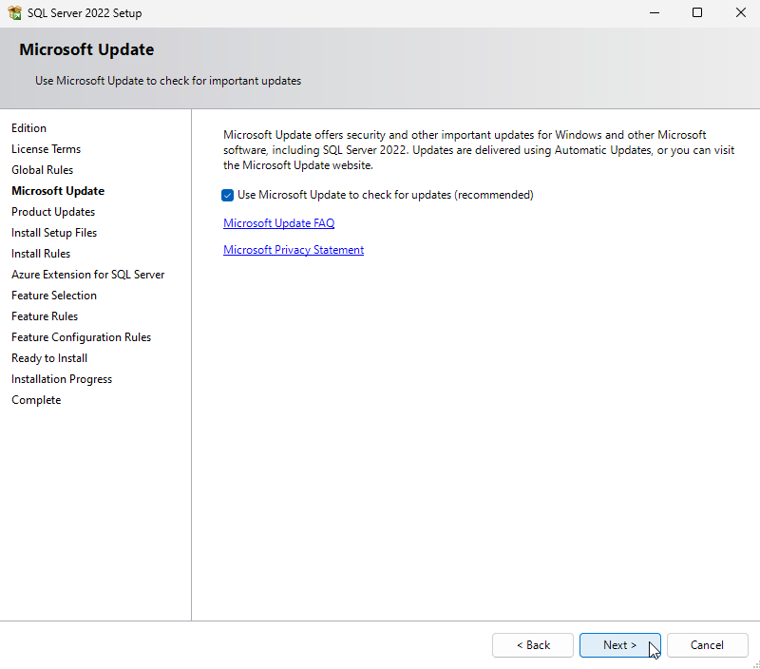

<!-- Page 33 -->

For “Feature Selection” we only need Database Engine Services. To support importing large
databases, we choose an install location on our “D:” partition.

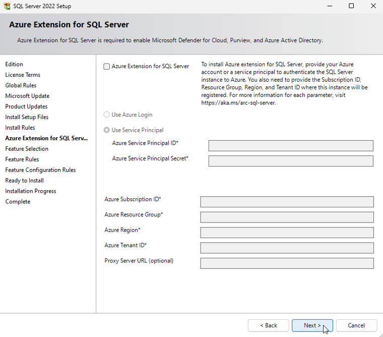

<!-- Page 34 -->

Here we want the “Default instance” which should be called “MSSQLSERVER”

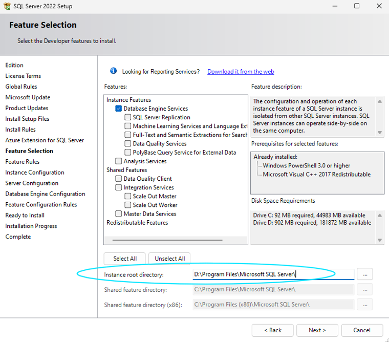

<!-- Page 35 -->

For “Server Configuration”, we keep the defaults and just click “Next”.

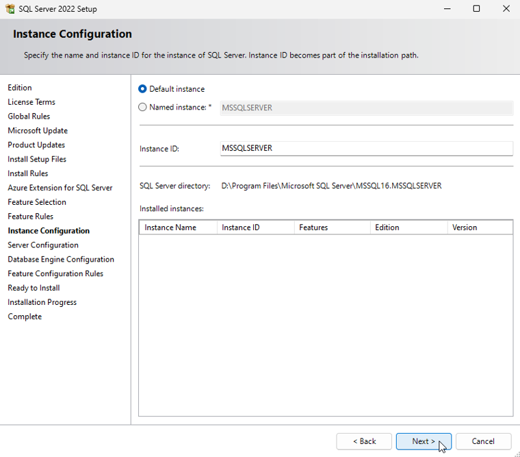

<!-- Page 36 -->

For “Database Engine Configuration” we “Add Current User” before clicking “Next”.

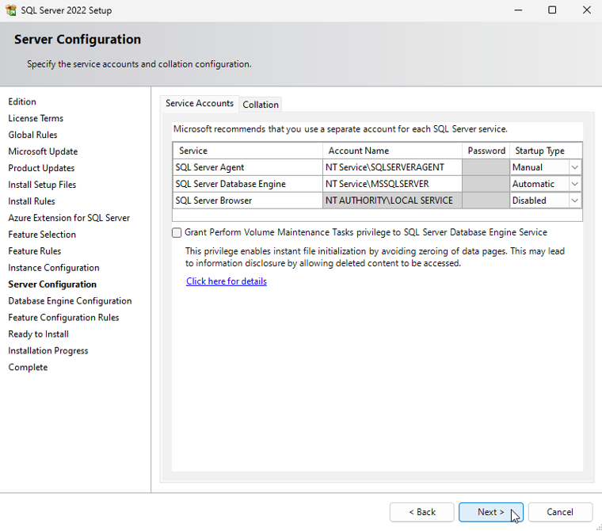

<!-- Page 37 -->

Click Next on the “Feature Configuration Rules” page and finally, “Install” on the “Ready to
Install” page to begin the installation.

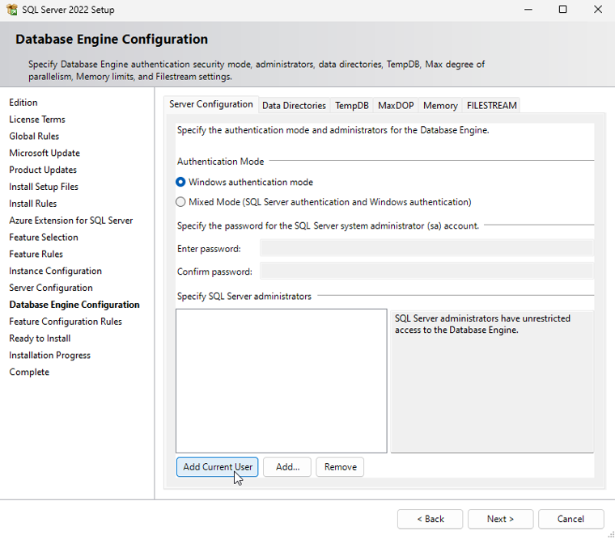

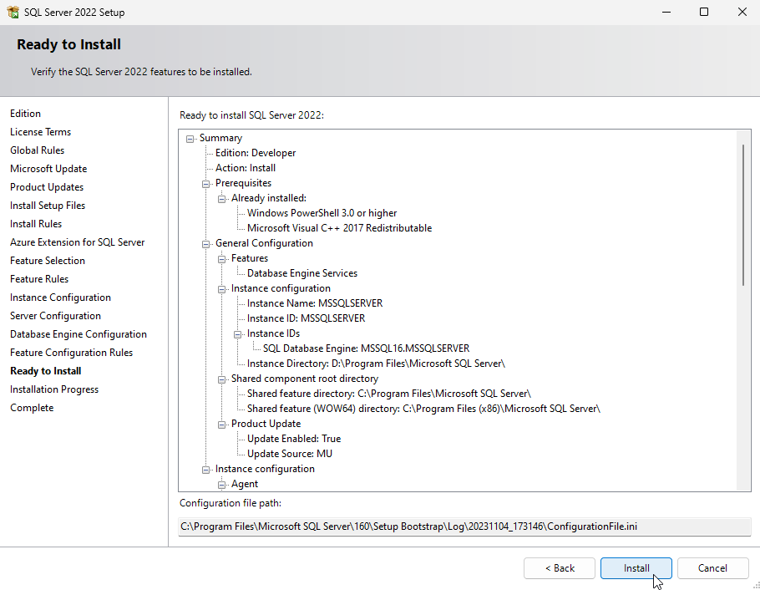

<!-- Page 38 -->

After the installer completes, we use a Cygwin as Admin terminal and create a symlink before
rebooting. We are extra careful and use CMD to make the link.
Enable Protocols
To enable protocols, we open Sql Server Configuration Manager. After enabling the protocols we
reboot.
SQL Package
The SQL Package can be found here: 
Note: Version should be 16.0.6161.0
With a Cygwin terminal we can download the installer with:
1
cd /cygdrive/c/Program\ Files/Microsoft\ SQL\ Server/150
2
cmd
3
mklink /D DAC "C:\Program Files\Microsoft SQL Server\160\DAC"
4
exit
5
ls -l
6
shutdown /r
https://go.microsoft.com/fwlink/?linkid=2196438

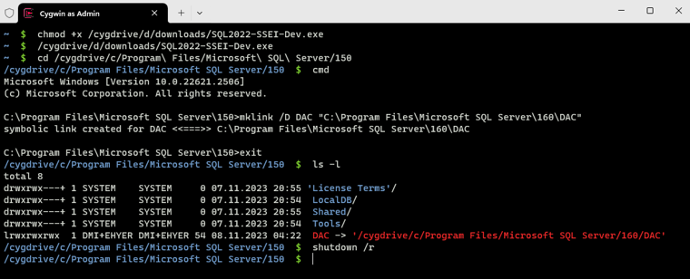

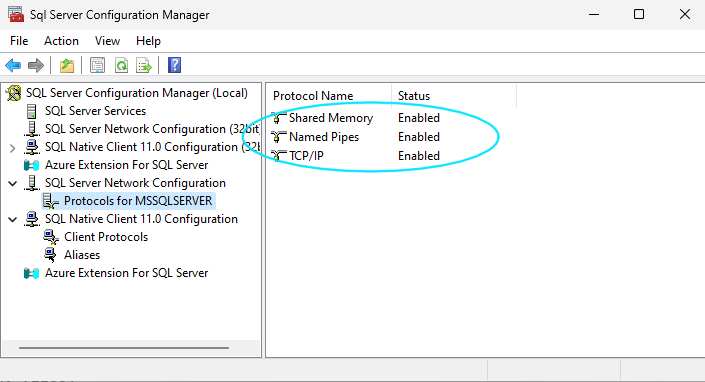

<!-- Page 39 -->

With a Cygwin as Admin terminal we can run the installer with:
SQL Server Management Studio (SSMS)
SSMS can be found at: 
Install SQL Server Management Studio
With a Cygwin terminal we download the installer,
and then to run it we use a Cygwin as Admin terminal:
We choose our location, install and then reboot again.
1
cd /cygdrive/d/downloads
2
wget https://download.microsoft.com/download/e/1/7/e170c7f4-1931-4d04-baef-
600220412086/x64/DacFramework.msi
1
cd /cygdrive/d/downloads
2
chmod +x DacFramework.msi
3
cmd
4
.\DacFramework.msi
1
cd /cygdrive/d/downloads
2
wget https://download.microsoft.com/download/a/c/a/aca4e29f-6925-4d50-a06b-5576c6ea629f/SSMS-
Setup-ENU.exe
1
chmod +x /cygdrive/d/downloads/SSMS-Setup-ENU.exe
2
/cygdrive/d/downloads/SSMS-Setup-ENU.exe

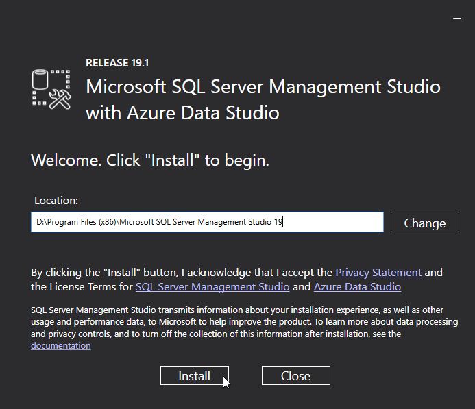

<!-- Page 40 -->

OpenJDK 11
OpenJDK 11 can be found here: 
Using a Cygwin terminal, we download the installer using a direct link with:
Using a Cygwin as Admin terminal, we run the installer with:
We install using default options and then reboot.
Git for Windows
The Git for Windows installer can be found here: 
Git for Windows
Using a Cygwin terminal, we download the installer with:
Using a Cygwin as Admin terminal, we run the installer with:
When running the installer we are greeted with the GNU GPL. At the next screen we accept the
default install location and continue on to the next step to select our desired components.
https://docs.microsoft.com/en-us/java/openjdk/download
1
cd /cygdrive/d/downloads
2
wget https://download.visualstudio.microsoft.com/download/pr/b84fb0a4-aeb3-459d-929f-
32355124f965/60cbca5371a7e829ae182cbd7c1e1c61/microsoft-jdk-11.0.21-windows-x64.msi
1
cd /cygdrive/d/downloads
2
chmod +x microsoft-jdk-11.0.21-windows-x64.msi
3
cmd
4
.\microsoft-jdk-11.0.21-windows-x64.msi
1
cd /cygdrive/d/downloads
2
wget https://github.com/git-for-windows/git/releases/download/v2.42.0.windows.2/Git-2.42.0.2-
64-bit.exe
1
chmod +x /cygdrive/d/downloads/Git-2.42.0.2-64-bit.exe
2
/cygdrive/d/downloads/Git-2.42.0.2-64-bit.exe

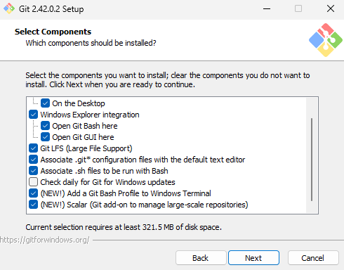

<!-- Page 41 -->

Next, we accept the default “Start Menu Folder” and then move on to choosing our favorite
editor:
Next, we have an opportunity to override the default branch with our favorite branch name:
For the PATH environment we choose the recommended setting:

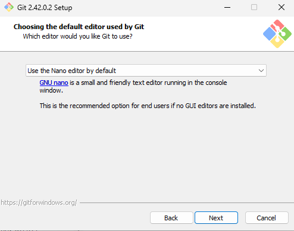

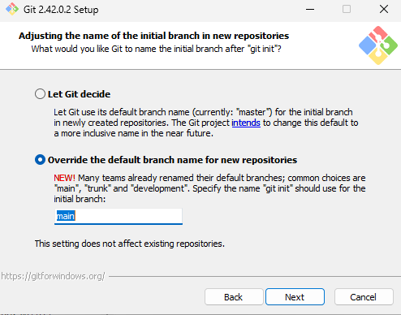

<!-- Page 42 -->

We “Use bundled OpenSSH” and “Use the OpenSSL library” at the next two wizard pages, but
other options might work too.
For configuring the line endings we choose, “Checkout as-is, commit Unix-style line endings”
Using the Windows default console window will better support other programs running in
terminal window.

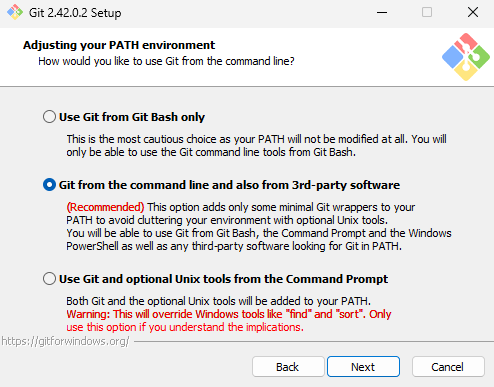

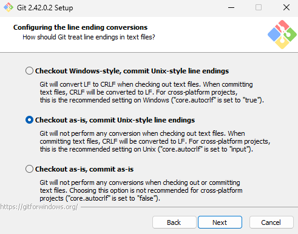

<!-- Page 43 -->

We choose our favorite “git pull” behavior, credential helper if wanted, and arrive at “Configuring
extra options”. Here we can enable symlinks and file system caching.
Then we are offered a chance to enable experimental and unstable features before completing
the installation.

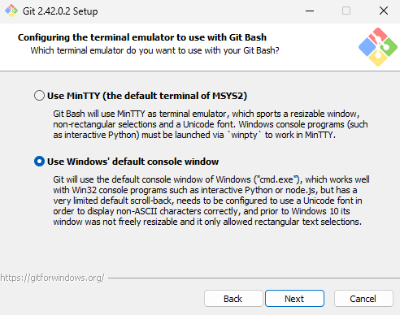

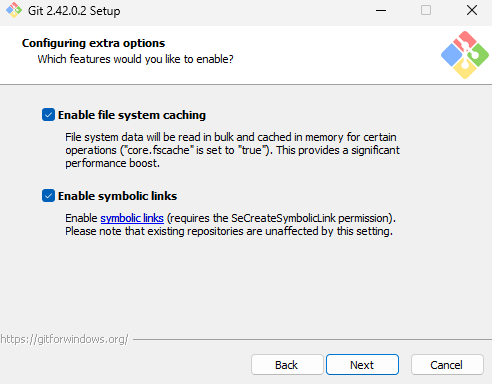

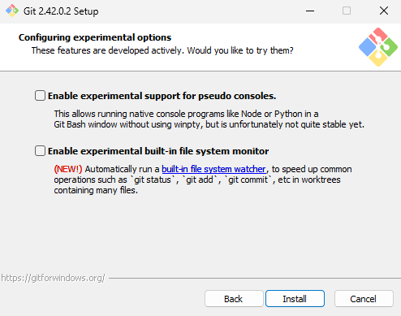

<!-- Page 44 -->

After the installation finishes we reboot.
Cygwin SSH Configuration
To use git-for-windows in a Cygwin terminal, we need to link cygwin’s ~/.ssh to point to the .ssh
dir of the windows user.
After running the commands above, we verify that all went well by running:
Which should return something like:
SSH Key Generation
We follow GitHub’s documentation at: 
 and generate a
new ssh key using a Cygwin terminal with something like:
To add the key in GitHub, we log into the site and go to settings, “SSH and GPG keys”, and then
“New SSH key”. Once there we can paste in the output of cat ~/.ssh/id_ed25519.pub
It should look something like:
1
WINSSH=${USERPROFILE}\\.ssh
2
CYGSSH=${HOME}/.ssh
3
test -d $CYGSSH && mv $CYGSSH $USERPROFILE
4
test -d $WINSSH || mkdir $WINSSH
5
chmod 700 $WINSSH
6
ln -s $WINSSH $CYGSSH
1
ls -la ~/.ssh
1
lrwxrwxrwx 1 DMI+EHYER DMI+EHYER 28 Nov  6 05:08 /home/EHYER/.ssh ->
/cygdrive/c/Users/EHYER/.ssh
Generating a new SSH key - GitHub Docs
1
ssh-keygen -t ed25519 -C "your_email@example.com"

<!-- Page 45 -->

Clone Repositories
Before attempting to clone, we verify that we have access to all the below repositories.
The code depends on being cloned to directories that differ from their repository names to
be able to build and run successfully. Additionally, default branches are not set properly for all
repos. To handle these intricacies easily, we use a script to clone and checkout all the repos
correctly.
With a Cygwin terminal, we create a directory for scripts and then with nano we create a new file
there called, “clone_repos.sh”
Then we paste in the following content:
https://github.com/tcp-software/tcp-cs-60
https://github.com/tcp-software/tcp-we-70
https://github.com/tcp-software/tcp-we-integration-legacy
https://github.com/tcp-software/tcp-we-thirdparty-new
1
mkdir /cygdrive/d/scripts
2
nano /cygdrive/d/scripts/clone_repos.sh
1
#!/bin/bash
2
3
repo_root="/d/Work"
4
if [ -d /cygdrive ]
5
then
6
repo_root="/cygdrive/d/Work"
7
fi
8
9
mkdir "${repo_root}"
10
cd "${repo_root}"
11
mkdir tcp-cs-60-70 tcp-we-71 tcp-we-integration tcp-we-thirdparty

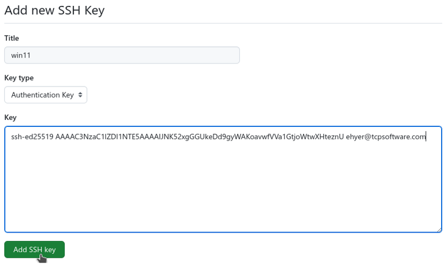

<!-- Page 46 -->

12
13
cd "${repo_root}/tcp-cs-60-70"
14
git clone git@github.com:tcp-software/tcp-cs-60.git .
15
if [ $? -ne 0 ]
16
then
17
echo "failed to clone tcp-cs-60"
18
exit 1
19
fi
20
git checkout we-70-base
21
if [ $? -ne 0 ]
22
then
23
echo "failed to checkout we-70-base within tcp-cs-60"
24
exit 1
25
fi
26
27
cd "${repo_root}/tcp-we-71"
28
git clone git@github.com:tcp-software/tcp-we-70.git .
29
if [ $? -ne 0 ]
30
then
31
echo "failed to clone tcp-we-70"
32
exit 2
33
fi
34
git checkout develop
35
if [ $? -ne 0 ]
36
then
37
echo "failed to checkout develop within tcp-we-70"
38
exit 2
39
fi
40
41
cd "${repo_root}/tcp-we-integration"
42
git clone git@github.com:tcp-software/tcp-we-integration-legacy.git .
43
if [ $? -ne 0 ]
44
then
45
echo "failed to clone tcp-we-integration"
46
exit 3
47
fi
48
git checkout main
49
if [ $? -ne 0 ]
50
then
51
echo "failed to main within tcp-we-integration"
52
exit 3
53
fi
54
55
cd "${repo_root}/tcp-we-thirdparty"
56
git clone git@github.com:tcp-software/tcp-we-thirdparty-new.git .
57
if [ $? -ne 0 ]
58
then
59
echo "failed to clone tcp-we-thirdparty"
60
exit 4
61
fi
62
git checkout main
63
if [ $? -ne 0 ]
64
then
65
echo "failed to checkout main within tcp-we-thirdparty"
66
exit 4
67
fi
68
69
cd "${repo_root}"
70
71
exit 0

<!-- Page 47 -->

Running clone_repos.sh
We run the clone_repos.sh script using the Cygwin terminal. However, the script can also be run
under a “Git Bash” terminal if desired. Optionally run with “time” to track how long it takes (it will
take a while).
Cygwin Example
Git Bash Example
output:
1
chmod +x /cygdrive/d/scripts/clone_repos.sh
2
time /cygdrive/d/scripts/clone_repos.sh
1
chmod +x /d/scripts/clone_repos.sh
2
time /d/scripts/clone_repos.sh
1
Cloning into '.'...
2
remote: Enumerating objects: 18434, done.
3
remote: Counting objects: 100% (8/8), done.
4
remote: Compressing objects: 100% (7/7), done.
5
remote: Total 18434 (delta 1), reused 7 (delta 0), pack-reused 18426
6
Receiving objects: 100% (18434/18434), 7.53 MiB | 121.00 KiB/s, done.
7
Resolving deltas: 100% (14918/14918), done.
8
Updating files: 100% (2707/2707), done.
9
Switched to a new branch 'we-70-base'
10
branch 'we-70-base' set up to track 'origin/we-70-base'.
11
Cloning into '.'...
12
remote: Enumerating objects: 1903736, done.
13
remote: Counting objects: 100% (56525/56525), done.
14
remote: Compressing objects: 100% (5996/5996), done.
15
remote: Total 1903736 (delta 52603), reused 53176 (delta 49815), pack-reused
1847211Receiving objects: 100% (1903736/190
16
17
18
Resolving deltas: 100% (1514581/1514581), done.
19
Updating files: 100% (47883/47883), done.
20
Filtering content: 100% (65/65), 203.13 MiB | 683.00 KiB/s, done.
21
Already on 'develop'
22
Your branch is up to date with 'origin/develop'.
23
Cloning into '.'...
24
remote: Enumerating objects: 8575, done.
25
remote: Counting objects: 100% (34/34), done.
26
remote: Compressing objects: 100% (25/25), done.
27
remote: Total 8575 (delta 7), reused 21 (delta 5), pack-reused 8541Receiving objects: 100%
(8575/8575), 5.07 MiB | 82.00Receiving objects: 100% (8575/8575), 5.12 MiB | 80.00 KiB/s,
done.
28
29
Resolving deltas: 100% (5244/5244), done.
30
Updating files: 100% (485/485), done.
31
Filtering content: 100% (81/81), 337.28 MiB | 1.21 MiB/s, done.
32
Already on 'main'
33
Your branch is up to date with 'origin/main'.
34
Cloning into '.'...
35
remote: Enumerating objects: 38891, done.
36
remote: Counting objects: 100% (8476/8476), done.
37
remote: Compressing objects: 100% (3972/3972), done.
38
remote: Total 38891 (delta 4223), reused 8372 (delta 4154), pack-reused 30415
39
Receiving objects: 100% (38891/38891), 201.20 MiB | 145.00 KiB/s, done.
40
Resolving deltas: 100% (16779/16779), done.
41
Updating files: 100% (21130/21130), done.
42
Filtering content: 100% (4216/4216), 1.73 GiB | 3.05 MiB/s, done.

<!-- Page 48 -->

Set NAnt Environment Variable
The 
build tool’s location of: D:\Work\tcp-we-thirdparty\Nant\0.92\bin
needs to be stored in the variable, “NANT_BIN”,
and %NANT_BIN% needs appended to the path:
43
Already on 'main'
44
Your branch is up to date with 'origin/main'.
45
46
real    81m0.550s
47
user    0m1.202s
48
sys     0m1.619s
NAnt

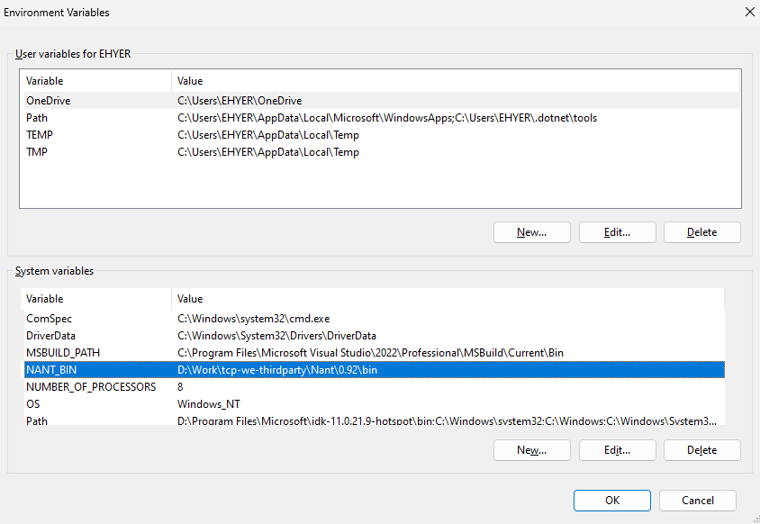

<!-- Page 49 -->

Set AWS Environment Variables
For AWS we need to set the following variables under “System variables”
so that it looks like:
Alter “ExecutionPolicy”
Building the server now requires the “RemoteSigned” “ExecutionPolicy”, so we open a
powershell as administrator
AWS_ACCESS_KEY_ID
<REDACTED-AWS-ACCESS-KEY-ID>
AWS_DEFAULT_REGION
us-east-1
AWS_SECRET_ACCESS_
KEY
<REDACTED-AWS-SECRET-ACCESS-KEY>
<redacted>
Key
Value

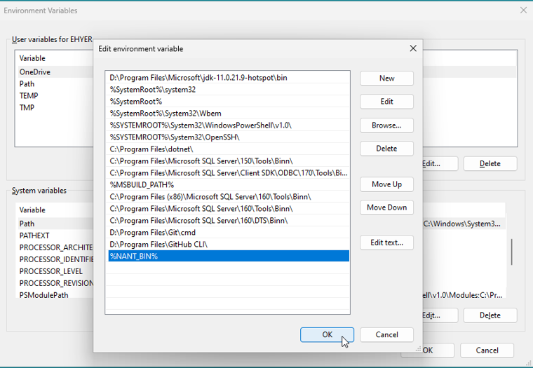

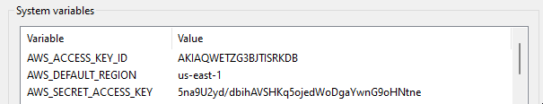

<!-- Page 50 -->

and paste in:
We ignore the security risks and confirm with Y before closing the PowerShell and rebooting.
Add NuGet Package Source
To add the package source, we will need a token.
1
Set-ExecutionPolicy -ExecutionPolicy RemoteSigned -Scope CurrentUser

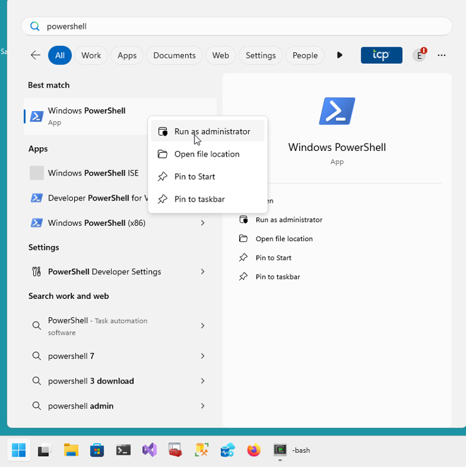

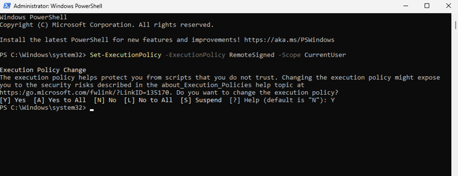

<!-- Page 51 -->

Generate New Token
To generate a new token, we sign in to GitHub and go to Settings → Developer Settings →
Personal access tokens. Once there we find, “Generate new token (classic)” under the
“Generate new token” drop-down
We provide “Github Packages” for the Note, set an expiration date and check “read:packages”.
Before clicking the green “Generate token” button at the bottom, we verify that “read:packages”
is the only scope selected.

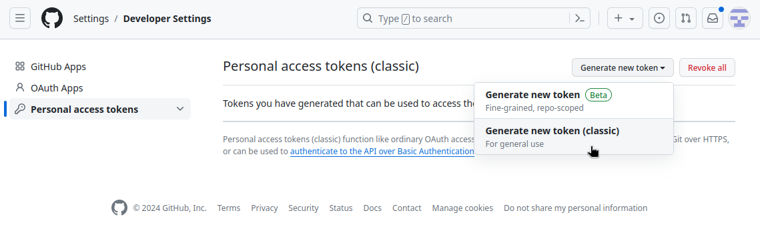

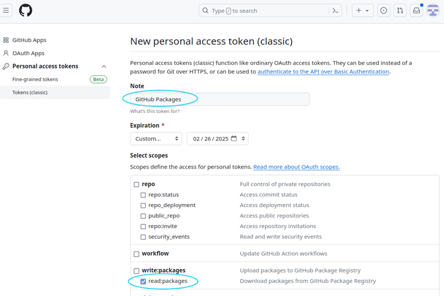

<!-- Page 52 -->

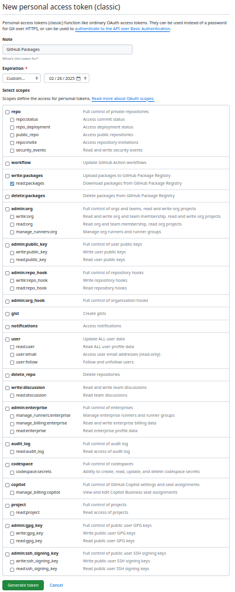

<!-- Page 53 -->

Clicking “Generate token” results in:
Use Generated Token to Add Package Source
The general command that we need to run in a Cygwin terminal looks like:
with placeholders, GITHUB_USERNAME and GITHUB_TOKEN replaced, this could look
something like:
but of course this will be different for everyone.
Build The Server
Using a Cygwin terminal, we build the server in steps starting with:
1
dotnet nuget add source https://nuget.pkg.github.com/tcp-software/index.json -n "GitHub
Packages" -u GITHUB_USERNAME -p GITHUB_TOKEN --store-password-in-clear-text
1
dotnet nuget add source https://nuget.pkg.github.com/tcp-software/index.json -n "GitHub
Packages" -u erichyer -p <REDACTED-GITHUB-PAT> --store-password-in-clear-
text

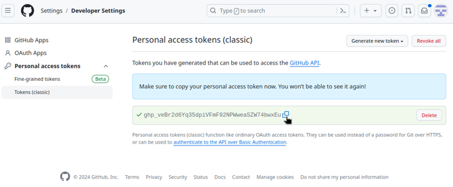

<!-- Page 54 -->

followed by:
and then finally:
Server Config Files
To setup the server’s config files, we first download this 
cfg.zip   archive, right click on it in
Explorer and “Extract All…” to:
D:\Work\tcp-we-71\server\Src\Interface
It looks like:
1
cd /cygdrive/d/Work/tcp-we-71/server
2
nant restore clean
1
cd /cygdrive/d/Work/tcp-we-71/server/Etc/Util
2
cmd /c "msbuild Util.sln /t:Rebuild"
1
cd /cygdrive/d/Work/tcp-we-71/server
2
nant build

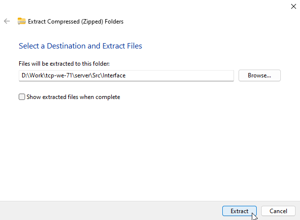

<!-- Page 55 -->

TCPCONN.XML
Start with TCPCONN.PROD.XML
Using a Cygwin terminal, we use the TCPCONN.PROD.XML file as a starting point for our
TCPCONN.XML file
Edit TCPCONN.XML
Using our favorite text editor, we change the “Integrated” property to be “true” instead of
“false”. Afterward, we look at the file and compare with TCPCONN.PROD.XML to make sure that
everything went ok.
The whole thing looks like this:
1
cd /cygdrive/d/Work/tcp-we-71/server/Src/Interface/cfg
2
mv TCPCONN.XML TCPCONN.XML.ORIG
3
cp TCPCONN.PROD.XML TCPCONN.XML
1
sed -i 's_Integrated>false</Integrated_Integrated>true</Integrated_g' TCPCONN.XML
2
cat TCPCONN.XML
3
diff TCPCONN.PROD.XML TCPCONN.XML

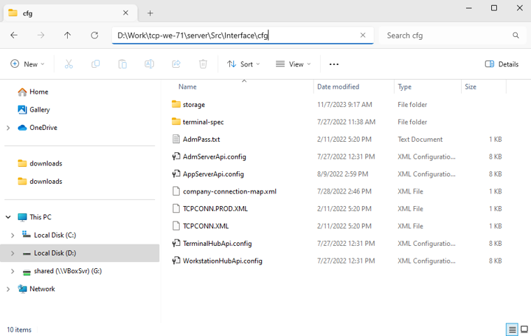

<!-- Page 56 -->

company-connection-map.xml
After making a backup, we use our favorite text editor to remove the 4th line:
so that it changes from:
to:
Restore a test DB
Using a Cygwin terminal, we can create a test database for the server with:
1
cp company-connection-map.xml company-connection-map.xml.orig
2
sed -i '4d' company-connection-map.xml
1
<?xml version="1.0" encoding="utf-8"?>
2
<company-connection-map xmlns:xsd="http://www.w3.org/2001/XMLSchema"
xmlns:xsi="http://www.w3.org/2001/XMLSchema-instance">
3
<company-connection-spec company-namespace="" connection-options-path="TCPCONN.XML"
connection-path-task-scheduler="TCPCONN.XML" />
4
<company-connection-spec company-namespace="PROD" connection-options-
path="TCPCONN.PROD.XML" connection-path-task-scheduler="TCPCONN.PROD.XML" />
5
</company-connection-map>
1
<?xml version="1.0" encoding="utf-8"?>
2
<company-connection-map xmlns:xsd="http://www.w3.org/2001/XMLSchema"
xmlns:xsi="http://www.w3.org/2001/XMLSchema-instance">
3
<company-connection-spec company-namespace="" connection-options-path="TCPCONN.XML"
connection-path-task-scheduler="TCPCONN.XML" />
4
</company-connection-map>
1
cd /cygdrive/d/Work/tcp-we-71/server
2
nant __restore-db-prod-test

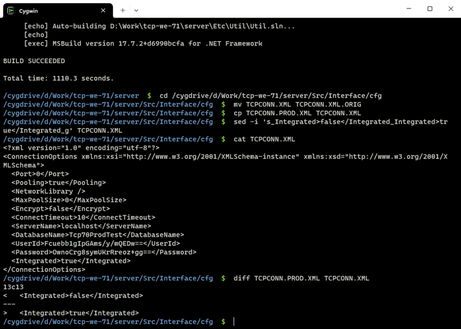

<!-- Page 57 -->

It takes a minute and then finishes with:
Optionally restore other databases with:
Create Logins
First, we run the following SQL Query in SQL Sever Management Studio.
Then we run this second query to create the logins.
1
nant restore-db-all
1
USE [master]
2
GO
3
4
CREATE LOGIN [tcadmin] WITH PASSWORD=N'<REDACTED-SQL-PASSWORD>', DEFAULT_DATABASE=[master],
DEFAULT_LANGUAGE=[us_english], CHECK_EXPIRATION=OFF, CHECK_POLICY=OFF
5
GO
6
7
ALTER LOGIN [tcadmin] ENABLE
8
GO
9
1
CREATE LOGIN Q3WShUtj8K WITH PASSWORD = '<REDACTED-SQL-PASSWORD>';
2
EXEC master..sp_addsrvrolemember @loginame = N'Q3WShUtj8K', @rolename = N'sysadmin';
3
ALTER LOGIN Q3WShUtj8K WITH PASSWORD = '<REDACTED-SQL-PASSWORD>' UNLOCK;
4
GO
5

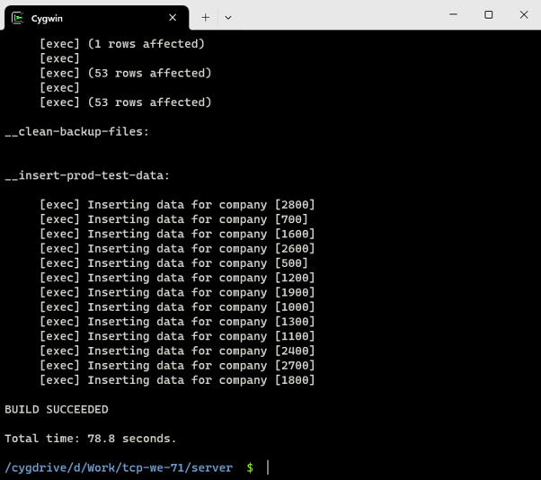

<!-- Page 58 -->

Node
Dependencies
Node has some dependencies that can be automatically installed by the installer but this
depends on Chocolatey so we avoid this and handle the dependencies manually.
Node’s Dependency Documentation
The following documentation was taken from here: 
Install the current 
 from the 
.
Install tools and configuration manually:
Install Visual C++ Build Environment: 
 (using "Visual C++ build tools"
if using a version older than VS2019, otherwise use "Desktop development with C++"
workload) or 
 (using the "Desktop development with C++" workload)
If the above steps didn't work for you, please visit 
for additional tips.
We already installed the "Desktop development with C++" workload when installing Visual
Studio, so the only dependency remaining is Python. We follow the documentation and install
the current 
 from the 
 before moving on.
Installation
The latest LTS version of Node can be found here: 
In a Cygwin terminal, we can download and run the installer with:
When the installer asks if we want to “Automatically install the necessary tools.”, we avoid
installing “Chocolatey” by leaving this option unchecked.
https://github.com/nodejs/node-gyp
version of Python
Microsoft Store
Visual Studio Build Tools
Visual Studio Community
Microsoft's Node.js Guidelines for Windows
version of Python
Microsoft Store
https://nodejs.org/en/download/
1
cd /cygdrive/d/downloads/
2
wget https://nodejs.org/dist/v20.9.0/node-v20.9.0-x64.msi
3
chmod +x node-v20.9.0-x64.msi
4
cmd
5
.\node-v20.9.0-x64.msi

<!-- Page 59 -->

With both Python and Node installed we reboot.
Building The Client
Dependencies
To install the client’s dependencies, we open a Cygwin terminal and enter:
Run The “build-js.prod-env.sh” Script
Using a Cygwin terminal, we run the script with:
and get the following output:
1
cd /cygdrive/d/Work/tcp-we-71/client
2
npm install
3
npm install grunt --save-dev
4
npm install -g grunt grunt-contrib-clean grunt-contrib-copy
1
/cygdrive/d/Work/tcp-we-71/client/scripts/build-js.prod-env.sh
1
> tcp-core-client@1.0.0 build-all-js
2
> grunt build-all-js
3
4
Running "concurrent:all" (concurrent) task
5
>> Warning: There are more tasks than your concurrency limit. After this limit
6
>> is reached no further tasks will be run until the current tasks are
7
>> completed. You can adjust the limit in the concurrent task options
8
9
Running "mkdir:webclock" (mkdir) task
10
Creating "build/javascript/webclock"...OK
11
12
Running "closure-compiler:webclock-prod" (closure-compiler) task
13
>> app/lib/tcpwe/tcpwe-webclock.min.js created
14
15
Running "compress:webclock" (compress) task
16
>> Compressed 1 file
17
18
Done.
19
20
Running "mkdir:mobileclock" (mkdir) task
21
Creating "build/javascript/webclock"...OK

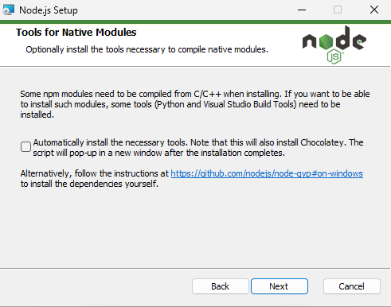

<!-- Page 60 -->

22
Creating "build/javascript/mobileclock"...OK
23
24
Running "closure-compiler:mobileclock-prod" (closure-compiler) task
25
>> app/lib/tcpwe/tcpwe-mobileclock.min.js created
26
27
Running "compress:mobileclock" (compress) task
28
>> Compressed 1 file
29
30
Done.
31
32
Running "mkdir:manager" (mkdir) task
33
Creating "build/javascript/manager"...OK
34
35
Running "closure-compiler:manager-prod" (closure-compiler) task
36
>> app/lib/tcpwe/tcpwe-manager.min.js created
37
38
Running "compress:manager" (compress) task
39
>> Compressed 1 file
40
41
Done.
42
43
Running "mkdir:mobilemanager" (mkdir) task
44
Creating "build/javascript/manager"...OK
45
Creating "build/javascript/mobilemanager"...OK
46
47
Running "closure-compiler:mobilemanager-prod" (closure-compiler) task
48
>> app/lib/tcpwe/tcpwe-mobilemanager.min.js created
49
50
Running "compress:mobilemanager" (compress) task
51
>> Compressed 1 file
52
53
Done.
54
55
Running "mkdir:terminals" (mkdir) task
56
Creating "build/javascript/terminals"...OK
57
58
Running "closure-compiler:terminals-prod" (closure-compiler) task
59
>> app/lib/tcpwe/tcpwe-terminals.min.js created
60
61
Running "compress:terminals" (compress) task
62
>> Compressed 1 file
63
64
Done.
65
66
Running "mkdir:admin" (mkdir) task
67
Creating "build/javascript/admin"...OK
68
69
Running "closure-compiler:admin-prod" (closure-compiler) task
70
>> app/lib/tcpwe/tcpwe-admin.min.js created
71
72
Running "compress:admin" (compress) task
73
>> Compressed 1 file
74
75
Done.
76
77
Running "mkdir:miniclock" (mkdir) task
78
Creating "build/javascript/miniclock"...OK
79
80
Running "mkdir:webclock" (mkdir) task
81
Creating "build/javascript/webclock"...OK
82
83
Running "closure-compiler:miniclock-prod" (closure-compiler) task
84
>> app/lib/tcpwe/tcpwe-miniclock.min.js created
85
86
Running "compress:miniclock" (compress) task
87
>> Compressed 1 file
88

<!-- Page 61 -->

Run The “build-ss.prod-env.sh” Script
Using a Cygwin terminal, we run the script with:
and get the following output:
89
Done.
90
91
Running "mkdir:workstation" (mkdir) task
92
Creating "build/javascript/workstation"...OK
93
94
Running "closure-compiler:workstation-prod" (closure-compiler) task
95
>> app/lib/tcpwe/tcpwe-workstation.min.js created
96
97
Running "compress:workstation" (compress) task
98
>> Compressed 1 file
99
100
Done.
101
102
Done.
1
/cygdrive/d/Work/tcp-we-71/client/scripts/build-ss.prod-env.sh
1
2023-11-08.08-19-05: Listing all stylesheets to build/stylesheet/tcpwe-
manager.overall.scss.tmp
2
2023-11-08.08-19-05: Listing all stylesheets to build/stylesheet/tcpwe-
webclock.overall.scss.tmp
3
2023-11-08.08-19-05: Listing all stylesheets to build/stylesheet/tcpwe-
workstation.overall.scss.tmp
4
2023-11-08.08-19-05: Listing all stylesheets to build/stylesheet/tcpwe-
miniclock.overall.scss.tmp
5
2023-11-08.08-19-05: Listing all stylesheets to build/stylesheet/tcpwe-
admin.overall.scss.tmp
6
2023-11-08.08-19-05: Listing all stylesheets to build/stylesheet/tcpwe-
terminals.overall.scss.tmp
7
Running "dart-sass:workstation-default" (dart-sass) task
8
Running "dart-sass:admin-default" (dart-sass) task
9
Running "dart-sass:terminals-default" (dart-sass) task
10
Running "dart-sass:webclock-default" (dart-sass) task
11
Successfully compiled 1 Sass file(s).
12
13
Done.
14
Successfully compiled 1 Sass file(s).
15
2023-11-08.08-19-05: Compiled default compressed stylesheets to app/lib/tcpwe/tcpwe-
workstation.default.min.css
16
17
Done.
18
2023-11-08.08-19-05: Compiled default compressed stylesheets to app/lib/tcpwe/tcpwe-
admin.default.min.css
19
2023-11-08.08-19-05: Compressing app/lib/tcpwe/tcpwe-workstation.default.min.css with gzip
(keep).
20
2023-11-08.08-19-05: Compressing app/lib/tcpwe/tcpwe-admin.default.min.css with gzip (keep).
21
Successfully compiled 1 Sass file(s).
22
23
Done.
24
2023-11-08.08-19-05: Compiled default compressed stylesheets to app/lib/tcpwe/tcpwe-
terminals.default.min.css
25
2023-11-08.08-19-05: Compressing app/lib/tcpwe/tcpwe-terminals.default.min.css with gzip
(keep).
26
Running "dart-sass:miniclock-default" (dart-sass) task
27
Successfully compiled 1 Sass file(s).
28
29
Done.

<!-- Page 62 -->

Nginx
Who Owns Tools?
Before installing nginx, we need to verify that our group owns “D:\Tools”
If the output of:
looks like this:
30
2023-11-08.08-19-05: Compiled default compressed stylesheets to app/lib/tcpwe/tcpwe-
webclock.default.min.css
31
Successfully compiled 1 Sass file(s).
32
2023-11-08.08-19-05: Compressing app/lib/tcpwe/tcpwe-webclock.default.min.css with gzip
(keep).
33
34
Done.
35
2023-11-08.08-19-05: Compiled default compressed stylesheets to app/lib/tcpwe/tcpwe-
miniclock.min.css
36
2023-11-08.08-19-05: Compressing app/lib/tcpwe/tcpwe-miniclock.min.css with gzip (keep).
37
Running "dart-sass:manager-default" (dart-sass) task
38
39
Deprecation
40
Warning
41
: Using / for division outside of calc() is deprecated and will be removed in Dart Sass
2.0.0.
42
43
Recommendation: math.div($calendarWidth, 7) or calc($calendarWidth / 7)
44
45
More info and automated migrator: https://sass-lang.com/d/slash-div
46
47
╷
48
6 │ $calendarDayWidth: $calendarWidth/ 7;
49
│                    ^^^^^^^^^^^^^^^^^
50
╵
51
52
app\manager\position-templates\default\PositionTemplate.scss 6:20  @import
53
build\stylesheet\tcpwe-manager.overall.scss 284:9                  root stylesheet
54
55
56
57
Successfully compiled 1 Sass file(s).
58
59
Done.
60
2023-11-08.08-19-05: Compiled default compressed stylesheets to app/lib/tcpwe/tcpwe-
manager.default.min.css
61
2023-11-08.08-19-05: Compressing app/lib/tcpwe/tcpwe-manager.default.min.css with gzip
(keep).
1
ls -l /cygdrive/d

<!-- Page 63 -->

then we ignored the warning about not letting the Cygwin installer auto-create directories (with
elevated permissions). Using chown is unfortunately not reliable, so we need to recreate the
Tools folder. We close all terminals and use Explorer to: 
1. Rename “D:\Tools” to “D:\admintools”
2. Recreate “D:\Tools”
3. Cut “cygwin” under “D:\admintools” and paste it under “D:\Tools”
4. remove “D:\admintools”
Finally, we open a Cygwin terminal to verify that all went well before moving on.
Download and Extract
nginx is released as an archive that can be found at: 
Using a Cygwin terminal, we download and extract the archive with:
http://nginx.org/en/download.html
1
cd /cygdrive/d/downloads
2
wget https://nginx.org/download/nginx-1.24.0.zip
3
powershell
4
Expand-Archive D:\downloads\nginx-1.24.0.zip -DestinationPath D:\Tools
5
exit

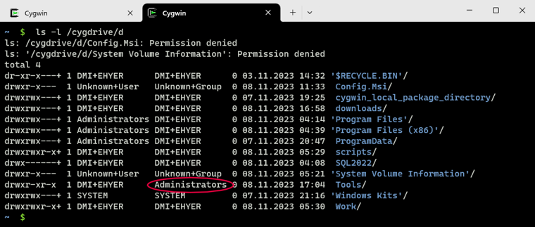

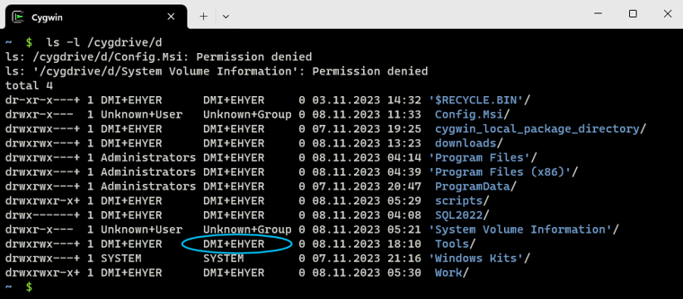

<!-- Page 64 -->

Root Directory Symlink
With a Cygwin as Admin terminal we link nginx → nginx-1.24.0, carefully using CMD for link
creation
Configuration Files
We save these two files inside the D:\Tools\nginx\conf directory
Then with a Cygwin terminal we create a “https” directory with:
before populating it with these two files:
With the symlink and all 4 files in place it should look like:
1
cd /cygdrive/d/Tools
2
cmd
3
mklink /D nginx nginx-1.24.0
4
exit
nginx.conf
09 Nov 2023, 02:57 PM
headers.
09 Nov 2023, 02:57 PM
include
1
mkdir /cygdrive/d/Tools/nginx/https
nginx.
09 Nov 2023, 02:58 PM
tcp.crt
nginx.
09 Nov 2023, 02:27 PM
tcp.key

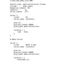

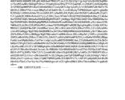

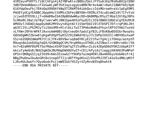

<!-- Page 65 -->

Windows Service For Nginx
To setup nginx to run as a Windows service, we create a new directory with two new files before
executing one of them to install the new service. Afterward, we open “Services” to start the
newly installed service.
Prepare nginxservice.exe
Using a Cygwin terminal, we create a new “service” directory and then copy the service from
within the code repository to this directory, while renaming it from “nginx.exe” to
“nginxservice.exe”.
Prepare nginxservice.xml
We save this xml file to D:\Tools\nginx\service\nginxservice.xml
Installing The Service
With the xml and service files in place, we can install the service in a Cygwin terminal with:
1
mkdir /cygdrive/d/Tools/nginx/service
2
cp /cygdrive/d/Work/tcp-we-71/overall/deploy/tst/etc/tst/etc/server/nginx.exe
/cygdrive/d/Tools/nginx/service/nginxservice.exe
nginxserv
09 Nov 2023, 04:32 AM
ice.xml
1
/cygdrive/d/Tools/nginx/service/nginxservice install

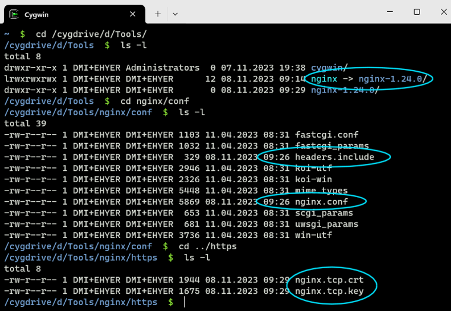

<!-- Page 66 -->

Starting The Service
Now that the service is installed, we start it within the Windows 11 “Services” application. To
open “Services”, we hit the window key and enter, “services”.
We select the “nginx” service and click “Start the service” in the top of the left area. All goes well
and “Running” appears for nginx’s status.
Troubleshooting
If we are presented with this error when attempting to start the service:
then we need to revisit the section, “Who Owns Tools”. Before doing so however, we should
remove the service using a Cygwin as Admin terminal with:
Create app symlink
We need to link D:\Tools\nginx\html\app → D:\Work\tcp-we-71\client\app
Using a Cygwin as Admin terminal, we do this with:
1
sc delete nginx
1
cd /cygdrive/d/Tools/nginx/html
2
cmd
3
mklink /D app D:\Work\tcp-we-71\client\app
4
exit

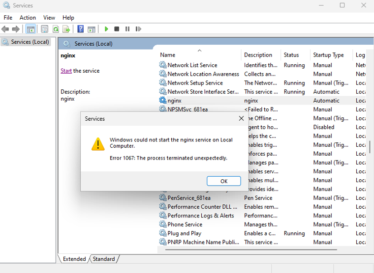

<!-- Page 67 -->

Starting the App Server
With a Cygwin terminal we can start the server with:
Once the server is running, we can access the application at: 
(the ADMIN password is blank)
Starting the Admin Server
With a Cygwin as Admin terminal we can start the server with:
Once the server is running, we can access the application at: 
(the ADMIN password is '1')
Switching Versions
Trying out different branches of the tcp-we-71 repository requires rebuilding the server, client
and test databases. To automate these tasks we copy the following script to 
/cygdrive/d/scripts/select_we.sh
1
cd /cygdrive/d/Work/tcp-we-71/server/Src/Interface
2
dotnet run --project AppServerApi/AppServerApi.csproj cfg
http://localhost:8081/app/manager
1
cd /cygdrive/d/Work/tcp-we-71/server/Src/Interface/AdmServerApi/bin/Debug
2
./Tcp.AdmServerApi ../../../cfg
http://localhost:8018/app/admin
1
#!/bin/bash
2
3
we_root=/cygdrive/d/Work/tcp-we-71
4
cd "${we_root}"
5
git fetch --all
6
7
8
declare -a branches
9
10
# Add all release branches greater than or equal to 7.1.56
11
for i in `git branch -r | grep 'origin/release/7.'`
12
do
13
if [[ ${i:19:1} -gt 5 ]]; then
14
branches+=("${i:7}")
15
elif [[ ${i:19:1} -eq 5 && ${i:20:1} -gt 5 ]]; then
16
branches+=("${i:7}")
17
fi
18
done
19
20
21
22
# Add any additional branches here
23
#branches+=( "develop" )
24
#branches+=( "fav_branch" )
25
26
27
while
28
echo -e "\nSelect a branch:"
29
i=-1
30
for branch in "${branches[@]}"

<!-- Page 68 -->

31
do
32
(( i = i + 1 ))
33
echo -e "  [${i}]\t${branch}"
34
done
35
echo ""
36
read -p "Please enter the index for the desired branch: " selection
37
[[ -z "${selection}" || "${selection}" =~ [^0-9] || ${selection} -lt 0 || ${selection} -
gt ${i} ]]
38
do echo -e "\n\nPlease enter a valid index"
39
done
40
41
branch="${branches[${selection}]}"
42
43
git checkout "${branch}"
44
ret=$?
45
if [[ ${ret} -ne 0 ]]; then
46
echo "'git checkout ${branch}' failed with: ${ret}"
47
exit ${ret}
48
fi
49
50
51
cd "${we_root}/server"
52
53
nant __clean-obj-bin restore
54
ret=$?
55
if [[ ${ret} -ne 0 ]]; then
56
echo "'nant __clean-obj-bin restore' failed with: ${ret}"
57
exit ${ret}
58
fi
59
60
cd "${we_root}/server"
61
nant clean build
62
ret=$?
63
if [[ ${ret} -ne 0 ]]; then
64
echo "'nant clean build' failed with: ${ret}"
65
exit ${ret}
66
fi
67
68
69
echo -e "\n********* Restore Test DB *********"
70
cd "${we_root}/server"
71
nant __restore-db-prod-test
72
ret=$?
73
if [[ ${ret} -ne 0 ]]; then
74
echo "'nant __restore-db-prod-test' failed with: ${ret}"
75
exit ${ret}
76
fi
77
78
79
echo -e "\n********* Building Client *********"
80
81
"${we_root}/client/scripts/build-js.prod-env.sh"
82
ret=$?
83
if [[ ${ret} -ne 0 ]]; then
84
echo "'./build-js.prod-env.sh' failed with: ${ret}"
85
exit ${ret}
86
fi
87
88
"${we_root}/client/scripts/build-ss.prod-env.sh"
89
ret=$?
90
if [[ ${ret} -ne 0 ]]; then
91
echo "'./build-ss.prod-env.sh' failed with: ${ret}"
92
exit ${ret}
93
fi
94
95
96
cd "${we_root}"

<!-- Page 69 -->

We set executable permissions on the script before running
to be greeted with an interactive prompt:
After entering our selection the script rebuilds the server, client and test databases for the
selected version.
Conclusion
We started with nothing but the Windows 11 installation media and are now able to run any
TimeClock Plus server that we want to build. A minimal development environment has been
established, that serves as an effective base for further project specific customization.
At this point, we take a snapshot and call it, “Guide Finished!”.
See also
.
97
98
exit 0
99
1
chmod 700 /cygdrive/d/scripts/select_we.sh
2
/cygdrive/d/scripts/select_we.sh
Workstation Setup Guide
Workstation Configuration for TimeClock Plus Core Development

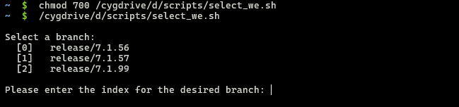
