# VE-Workstation Setup Guide-150626-181317

<!-- Page 1 -->

Workstation Setup Guide
This page is a walk through of setting up a dev environment and launching the TCP web
application locally. Note that you must have Admin permissions. If you don’t, submit a request
here: https://tcpsoftware.sysaidit.com/servicePortal

    Set your dev machine automatically. Takes only one hour!
    Checkout here TCP Core Developer Machine Setup. Reach out to @Vitalii Pianykh for
    help.

Step. 1. Create a GitHub Account and Request Repo Access
If you already have a GitHub identity/account, you may use it to join the TCP Software org, or
you may create a new GitHub identity.
  Two-factor authentication (2FA) is required to join the org. You can use a mobile app such as
  Authy, Duo, Google Authenticator, etc. to generate the TOTP codes for authentication.
  Your GitHub profile picture and username must be work-appropriate.
Send an email to your manager, and Philip DeVries to request access to the TCP GitHub
repositories.

Step. 2. Create Your Working Partition
The development machine comes with some preconfigured partitions. In order to move forward
with these steps you may need to create a new partition for a “D:\” drive.
If you do not already have a D:\ drive partition, you can set it up on your own (reach out to IT or
your manager if you need assistance). Within the “D:\” drive you need to create a Tools
directory and a Work directory i.e. D:\Tools and D:\Work.
You can send an mail to ITCase@TCPSoftware.com for getting your partition created.

Step. 3. Install Git
Initial
    Thisinstructions     arelink.
         page has 1 OneDrive   provided here for OS X and Linux.
Connect to preview what's inside. Your
teammates have connected this app.
Connect

<!-- Page 2 -->

Install Git for Windows

Git for Windows (also known as GFW and Git Bash) is the official Windows distribution for Git.
It provides a Unix-like bash shell environment for Windows similar to Cygwin.
1. Download the Git for Windows installer from here:        Git for Windows
2. Run the installer.
3. Click Next to accept the defaults until you reach the screen prompting you to choose the
   default editor. Choose whichever text editor you prefer (e.g., notepad++, Visual Studio Code
   or any other editor of your choice), then click Next.
4. Choose Override the default branch name for new repositories and accept the override's
   default of main. Click Next.
5. Continue clicking Next to accept the defaults until you reach the screen entitled
   Configuring the line endings conversions. Select the top option, Check-out windows-style,
   commit Unix-style line-endings. Some resources found this best in their experience; we will
   revisit if needed.
6. Continue clicking Next to accept the defaults until you reach the screen entitled Configuring
   extra options. Tick both options to enable file system caching and symbolic links. Click Next.
7. On the next screen, entitled Configure experimental options, tick both boxes to enable
   pseudo console and file system monitor support.
8. Click Install.
9. On the Completing the Git Setup Wizard screen, untick View Release Notes then click
   Finish.
NOTE: Visual Studio installation/update may overwrite installed Git settings with incorrect
options/setup. If this happens, reinstall Git for Windows from latest version!!! You may validate if
Git is still properly installed by validating if you still have installed “git-lfs.exe” in your Git path.
Install GitHub CLI

In the Git Bash window execute:
                1 winget install -i --id GitHub.cli

You may need to run Git Bash as administrator if this command fails.

Step. 4. Cygwin Configurations
    This page has 1 OneDrive link.
We   need
 Connect      to install
         to preview what's Cygwin
                           inside. Your (https://www.google.com/url?
 teammates have connected this app.
sa=t&rct=j&q=&esrc=s&source=web&cd=&cad=rja&uact=8&ved=2ahUKEwi2-
ZbZkr6BAxV6QvEDHXEKARsQFnoECBsQAQ&url=https%3A%2F%2Fwww.cygwin.com%2F&us

<!-- Page 3 -->

g=AOvVaw1ML-xRRSreUYpIZ0sPvZ_F&opi=89978449 ), which contains a large collection of
GNU and Open Source tools to provide functionality similar to a Linux distribution on Windows.
So, download and install it in “D:\Tools\Cygwin” folder.
Install the Windows Terminal from store        Windows Terminal - Free download and install on Wi
 ndows | Microsoft Store .
Open the Terminal and Go to Settings

Setup the New Profile like below.

    Add this information like below.

   Name: cygwin
   Command Line: “D:\Tools\cygwin\bin\bash.exe -i -l”
   Icon: “D:\Tools\cygwin\Cygwin.ico”
   Run as Administrator: On
    This page has 1 OneDrive link.
Step.
 Connect5.  Create
         to preview   SSH
                    what's     & GPG
                           inside. Your Keys
 teammates have connected this app.

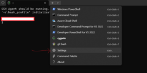

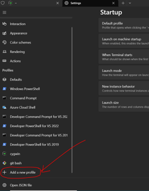

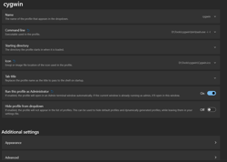

<!-- Page 4 -->

     Please do not remove any previously used GPG or SSH keys from Github. If a key has ever
     been used to sign a commit in our codebase, its public key must remain on Github for
     commit verification.

Cygwin SSH configuration

Additional configuration for Cygwin and SSH is needed. Execute the following from the Cygwin
command prompt. Ensure that you are NOT running Cygwin as administrator.
                 1   export WINSSH=${USERPROFILE}\\.ssh
                 2   export CYGSSH=${HOME}/.ssh
                 3   test -d $CYGSSH && mv $CYGSSH $USERPROFILE
                 4   test -d $WINSSH || mkdir $WINSSH
                 5   chmod 700 $WINSSH
                 6   ln -s $WINSSH $CYGSSH

You may alternatively run the following command in windows terminal if issues occur (update
<User> to your own username):
                 1 mklink /D "D:\Tools\cygwin\.ssh" "C:\Users\<User>\.ssh"

(NOTE: symlink commands seem to only work on a windows command prompt/shell)
SSH Keys
1. Open a new Unix bash shell (git bash) so that it will pick up the gh GitHub CLI tool in its path.
   If on Windows, ensure that you are NOT running it as administrator.
2. Ensure you have created a “.ssh” folder under your windows user profile folder
   (%USERPROFILE%)
3. Ensure you created symbolic link to this “.ssh” folder for your CYGWIN home folder ($HOME
   or just ~).
4. Create your SSH public/private key pair by typing in any “bash” like command shell:
                 1 ssh-keygen -b 4096 -t rsa

5. Enter id_rsa as the key name when prompted. You can just hit enter to continue when
   prompted for a passphrase.
6. Move the id_rsa and id_rsa.pub files to your .ssh folder (if they were created somewhere else).
7. Navigate to https://github.com/settings/keys Can't find link create a new SSH key entry
   using the contents of id_rsa.pub.
GPGThis
    Keyspage has 1 OneDrive link.
 Connect to preview what's inside. Your
     It’s strongly recommended that you configure commit signing to use SSH rather than GPG
 teammates have connected this app.

     for new setups, and you should consider switching to SSH signing if you currently use

<!-- Page 5 -->

    GPG.
        Do NOT delete your GPG keys on GitHub or your workstation. The public key is still
        needed to verify commits you’ve already signed.
    See        Git Commit Signing with SSH Keys for set up instructions.
1. Download the github_setup.sh script attached to ticket V7-20858. Save it in or move it to your
   home directory. (like C:\Users\USERNAME)
2. Run the script with your @TcpSoftware.com email address as the sole argument from Git
   Bash (but run it as Administrator!!!). For example:
                1 ./github_setup.sh mkirk@tcpsoftware.com

Step. 6. Clone Git Repositories
Create the Work Folders

Create a Work folder on the D drive i.e. “D:\Work“.
Within the Work folder, create the following 4 folders:
“D:\Work\tcp-cs-60-70”
“D:\Work\tcp-we-71”
”D:\Work\tcp-we-integration”
”D:\Work\tcp-we-thirdparty”
Clone the Repositories

Use Git Bash to go within each folder and run the following commands in the respective folder
written in front of each command.
Note: Don’t miss dot at the end of git clone command because it will cause it to clone the
repository in the current working directory.
                1 tcp-we-71-->               git clone git@github.com:tcp-software/tcp-we-
                  70.git .

Just for understanding: local folder names didn't match our repo names, but the repo URLs
are:
Note: Make sure you have access to all the below repositories.
tcp-cs-60-70:          tcp-software/tcp-cs-60
   This page has 1 OneDrive link.
Connect to preview what's inside. Your
tcp-we-71:         tcp-software/tcp-we-70
 teammates have connected this app.

tcp-we-integration:                tcp-software/tcp-we-integration-legacy

<!-- Page 6 -->

tcp-we-thirdparty:             tcp-software/tcp-we-thirdparty-new
Note: cloning may not work until you complete the SSH Keys and GPG Keys setup
It’s very important to checkout the respective branches in each repository in order to get it build
and run successfully. Following lists the details;
1. tcp-cs-60 (we-70-base)
2. tcp-we-70 (develop)
3. tcp-we-integration-legacy (main)
4. tcp-we-thirdparty-new (main)

Note: You may need to set up a path variable by going in Environment /Path as C:\Program
Files\Git\usr\bin
Setup to run GenSql tool for sql changes commit and deployment

Save the attachment below to your <local repo>\.git\hooks.

prepare-commit-msg (1)
26 Feb 2024, 08:10 PM

     This is a bash script that will automatically prepend the branch number to the commit
     message to allow for easy identification of SQL changes on the current branch.

Step. 7. Install dotnet SDK
Install Version 8 of the dotnet SDK found here:
  Download .NET 8.0 (Linux, macOS, and Windows) | .NET
Install Version 6 of the dotnet SDK found here:
  Download .NET 6.0 (Linux, macOS, and Windows) | .NET
Install version 5 of the dotnet SDK found here:
https://download.visualstudio.microsoft.com/download/pr/14ccbee3-e812-4068-af47-
1631444310d1/3b8da657b99d28f1ae754294c9a8f426/dotnet-sdk-5.0.408-win-x64.exe
Also install .NET 3.5 if it is not pre-install on your system. You can install from this from the link
given
    Thisbelow:
         page has 1 OneDrive link.
   Install
 Connect     .NETwhat's
         to preview Framework
                         inside. Your 3.5 on Windows 10 - .NET Framework
teammates have connected this app.

<!-- Page 7 -->

Step. 8. Download and install nginx
1. Download the latest version of nginx into “D:\Tools”: nginx: download (use the latest Stable
   version). NOTE: The latest nginx version do not work with configs provided. The last version
   worked with them is ( 1.10.3 )
2. Put these two files in “D:\Tools\nginx\conf”

 headers.include         nginx.conf
 31 Aug 2022, 04:06 PM   31 Aug 2022, 04:06 PM

1. Create an https folder in “D:\Tools\nginx” if it doesn’t already exist and place the following
   certificates in this folder.

 nginx.tcp.crt           nginx.tcp.key
 31 Aug 2022, 04:07 PM   31 Aug 2022, 04:07 PM

Step. 9. Create nginx Windows Service
We run nginx as a Windows service on our local machines, so you’ll need a Windows Service
Wrapper to turn your nginx.exe into a service:
1. Create a “service” directory in “D:\Tools\nginx”.
2. Copy “nginx.exe“ from source to destination and change the name from “nginx.exe” to
   “nginxservice.exe”
   Source: “D:\Work\tcp-we-71\overall\deploy\tst\etc\tst\etc\server\nginx.exe”
   Destination: “D:\Tools\nginx\service”
The following command can be used instead of manually copying and renaming the exe:
1 cp "D:\Work\tcp-we-71\overall\deploy\tst\etc\tst\etc\server\nginx.exe"
  "D:\Tools\nginx\service\nginxservice.exe"

If you encounter a “path not found” type of error, it’s because the above path is not available in
the develop branch. In that case, use the following command instead.
Source: D:\Work\tcp-we-71\overall\deploy\etc\tmpl\etc\service
     1 cp "D:\Work\tcp-we-71\overall\deploy\etc\tmpl\etc\service"
     This"D:\Tools\nginx\service\nginxservice.exe"
          page has 1 OneDrive link.

3.Connect
    Add tothis
 teammates
           preview what's inside. Your
            havefile (nginxservice.xml)
                 connected this app.    to “D:\Tools\nginx\service”

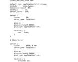

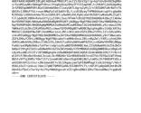

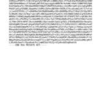

<!-- Page 8 -->

nginxservice.xml
31 Aug 2022, 04:13 PM

Navigate to “D:\Tools\nginx\service” (in any shell) and run the following commands:
                   1 cmd command execute
                   2 nginxservice.exe install

Open the Services app to confirm that the service is running (search for services from the
windows start menu). Select the Nginx service and right click to go for properties. If the service
is not running, click the Start button. Your nginx service should be up and running.
NOTE: If you also have IIS installed and running, you’ll need to open
“D:\Tools\nginx\conf\nginx.conf” in Notepad and update the port number to 81. This is also
part of Step 19, but if you don’t want to disable IIS, this will get the nginx service running.

Step. 10. Setup NAnt Environment Variable
We use NAnt (A .NET Build Tool) as a default building tool for our app, so what you want to do
is add an environment variable for it:

    This page has 1 OneDrive link.
Connect to preview what's inside. Your
teammates have connected this app.

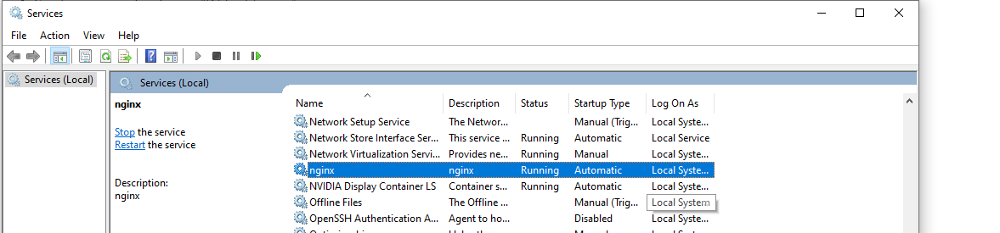

<!-- Page 9 -->

And then add the environment variable %NANT_BIN% to a path:

Step. 11. Install Visual Studio
As of the writing of this guide, the version of Visual Studio you should install is VS 2022
Professional.
You should already have a license for it and it can be downloaded from
http://my.visualstudio.com
    This page has 1 OneDrive link.

IfConnect
    you todopreview
teammates      not
            have
                    what's inside. Your
                    see athis
                 connected   license
                                app.    for VS 2022 Professional, contact IT.

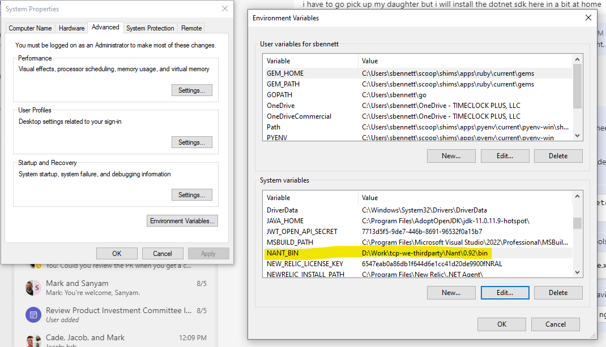

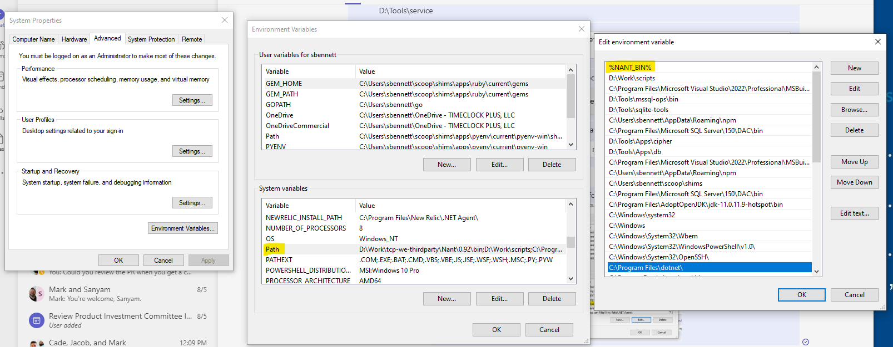

<!-- Page 10 -->

During the installation of Visual Studio, make sure you install the following packages (denoted
by the blue check mark)

Once the installation is complete, create an environment variable called “MSBUILD_PATH” to
the location of your MSBuild.exe:

    This page has 1 OneDrive link.
Connect to preview what's inside. Your
teammates have connected this app.

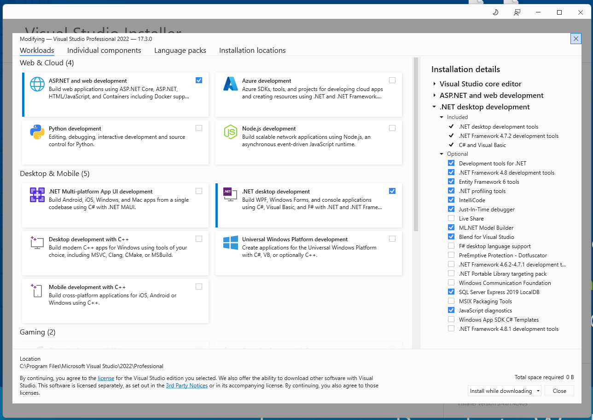

<!-- Page 11 -->

Make sure this path exists: C:\Program Files\Microsoft Visual
Studio\2022\Professional\MSBuild\Current\Bin
Add %MSBUILD_PATH% to the Path Environment Variable

    This page has 1 OneDrive link.
Connect to preview what's inside. Your
teammates have connected this app.
Restart any terminals you have open.

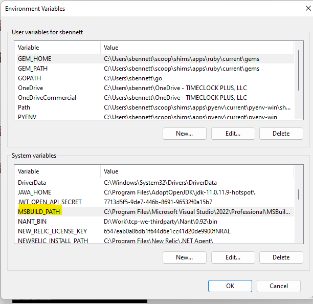

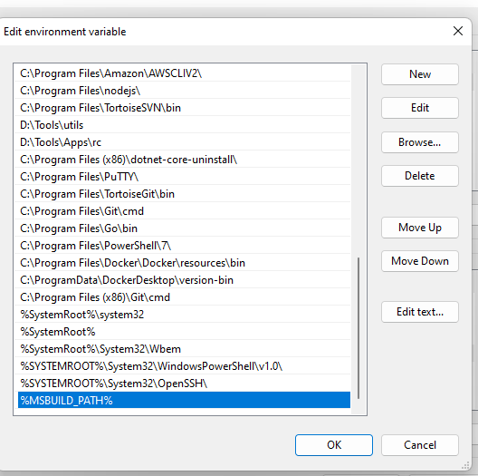

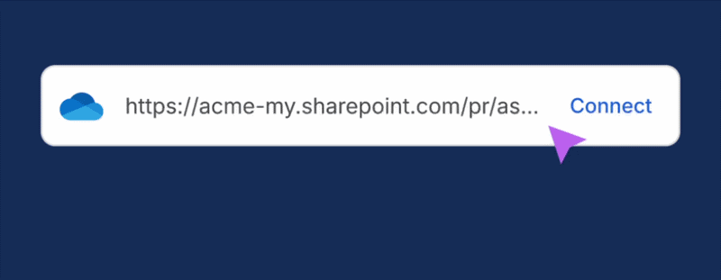

<!-- Page 12 -->

Step. 12. Build the Application
You need to go to the path: “D:\Work\tcp-we-71\server\Etc\Util”. Open Util.sln in Visual Studio.
Follow the instructions on Configuring Local Environment for TCP's NuGet Packages. This will
be required to successfully build the application as it authenticates into our Github Packages.
Build the application.
If you have an open Git Bash terminal, restart it, then navigate to “D:\Work\tcp-we-71\server”
and build the application:
                1 nant restore clean build

All NAnt commands work correctly in Cygwin, so if you encounter errors in the terminal, it’s
recommended to run all NAnt commands using Cygwin.
Note: If you are installing Visual Studio 2026, .NET 10 will be installed alongside it, which may
cause issues related to NuGet.Build.Tasks.Pack . In that case, navigate to the specified
path where you will find multiple .NET versions, such as the following:

Navigate to version 8 in the same directory path, which will look something like the following:

    This page has 1 OneDrive link.
Connect to preview what's inside. Your
teammates have connected this app.

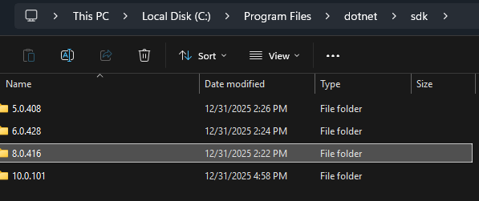

<!-- Page 13 -->

Copy the folder and paste it into the same directory path under version 10. After doing this, it
should start working correctly.

Step. 13. Install Microsoft SQL Server
Uninstall SQL Server 2012

As of the writing of this guide, the version of SQL Server you need to install is 2019. First thing to
do is check to see if you have a previous version of SQL Server installed (likely 2012). Best way
to find out is check Control Panel > Programs

Uninstall  allhasartifacts
   This page      1 OneDrive related
                             link.   to 2012. Starting with “Microsoft SQL Server 2012 (64-bit)”.
Connect to preview what's inside. Your
teammates have connected this app.

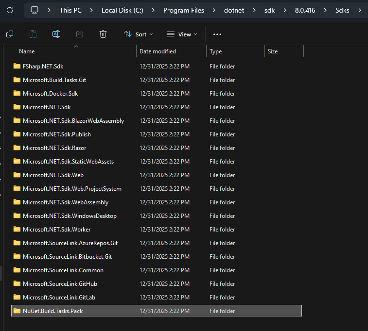

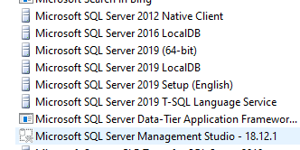

<!-- Page 14 -->

Once every reference to SQL Server 2012 has been uninstalled, restart your workstation.
Install SQL Server 2022

              Make sure to download the same          Download SQL 2022: SQL Serve
              version of SQL Server being used        r Downloads | Microsoft
              for production instances to avoid a
              situation where something works
              in a local version but doesn’t work
              in prod.
              As of Jan 1, 2026, the download
              version should be 2022. The
              current scripts are not updated for
              2025, which may cause
              encryption errors. Please use the
              following link to install: SQL Server
              2022 Developer Edition
Run the installer, select Custom type, and click Install
In the SQL Server Installation Center select Installation > New SQL Server stand-alone
installation or..
In the Installation Type select Perform a new installation of SQL Server 2022

    This page has 1 OneDrive link.
Connect to preview what's inside. Your
teammates have connected this app.

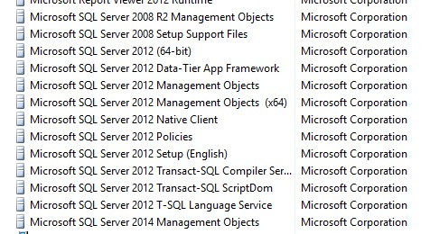

<!-- Page 15 -->

In Feature Selection only check Database Engine Services

Select Default instance in the Instance Configuration
Should be called MSSQLSERVER
   This page has 1 OneDrive link.
InConnect
    Database
          to previewEngine     Configuration,
                    what's inside. Your       select Windows Authentication Mode and click on Add
 teammates have connected this app.
Current User below.
That completes the SQL Server 2022 installation setup.

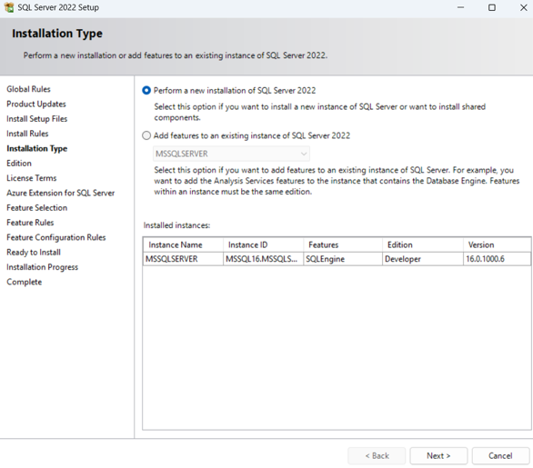

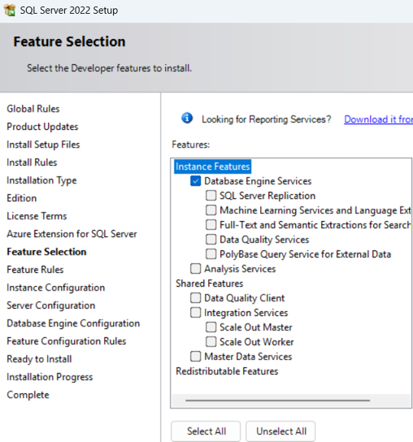

<!-- Page 16 -->

Step. 14. Install SSMS and SQL Package
1. Download and install SQL Server 2022 SQL Server Management Studio: Install SQL Server
   Management Studio
2. Download and install SQL Package: https://go.microsoft.com/fwlink/?linkid=2196438

Note: SQL Package Version should be 16.0.6161.0

Step. 15. Restore a test DB
In the “D:\Work\tcp-we-71\server” directory, run the restore database command:
                1 nant __restore-db-prod-test

Note: If you have any error like “sqlpackage.exe“ not found”. Make sure you have DAC is
installed. Download an msi here https://aka.ms/dacfx-msi. Please go to “C:\Program
Files\Microsoft SQL Server\150“ path dir. and run following command to create symlink. (NOTE:
symlink commands seem to only work on a windows command prompt/shell)

                1 mklink /D DAC "C:\Program Files\Microsoft SQL Server\170\DAC"

After the DB Restore, run the below SQL Query in SQL Sever Management Studio. The server
name should default to the name of your computer, otherwise enter your computer name
manually (found in settings).
1 USE [master]
2 GO
3
4 CREATE LOGIN [tcadmin] WITH PASSWORD=N'<REDACTED-SQL-PASSWORD>', DEFAULT_DATABASE=[master],
  DEFAULT_LANGUAGE=[us_english], CHECK_EXPIRATION=OFF, CHECK_POLICY=OFF
5 GO
6
7 ALTER LOGIN [tcadmin] ENABLE
8 GO
9

After running the above command Now run the below command to create logins.
1   CREATE LOGIN Q3WShUtj8K WITH PASSWORD = '<REDACTED-SQL-PASSWORD>';
2   EXEC master..sp_addsrvrolemember @loginame = N'Q3WShUtj8K', @rolename = N'sysadmin';
3   ALTER LOGIN Q3WShUtj8K WITH PASSWORD = '<REDACTED-SQL-PASSWORD>' UNLOCK;
4   GO
5
    This page has 1 OneDrive link.
Now navigate to “D:\Work\tcp-we-71\server” in cygwin and run the below command to restore
 Connect to preview what's inside. Your
the  otherhave
 teammates    databases.
                 connected this app.

                1 nant restore-db-all

<!-- Page 17 -->

After It Right Click on The Server go to Properties and then security and check authentication
as shown below.

Step. 16. Install JDK11
Download and install OpenJDK 11 from Microsoft:            Download the Microsoft Build of OpenJDK

Step. 17. Install Node
Download and install the latest LTS version of Node here:          Node.js — Download Node.js®

Step. 18. Build Client
Go to the “D:\\Work\tcp-we-71\client“ folder in Git Bash and run the “npm install” command to
install any node dependencies required to build the client on your system.
                   1 npm install

Go to the “D:\Work\tcp-we-71\client\scripts” folder in Git Bash and run the below command.
                   1 ./build-js.prod-env.sh && ./build-ss.prod-env.sh

If encountering an error running the above commands, type “which ruby” to check if ruby is
installed. It will return the path if it is already installed. Otherwise, download the below zip and
unzip it into the “D:\Tools” directory.
    This page has 1 OneDrive link.
Connect to preview what's inside. Your
teammates have connected this app.

ruby-251.zip
26 Oct 2022, 01:02 PM

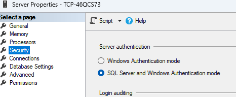

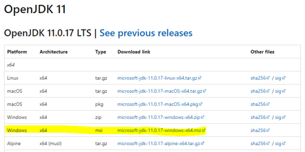

<!-- Page 18 -->

Add “D:\Tools\ruby-251\ruby\bin” to your Path environment variable as shown in the image
below.

Confirm that running “which ruby” in Git Bash is successfully returning a path, then run the
below command in the “D:\Work\tcp-we-71\client\scripts” directory once more.
            1 ./build-ss.prod-env.sh

If still encountering issues, use the “which grunt” command to check if Grunt is installed. Use
the commands below to install Grunt if needed.
            1 npm install -g grunt
            2 npm install -g grunt-cli

These commands will install Grunt globally. If it is still not working, follow the link below for help
installing Grunt.
grunt: command not found error [Solved] | bobbyhadz

After successfully installing Grunt, you can check its version with the “grunt --version“
command. Once installed, try to run the failed command in the client scripts directory once
more:
            1 ./build-ss.prod-env.sh

TheThis
    below     command should now be running successfully in the client scripts directory.
        page has 1 OneDrive link.
Connect to preview
                1 what's inside. Your
                   ./build-js.prod-env.sh && ./build-ss.prod-env.sh
teammates have connected this app.

If there are still issues, deleting node_modules folder and try doing npm install might work

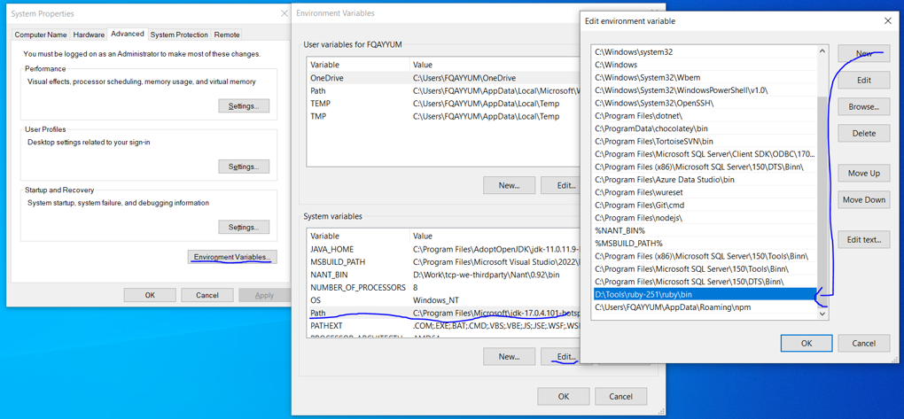

<!-- Page 19 -->

Step. 19. Create nginx symlink
Now we have to create a symlink pointing to the client code.
Navigate to “D:\Tools\nginx\html” (create this directory if it does not exist).
Create a soft symlink pointing to the app folder in the tcp-we-71\client directory
                   1 mklink /D app D:\Work\tcp-we-71\client\app

Step. 20. Setup Config Files
Create a directory called “cfg” in “D:\Work\tcp-we-71\server\Src\Interface”
Unpack the contents of the following zip file into “D:\Work\tcp-we-
71\server\Src\Interface\cfg”

cfg.zip
06 Dec 2023, 11:29 PM

It should look like this:

Go to the “D:\Tools\nginx\conf“ folder and open “nginx.conf” in a text editor like notepad, then
update the server listen port to 81. See the image below for an example of how your config file
should look.

    This page has 1 OneDrive link.
Connect to preview what's inside. Your
teammates have connected this app.

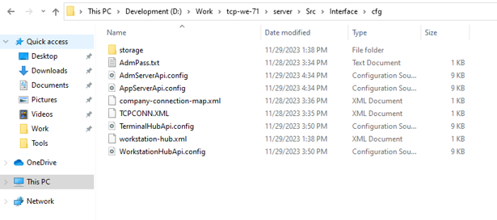

<!-- Page 20 -->

Step. 21. Starting the App from Visual Studio
Open “D:\Work\tcp-we-71\server\tcp-we-7.sln” in Visual Studio (using RUN as
Administrator).
Once the solution loads completely, expand the Solution Explorer and go to the Properties for
these 4 projects:

In the properties of AppServerApi find the Debug tab and in the Command Line Arguments put:
                1 ../../../../cfg .

    This page has 1 OneDrive link.
Connect to preview what's inside. Your
teammates have connected this app.

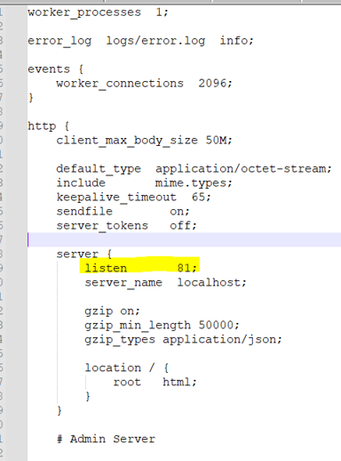

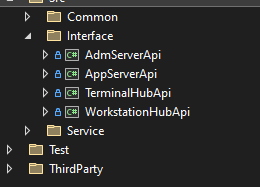

<!-- Page 21 -->

For the other 3 projects the Command Line Arguments path is:
             1 ../../../cfg .

Now, Right-click on the solution in the solution explorer and go to Properties:

Select Start action for the following 4 projects:
AppServerApi,        AdmServerApi, TerminalHubApi, and WorkstationHubApi
   This page has 1 OneDrive link.

Now  intoVisual
Connect           Studio,
          preview what's      hitYourthe F5 key to start all 4 projects. VS should launch 4 console windows.
                         inside.
teammates have connected this app.

Once the server is running, access the application link here:

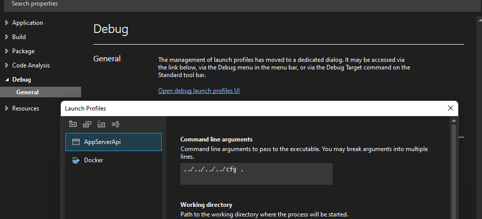

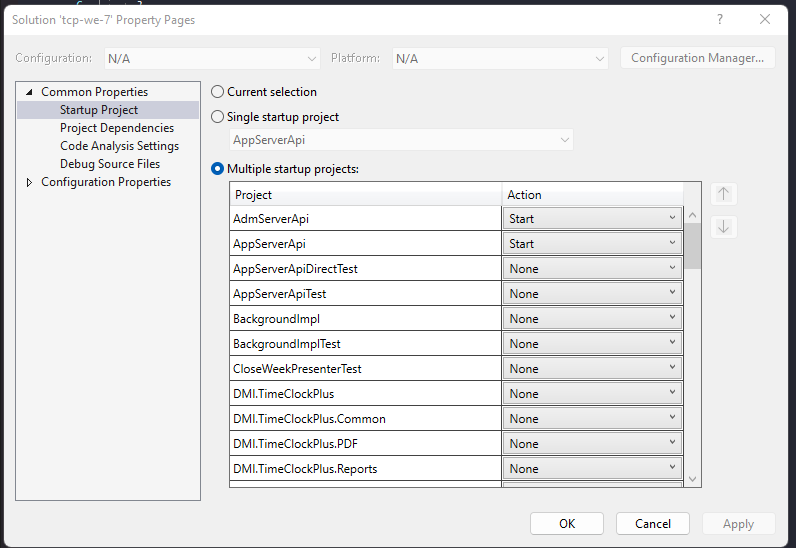

<!-- Page 22 -->

http://localhost:8081/app/manager
You should see a screen like:

That’s it. You have now setup and launched the application from Visual Studio. If you face any
issue you can re-verify the steps above. You should be able to log on without a password.

References
You may also look into the documentation in Microsoft Word Format which covers the
Workstation Configuration for TimeClock Plus Core Development.

Troubleshooting
Admin was working, now it’s not
Run these commands in Powershell as an admin:
#Get network adapters with IPv6 enabled
Get-NetAdapterBinding -ComponentID ms_tcpip6

#Disable
     This pageIPv6    on all network
               has 1 OneDrive  link.    adapters
 Connect to preview what's inside. Your
Get-NetAdapter          | Disable-NetAdapterBinding
 teammates have connected   this app.               -ComponentID ms_tcpip6

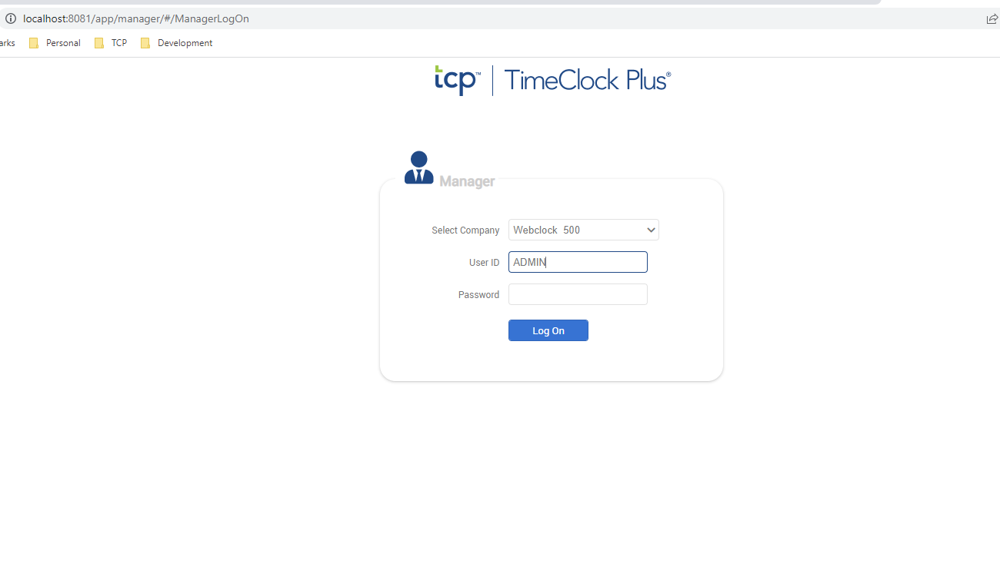

<!-- Page 23 -->

#(optional) Re-enable IPv6 on all network adapters
Enable-NetAdapterBinding -Name "Ethernet" -ComponentID ms_tcpip6

SQL Server Upgrade - Restoring Test Database
After upgrading SQL Server, you may encounter an issue when attempting to restore the test
database during Step 15. Specifically, if you execute the nant __restore-db-prod-test
command, check the __restore-db-prod-test-unmodified section for any errors.
Common Error: If you see an error indicating that the Tcp70ProdTest.ldf and
 Tcp70ProdTest.mdf files already exist in the following directory: C:\Program
 Files\Microsoft SQL Server\MSSQL15.MSSQLSERVER\MSSQL\DATA , proceed with the
following steps:
1. Manually Delete the Existing Files:
     Navigate to the folder: C:\Program Files\Microsoft SQL
      Server\MSSQL15.MSSQLSERVER\MSSQL\DATA
     Locate and delete the Tcp70ProdTest.ldf and Tcp70ProdTest.mdf files.
2. Retry the Restoration Process:
     After deleting the files, rerun the nant __restore-db-prod-test command to
     successfully restore the test database.
By performing these steps, you should be able to resolve the file conflict and complete the
restoration process.

    This page has 1 OneDrive link.
Connect to preview what's inside. Your
teammates have connected this app.

