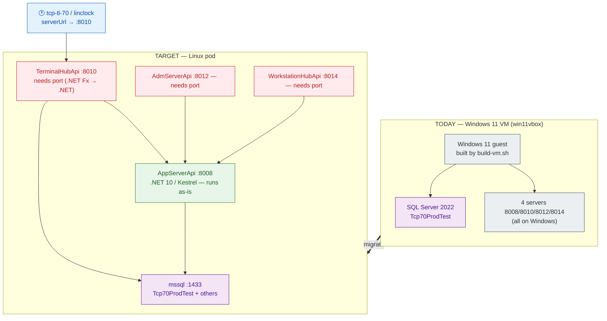
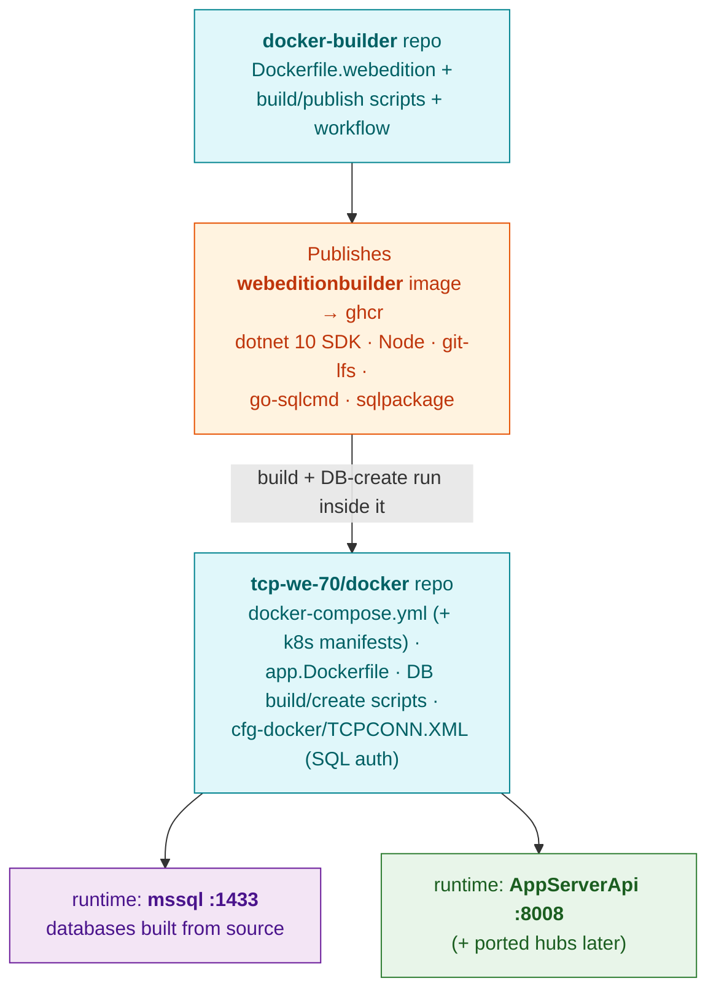
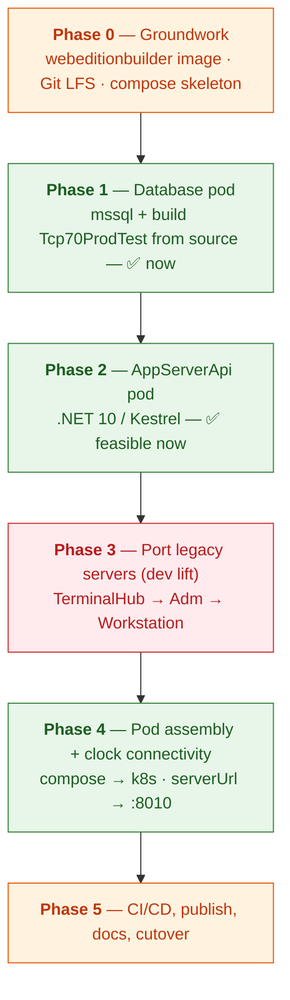
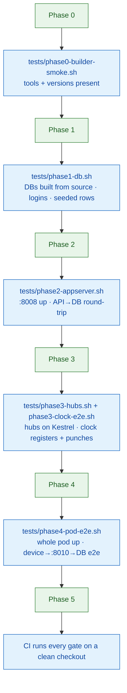
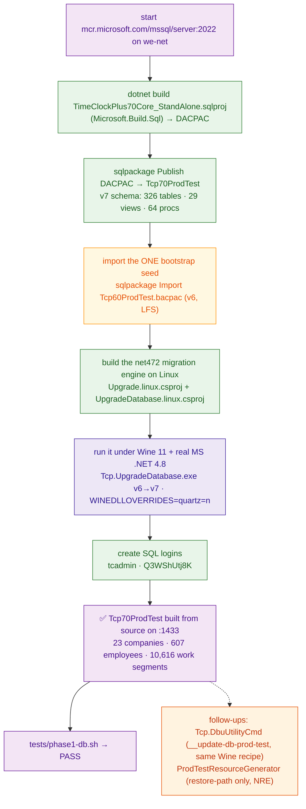

# TimeClock Plus WebEdition on Linux — Migration Plan (VM → Pods)

**Status:** LOCKED — execution in progress · **Owner:** _tbd_ · **Last updated:** 2026-09-18

Move the TimeClock Plus **WebEdition** development/host environment off the Windows 11 VirtualBox VM
(`win11vbox` / `build-vm.sh`) and onto **Linux containers/pods** — building the whole stack from
source in a fresh Linux builder image, and hosting the databases and servers as a pod that a
`tcp-tl-70` clock (or a linclock) can connect to.

> This plan is grounded in a code audit of `tcp-we-70` (servers + DB) and `tcp-tl-70` (the clock).
> The headline finding: **the DB and the .NET 10 AppServerApi are Linux-native today; the other
> three servers are .NET Framework 4.7.2 (WCF/`System.Web`) and require a real port.**

---

## 1. Goals & non-goals

**Goals**
- **G1** — The WebEdition **databases** (`Tcp70ProdTest` and the others) are **built from source** —
  SSDT schema project → create v7 DB → run the migration engine (`UpgradeDatabase`, ported to
  `net10.0`) → generate test data — and run in a Linux SQL Server container/pod. We deliberately do
  **not** restore the pre-built **v7** `Tcp70ProdTest.bak`/`.bacpac` snapshots (those are cached build
  outputs, kept only as an optional dev-only fast path).
  - **One accepted bootstrap seed:** the base test *data* (companies, employees) has **no
    from-source origin in the repo** — the product's own build upgrades a **v6** database
    (`Tcp60ProdTest`) into v7, and that v6 DB only ever comes from the shipped `Tcp60ProdTest.bacpac`
    (17 MB, Git-LFS). We therefore treat that **single v6 seed** as the irreducible bootstrap (like a
    compiler's bootstrap binary): it is imported once, then the v7 schema, migration engine, and
    generator — **all built/run from source** — produce the final `Tcp70ProdTest`.
- **G2** — The WebEdition **servers** run in the same pod, reachable on their ports
  (8008/8010/8012/8014), with a clock/linclock able to connect to `TerminalHubApi` (8010).
- **G3** — Everything **builds from source in a fresh Linux container** — no Windows, no VM — with
  all packages installed as needed.
- **G4** — Reproducible + publishable: a standardized **`webeditionbuilder`** image (in
  `docker-builder`, per the org pattern) and runtime pod definitions (in `tcp-we-70/docker/`).

**Non-goals**
- Retiring `win11vbox` — the VM stays for anything that can't move off Windows (and as a fallback).
- Porting hardware/telephony device drivers beyond what a dev/linclock scenario needs.
- Production hardening (HA, secrets management, TLS certs) beyond a dev/QA pod — noted as follow-up.

---

## 2. Current state → target state

---

## 3. Feasibility verdict (from the code audit)

| Component | Port | Today | Linux verdict |
|---|---|---|---|
| **Databases** (`Tcp70ProdTest`, `Tcp70Report`, `Tcp60*`, base `TimeClockPlus70Core`) | 1433 | SQL Server 2022 | ✅ **Native + buildable from source.** SSDT project is SDK-style **`Microsoft.Build.Sql`** (builds on Linux via `dotnet build` — `docker/sql.Dockerfile` already does it); the `ProdTestResourceGenerator` data generator is **`net10.0`** (runs on Linux). Build schema → create DB → deploy → generate (the `stage-dbs` path). No `xp_cmdshell`/FILESTREAM/CLR. (Pre-built LFS `.bak`/`.bacpac` exist but we don't use them.) |
| **AppServerApi** | 8008 | **.NET 10 / Kestrel** | ✅ **Runs as-is** — already has Linux Dockerfiles (`docker/app.Dockerfile`, `AppServerApi/Dockerfile`) |
| **AdmServerApi** | 8012 | .NET Fx 4.7.2 + WCF self-host + Asterisk.NET | ⚠️ **Port required** |
| **TerminalHubApi** | 8010 | .NET Fx 4.7.2 + WCF + native SQLite + device drivers | ⚠️ **Port required** (the clock's endpoint — highest priority) |
| **WorkstationHubApi** | 8014 | .NET Fx 4.7.2 + WCF + native `SQLite.Interop.dll` | ⚠️ **Port required** |
| **Client** (`tcp-core-client`, npm/grunt) | — | Node | ✅ Cross-platform |

**Blockers, precisely:**
- DB: only in *tooling wrappers* — `sqlcmd -E` (Windows/trusted auth) → SQL login; `SqlPackage.exe` →
  the cross-platform `sqlpackage` dotnet tool; a `.bat` + a PowerShell post-step → shell/`pwsh`.
- Legacy servers: **WCF `HttpSelfHostServer`** (in `Common/WebApi`) → replace with Kestrel (the unused
  `Common/WebApiCore` netcoreapp3.1 project is the intended replacement); `System.Web` controllers;
  native `SQLite.Interop.dll` → `Microsoft.Data.Sqlite`; `Asterisk.NET` telephony; a few hardcoded
  `C:\` paths in the net472 libs.
- Full **NAnt/`MSBuild.exe`/Cygwin** build is Windows-only — but **not needed** to build the DB +
  AppServerApi + client on Linux (the existing Dockerfiles prove `dotnet` + `npm` suffice).

---

## 4. Architecture & where each piece lives (Option B)

- **`docker-builder`** → the **`webeditionbuilder`** toolchain image (new `Dockerfile.webedition`,
  `build-docker-image.sh --build-for-webedition`, `publish-to-ghcr.sh`, a `publish-*.yml` workflow —
  exactly mirroring `clockwarebuilder`/`vmbuilder`/`yoctobuilder`).
- **`tcp-we-70/docker/`** → the **runtime pod**: the `mssql` service (currently absent from the
  compose), the app image (`app.Dockerfile`, base bumped 8.0 → 10.0), the DB build/create scripts, and the
  `cfg` (already SQL-auth). Later, the ported hub images.
- **`win11vbox`** (this repo) → **not** a home for the runtime; it stays the VM builder. This plan
  doc lives here only because the initiative grew out of replacing the VM.

---

## 5. Phased roadmap

Green = achievable with existing pieces; red = genuine development (the .NET Framework → .NET port).

### Automated verification (per-phase test gates)

**Every phase ends with an automated test that asserts its goals and gates the next phase.** Each is a
script that **exits non-zero on any failure**, runnable locally and in CI, run inside the
`webeditionbuilder` image against the running pod. They live in `tests/` (runtime tests in
`tcp-we-70/docker/tests/`; the image test in `docker-builder`). No phase is "done" until its gate is
green; Phase 5 wires all gates into CI so a clean checkout must pass every one.

### Phase 0 — Groundwork
- **Goal:** a standardized Linux build environment and the skeleton to hang everything on.
- **Steps:**
  1. In `docker-builder`: add `Dockerfile.webedition` (base Ubuntu/Debian + **dotnet SDK 10**, **Node
     LTS**, **git + git-lfs**, **go-sqlcmd**/`mssql-tools18`, the **`sqlpackage`** dotnet tool, `pwsh`).
  2. Wire `build-docker-image.sh --build-for-webedition`, `publish-to-ghcr.sh`, and a
     `.github/workflows/publish-webeditionbuilder-ghcr.yml` (mirror the existing three).
  3. Ensure `git lfs` is present for any LFS **build inputs** the build genuinely needs (e.g.
     third-party libs). We do **not** depend on the pre-built `.bak`/`.bacpac` LFS artifacts — Phase 1
     builds the DB from source.
- **Acceptance — `tests/phase0-builder-smoke.sh` (CI gate):** run the published `webeditionbuilder`
  and assert every tool is present at the required version — `dotnet --version` = 10.x, `node -v`,
  `npm -v`, `git lfs version`, `go-sqlcmd`/`sqlcmd -?`, `sqlpackage /version`, `pwsh -v`. Exits
  non-zero if any is missing or wrong (a fast pre-flight, same shape as `win11vbox`'s smoke test).

### Phase 1 — Database pod (built from source) ✅ DONE — `tests/phase1-db.sh` PASS
- **Goal:** the databases **built from source** (schema → create → deploy → generated data) and running
  in Linux SQL Server. **No pre-built `.bak`/`.bacpac` restored.** This is the NAnt `stage-dbs` path,
  ported to Linux.
- **Steps (as executed — this is the real NAnt `__stage-db-prod` path, ported):**
  1. Run `mcr.microsoft.com/mssql/server:2022-latest` (CU27) on the docker network `we-net`; SQL auth.
  2. **Build the v7 schema from source** — `dotnet build` the SDK-style `Microsoft.Build.Sql` project
     `TimeClockPlus70Core_StandAlone.sqlproj` → DACPAC, then `sqlpackage /Action:Publish` it into
     `Tcp70ProdTest` (326 tables, 29 views, 64 procs). This replaces `__create-db-prod`.
  3. **Import the one accepted bootstrap seed** — `sqlpackage /Action:Import` the v6
     `Tcp60ProdTest.bacpac` (Git-LFS, 17 MB) into `Tcp60ProdTest`. See G1: base data has no
     from-source origin; the product's own build upgrades this v6 DB into v7.
  4. **Run the real v6→v7 migration engine on Linux** (`__migrate-db-prod`): `Tcp.UpgradeDatabase.exe`
     is `net472` and bolted to closed .NET-Framework-only `DMI.TimeClockPlus.*` binaries that P/Invoke
     Win32 — so it is *built* on Linux (`Upgrade.linux.csproj` / `UpgradeDatabase.linux.csproj`:
     `Microsoft.NET.Sdk` + `Microsoft.NETFramework.ReferenceAssemblies`, WinForms SDK dropped) and
     *run* under **Wine 11 + the official MS .NET Framework 4.8** (`docker/_wine`,
     `docker/_migrate/run-migration.sh`). Mono was tried first and cannot work (no Win32).
     Result: **SUCCEEDED in 83 s, 0 errors** → 23 companies, 607 employees, 10,616 work segments.
  5. Create the SQL logins (`tcadmin` sysadmin, `Q3WShUtj8K` = the login the shipped docker
     `TCPCONN.XML` encrypts; decrypted with the app's own `Cipher` to confirm).
  6. Gate: `docker/tests/phase1-db.sh` (go-sqlcmd from `webeditionbuilder`).
  - **Follow-ups (not gating):** `__update-db-prod-test` runs `Tcp.DbuUtilityCmd.exe` (also `net472`
    → same Wine recipe); `__install-prod-license-files` is a server concern (Phase 2). The
    `ProdTestResourceGenerator` belongs to the pre-built-*restore* path only (not `stage-dbs`) and
    currently hits an NRE in its Automations generator — worth fixing for test parity, not for the DB.
  - **Wine gotchas solved (see memory `wine-quartz-dll-collision`):** the Wine-Mono prompt hangs
    `wineboot --init` under `xvfb-run` (surfaces as `kernel32.dll c0000135`) → init with
    `WINEDLLOVERRIDES=mscoree=d;mshtml=d`; and Wine's builtin **DirectShow `quartz.dll` shadows the
    managed Quartz.NET `Quartz.dll`** (`BadImageFormat: expected to contain an assembly manifest`) →
    run with `WINEDLLOVERRIDES=quartz=n`.

- **Acceptance — `docker/tests/phase1-db.sh` (CI gate) — ✅ PASS (10/10):** with the DB **built from
  source (no v7 `.bak` restored)**, asserts via `go-sqlcmd -S we-mssql,1433 -U tcadmin -P …` from the
  `webeditionbuilder` image: (a) `Tcp70ProdTest` in `sys.databases` → 1; (b) the `tcadmin` and
  `Q3WShUtj8K` **SQL-auth logins connect**; (c) **core tables exist and are non-empty** — Company 23,
  Employee 607, WorkSegment 10,616, JobCode 267; (d) the known **PIN-only employee** query (`Pin` set,
  both biometric timestamps NULL) → 8 rows; (e) **no pre-built backup was RESTOREd** —
  `msdb.dbo.restorehistory` for `Tcp70ProdTest` → 0. Non-zero exit on any miss.

### Phase 2 — AppServerApi pod ✅
- **Goal:** the .NET 10 app server running on Linux, talking to the DB pod.
- **Steps:** use `docker/app.Dockerfile` (Node client build + `dotnet publish`); **bump base images
  8.0 → 10.0** to match `net10.0`; mount `cfg` with `TCPCONN.XML` → `ServerName=mssql`, `Port=1433`,
  `Integrated=false` (already SQL-auth); expose 8008.
- **Acceptance — `tests/phase2-appserver.sh` (CI gate):** wait for the `AppServerApi` container
  healthy, then assert: (a) a health/version endpoint on `:8008` returns 200; (b) an API call that
  reads **through to SQL** returns expected data (proves app→DB wiring against the Phase-1 DB); (c) it
  fails fast if the container exits or the DB is unreachable. Non-zero on any failure.

### Phase 3 — Port the legacy servers ⚠️ (the development lift)
- **Goal:** `TerminalHubApi`, `AdmServerApi`, `WorkstationHubApi` build + run on Linux.
- **Steps (per server; TerminalHubApi first — it's the clock's endpoint):**
  1. Retarget csproj `v4.7.2` → `net8/10`; convert to SDK-style + PackageReference.
  2. Replace **WCF `HttpSelfHostServer`** (`Common/WebApi`) with **Kestrel/ASP.NET Core** — build on
     the existing `Common/WebApiCore` (netcoreapp3.1) scaffold; migrate the `System.Web`-based
     controllers.
  3. Server-specifics: **TerminalHubApi** — port the net472 `TerminalHub` lib, drop
     `System.ServiceModel`/`System.Data.Linq`, resolve/stub the device-driver + `C:\` paths;
     **WorkstationHubApi** — native `SQLite.Interop.dll` → `Microsoft.Data.Sqlite`; **AdmServerApi** —
     `Asterisk.NET`/telephony.
  4. Add each to the compose/pod once green.
- **Acceptance — `tests/phase3-hubs.sh` + `tests/phase3-clock-e2e.sh` (CI gate):** `phase3-hubs.sh`
  asserts each ported server **builds with `dotnet` on Linux**, starts under Kestrel, and answers a
  health/version call on its port (8010/8012/8014). `phase3-clock-e2e.sh` is the real TerminalHubApi
  gate: drive a **headless linclock (or a scripted client) with `serverUrl=…:8010`** through
  auto-registration (`IsStandaloneTerminalRegistered`→`RegisterStandAloneTerminal`→`GetStandaloneSpecs`)
  and a **clock punch**, with the `Standalone-Id` header, then assert the registration + punch
  **landed in the DB** (a `go-sqlcmd` row check). Non-zero if any server fails to build/start or the
  clock e2e doesn't reach the DB.

### Phase 4 — Pod assembly + clock connectivity
- **Goal:** a single deployable pod, reachable by devices.
- **Steps:** finalize `docker-compose.yml` (dev) → **k8s manifests** (mssql + app + hubs, services,
  volumes); expose the ports; document pointing `tcp-tl-70`/linclock `serverUrl` at the pod (bridged
  reachability, TLS: `shouldSkipSslValidation` or a pinned self-signed CA for dev).
- **Acceptance — `tests/phase4-pod-e2e.sh` (CI gate):** bring the whole stack up (`docker compose up
  -d` or `kubectl apply`, then wait-for-ready on every service), assert all intended ports are
  reachable (8008/8010/8012/8014, and 1433 as scoped), run the **full clock e2e from outside the
  pod** (register + punch + read-back through `:8010`→app→SQL), then tear down. Self-contained
  (up → wait → assert → down); non-zero on any failure.

### Phase 5 — CI/CD, publish, docs, cutover
- **Goal:** repeatable, documented, and the VM demoted to fallback.
- **Steps:** GitHub Actions to build/publish `webeditionbuilder` and the runtime images; a smoke test
  (mirroring `smoke-publish.sh`) for the pod; docs in `tcp-we-70`; update `win11vbox` README to point
  at the pod as the primary path where applicable.
- **Acceptance — CI pipeline (the meta-gate):** on a **clean runner/checkout**, CI builds the images,
  brings the pod up, and runs **every prior gate in order** (`phase0` → `phase4`) plus a publish smoke
  test (mirroring `smoke-publish.sh`); the pipeline is red if any gate fails. A nightly/PR run proves
  the whole stack reproduces from scratch and still meets every phase's goals.

---

## 6. Risks & open questions

- **R1 (largest):** the .NET Framework → .NET port of three servers (Phase 3) is real, unbounded-until-
  scoped development. WCF self-host has no drop-in Kestrel equivalent; each `System.Web` controller
  needs review. **Mitigation:** `WebApiCore` scaffold exists; do TerminalHubApi first and time-box a
  spike to size the rest.
- **R2:** device-driver / telephony deps (fingerprint readers, Asterisk) are inherently hardware/OS
  bound — may be stubbed for a dev/linclock pod but block a full production terminal server on Linux.
- **R3:** SQL Server on Linux feature gaps (no FILESTREAM, some Agent/Windows-auth features) — audited
  as **not used** by the core build, but re-verify against `DBATools`/report DBs if those are needed.
- **R4:** licensing — SQL Server Developer/Express in a container for dev is fine; confirm terms for
  any shared/CI use.
- **Q1:** do we need **all** databases (report, migration, Tcp60*) or just `Tcp70ProdTest` for the first
  cut? **Q2:** target orchestrator — plain `docker compose` first, then k8s, or straight to k8s?
  **Q3:** is a linclock-against-the-pod (no physical device) an acceptable Phase-3 acceptance proof?

---

## 7. Definition of done

Each milestone is **done only when its phases' automated gates pass** (the `tests/phaseN-*.sh` scripts
in §5), green in CI — not by manual inspection.

- **Milestone A (quick win):** Phases 0–2 — a Linux pod hosting the **databases + AppServerApi**,
  built by `webeditionbuilder`, reproducible from a clean checkout. _No physical clock yet._
- **Milestone B (clock-capable):** Phase 3 for **TerminalHubApi** — a linclock/clock registers and
  clocks in against the pod on `:8010`.
- **Milestone C (full parity):** Phases 3–5 — all four servers on Linux, pod deployable to k8s,
  CI-published, VM demoted to fallback.

**Recommended first step after approval:** Phase 0 + Phase 1 (the database pod) — lowest risk, highest
immediate value, and it unblocks everything else.
