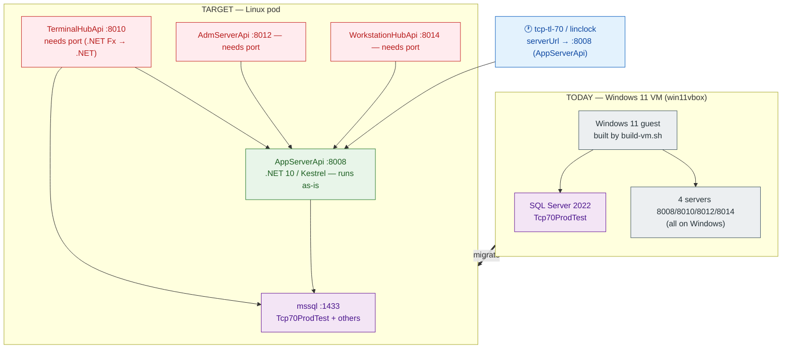
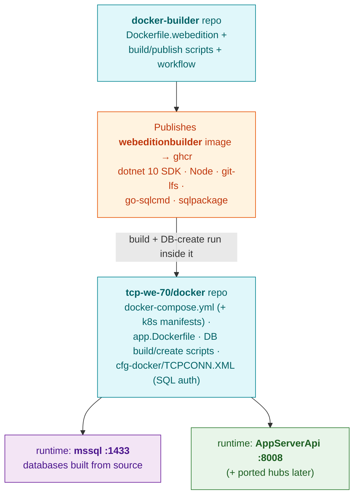
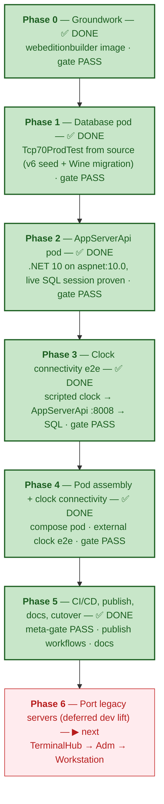
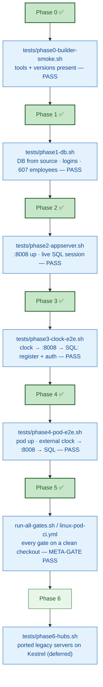
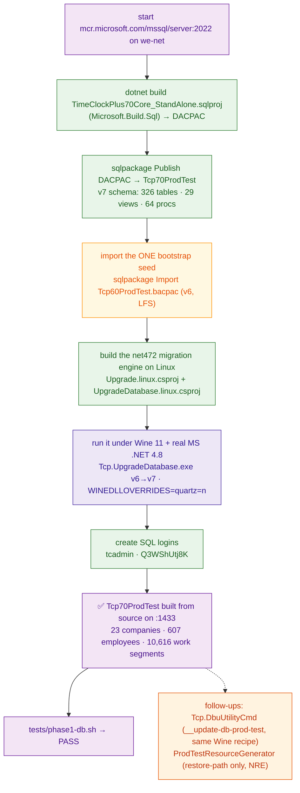

# TimeClock Plus WebEdition on Linux — Migration Plan (VM → Pods)

**Status:** Phases 0–5 COMPLETE (all gates green) · Phase 6 (legacy server ports) deferred · **Owner:** _tbd_ · **Last updated:** 2026-09-18

Move the TimeClock Plus **WebEdition** development/host environment off the Windows 11 VirtualBox VM
(`win11vbox` / `build-vm.sh`) and onto **Linux containers/pods** — building the whole stack from
source in a fresh Linux builder image, and hosting the databases and servers as a pod that a
`tcp-tl-70` clock (or a linclock) can connect to.

> This plan is grounded in a code audit of `tcp-we-70` (servers + DB) and `tcp-tl-70` (the clock).
> The headline finding: **the DB and the .NET 10 AppServerApi are Linux-native today; the other
> three servers are .NET Framework 4.7.2 (WCF/`System.Web`) and require a real port.**

---

## 1. Goals & non-goals

**Goals**
- **G1** — The WebEdition **databases** (`Tcp70ProdTest` and the others) are **built from source** —
  SSDT schema project → create v7 DB → run the migration engine (`UpgradeDatabase`, ported to
  `net10.0`) → generate test data — and run in a Linux SQL Server container/pod. We deliberately do
  **not** restore the pre-built **v7** `Tcp70ProdTest.bak`/`.bacpac` snapshots (those are cached build
  outputs, kept only as an optional dev-only fast path).
  - **One accepted bootstrap seed:** the base test *data* (companies, employees) has **no
    from-source origin in the repo** — the product's own build upgrades a **v6** database
    (`Tcp60ProdTest`) into v7, and that v6 DB only ever comes from the shipped `Tcp60ProdTest.bacpac`
    (17 MB, Git-LFS). We therefore treat that **single v6 seed** as the irreducible bootstrap (like a
    compiler's bootstrap binary): it is imported once, then the v7 schema, migration engine, and
    generator — **all built/run from source** — produce the final `Tcp70ProdTest`. _(Phases 0–5
    provision `Tcp70ProdTest` — the clock's DB; `Tcp70Report`/`Tcp60*` are the same pattern and are a
    documented follow-up, not required for the clock e2e.)_
- **G2** — The WebEdition **servers** run in the same pod, reachable on their ports
  (8008/8010/8012/8014), with a clock/linclock able to connect to **`AppServerApi` (8008)** — *correction
  (Phase 3 sizing):* every endpoint `tcp-tl-70` calls (`clockOperation`, `Biometric`,
  `terminalSpecifications/…/RegisterStandAloneTerminal|IsStandaloneTerminalRegistered|GetStandaloneSpecs`,
  `employeeSessions`, `viewSchedules`, …) is an AppServerApi controller; `TerminalHubApi` is a thin
  admin *proxy* to it, not the clock's endpoint.
- **G3** — Everything **builds from source in a fresh Linux container** — no Windows, no VM — with
  all packages installed as needed.
- **G4** — Reproducible + publishable: a standardized **`webeditionbuilder`** image (in
  `docker-builder`, per the org pattern) and runtime pod definitions (in `tcp-we-70/docker/`).

**Non-goals**
- Retiring `win11vbox` — the VM stays for anything that can't move off Windows (and as a fallback).
- Porting hardware/telephony device drivers beyond what a dev/linclock scenario needs.
- Production hardening (HA, secrets management, TLS certs) beyond a dev/QA pod — noted as follow-up.

---

## 2. Current state → target state

---

## 3. Feasibility verdict (from the code audit)

| Component | Port | Today | Linux verdict |
|---|---|---|---|
| **Databases** (`Tcp70ProdTest`, `Tcp70Report`, `Tcp60*`, base `TimeClockPlus70Core`) | 1433 | SQL Server 2022 | ✅ **Native + buildable from source.** SSDT project is SDK-style **`Microsoft.Build.Sql`** (builds on Linux via `dotnet build` — `docker/sql.Dockerfile` already does it); the `ProdTestResourceGenerator` data generator is **`net10.0`** (runs on Linux). Build schema → create DB → deploy → generate (the `stage-dbs` path). No `xp_cmdshell`/FILESTREAM/CLR. (Pre-built LFS `.bak`/`.bacpac` exist but we don't use them.) |
| **AppServerApi** | 8008 | **.NET 10 / Kestrel** | ✅ **Runs as-is** — already has Linux Dockerfiles (`docker/app.Dockerfile`, `AppServerApi/Dockerfile`) |
| **AdmServerApi** | 8012 | .NET Fx 4.7.2 + WCF self-host + Asterisk.NET | ⚠️ **Port required** |
| **TerminalHubApi** | 8010 | .NET Fx 4.7.2 + WCF (Web API 2 self-host) | ⚠️ **Port required** — but it is the terminal *admin proxy* (its 23 controllers `ExecuteRequest` to AppServerApi), **not the clock's endpoint** (the clock talks to AppServerApi :8008). Lower priority than first assumed. |
| **WorkstationHubApi** | 8014 | .NET Fx 4.7.2 + WCF + native `SQLite.Interop.dll` | ⚠️ **Port required** |
| **Client** (`tcp-core-client`, npm/grunt) | — | Node | ✅ Cross-platform |

**Blockers, precisely:**
- DB: only in *tooling wrappers* — `sqlcmd -E` (Windows/trusted auth) → SQL login; `SqlPackage.exe` →
  the cross-platform `sqlpackage` dotnet tool; a `.bat` + a PowerShell post-step → shell/`pwsh`.
- Legacy servers: **WCF `HttpSelfHostServer`** (in `Common/WebApi`) → replace with Kestrel (the unused
  `Common/WebApiCore` netcoreapp3.1 project is the intended replacement); `System.Web` controllers;
  native `SQLite.Interop.dll` → `Microsoft.Data.Sqlite`; `Asterisk.NET` telephony; a few hardcoded
  `C:\` paths in the net472 libs.
- Full **NAnt/`MSBuild.exe`/Cygwin** build is Windows-only — but **not needed** to build the DB +
  AppServerApi + client on Linux (the existing Dockerfiles prove `dotnet` + `npm` suffice).

---

## 4. Architecture & where each piece lives (Option B)

- **`docker-builder`** → the **`webeditionbuilder`** toolchain image (new `Dockerfile.webedition`,
  `build-docker-image.sh --build-for-webedition`, `publish-to-ghcr.sh`, a `publish-*.yml` workflow —
  exactly mirroring `clockwarebuilder`/`vmbuilder`/`yoctobuilder`).
- **`tcp-we-70/docker/`** → the **runtime pod**: the `mssql` service (currently absent from the
  compose), the app image (`app.Dockerfile`, base bumped 8.0 → 10.0), the DB build/create scripts, and the
  `cfg` (already SQL-auth). Later, the ported hub images.
- **`win11vbox`** (this repo) → **not** a home for the runtime; it stays the VM builder. This plan
  doc lives here only because the initiative grew out of replacing the VM.

---

## 5. Phased roadmap

Green = achievable with existing pieces; red = genuine development (the .NET Framework → .NET port).

### Automated verification (per-phase test gates)

**Every phase ends with an automated test that asserts its goals and gates the next phase.** Each is a
script that **exits non-zero on any failure**, runnable locally and in CI, run inside the
`webeditionbuilder` image against the running pod. They live in `tests/` (runtime tests in
`tcp-we-70/docker/tests/`; the image test in `docker-builder`). No phase is "done" until its gate is
green; Phase 5 wires all gates into CI so a clean checkout must pass every one.

### Phase 0 — Groundwork
- **Goal:** a standardized Linux build environment and the skeleton to hang everything on.
- **Steps:**
  1. In `docker-builder`: add `Dockerfile.webedition` (base Ubuntu/Debian + **dotnet SDK 10**, **Node
     LTS**, **git + git-lfs**, **go-sqlcmd**/`mssql-tools18`, the **`sqlpackage`** dotnet tool, `pwsh`).
  2. Wire `build-docker-image.sh --build-for-webedition`, `publish-to-ghcr.sh`, and a
     `.github/workflows/publish-webeditionbuilder-ghcr.yml` (mirror the existing three).
  3. Ensure `git lfs` is present for any LFS **build inputs** the build genuinely needs (e.g.
     third-party libs). We do **not** depend on the pre-built `.bak`/`.bacpac` LFS artifacts — Phase 1
     builds the DB from source.
- **Acceptance — `tests/phase0-builder-smoke.sh` (CI gate):** run the published `webeditionbuilder`
  and assert every tool is present at the required version — `dotnet --version` = 10.x, `node -v`,
  `npm -v`, `git lfs version`, `go-sqlcmd`/`sqlcmd -?`, `sqlpackage /version`, `pwsh -v`. Exits
  non-zero if any is missing or wrong (a fast pre-flight, same shape as `win11vbox`'s smoke test).

### Phase 1 — Database pod (built from source) ✅ DONE — `tests/phase1-db.sh` PASS
- **Goal:** the databases **built from source** (schema → create → deploy → generated data) and running
  in Linux SQL Server. **No pre-built `.bak`/`.bacpac` restored.** This is the NAnt `stage-dbs` path,
  ported to Linux.
- **Steps (as executed — this is the real NAnt `__stage-db-prod` path, ported):**
  1. Run `mcr.microsoft.com/mssql/server:2022-latest` (CU27) on the docker network `we-net`; SQL auth.
  2. **Build the v7 schema from source** — `dotnet build` the SDK-style `Microsoft.Build.Sql` project
     `TimeClockPlus70Core_StandAlone.sqlproj` → DACPAC, then `sqlpackage /Action:Publish` it into
     `Tcp70ProdTest` (326 tables, 29 views, 64 procs). This replaces `__create-db-prod`.
  3. **Import the one accepted bootstrap seed** — `sqlpackage /Action:Import` the v6
     `Tcp60ProdTest.bacpac` (Git-LFS, 17 MB) into `Tcp60ProdTest`. See G1: base data has no
     from-source origin; the product's own build upgrades this v6 DB into v7.
  4. **Run the real v6→v7 migration engine on Linux** (`__migrate-db-prod`): `Tcp.UpgradeDatabase.exe`
     is `net472` and bolted to closed .NET-Framework-only `DMI.TimeClockPlus.*` binaries that P/Invoke
     Win32 — so it is *built* on Linux (`Upgrade.linux.csproj` / `UpgradeDatabase.linux.csproj`:
     `Microsoft.NET.Sdk` + `Microsoft.NETFramework.ReferenceAssemblies`, WinForms SDK dropped) and
     *run* under **Wine 11 + the official MS .NET Framework 4.8** (`docker/_wine`,
     `docker/_migrate/run-migration.sh`). Mono was tried first and cannot work (no Win32).
     Result: **SUCCEEDED in 83 s, 0 errors** → 23 companies, 607 employees, 10,616 work segments.
  5. Create the SQL logins (`tcadmin` sysadmin, `Q3WShUtj8K` = the login the shipped docker
     `TCPCONN.XML` encrypts; decrypted with the app's own `Cipher` to confirm).
  6. Gate: `docker/tests/phase1-db.sh` (go-sqlcmd from `webeditionbuilder`).
  - **Follow-ups (not gating):** `__update-db-prod-test` runs `Tcp.DbuUtilityCmd.exe` (also `net472`
    → same Wine recipe); `__install-prod-license-files` is a server concern (Phase 2). The
    `ProdTestResourceGenerator` belongs to the pre-built-*restore* path only (not `stage-dbs`) and
    currently hits an NRE in its Automations generator — worth fixing for test parity, not for the DB.
  - **Wine gotchas solved (see memory `wine-quartz-dll-collision`):** the Wine-Mono prompt hangs
    `wineboot --init` under `xvfb-run` (surfaces as `kernel32.dll c0000135`) → init with
    `WINEDLLOVERRIDES=mscoree=d;mshtml=d`; and Wine's builtin **DirectShow `quartz.dll` shadows the
    managed Quartz.NET `Quartz.dll`** (`BadImageFormat: expected to contain an assembly manifest`) →
    run with `WINEDLLOVERRIDES=quartz=n`.

- **Acceptance — `docker/tests/phase1-db.sh` (CI gate) — ✅ PASS (10/10):** with the DB **built from
  source (no v7 `.bak` restored)**, asserts via `go-sqlcmd -S we-mssql,1433 -U tcadmin -P …` from the
  `webeditionbuilder` image: (a) `Tcp70ProdTest` in `sys.databases` → 1; (b) the `tcadmin` and
  `Q3WShUtj8K` **SQL-auth logins connect**; (c) **core tables exist and are non-empty** — Company 23,
  Employee 607, WorkSegment 10,616, JobCode 267; (d) the known **PIN-only employee** query (`Pin` set,
  both biometric timestamps NULL) → 8 rows; (e) **no pre-built backup was RESTOREd** —
  `msdb.dbo.restorehistory` for `Tcp70ProdTest` → 0. Non-zero exit on any miss.

### Phase 2 — AppServerApi pod ✅ DONE — `tests/phase2-appserver.sh` PASS
- **Goal:** the .NET 10 app server running on Linux, talking to the DB pod.
- **Steps (as executed):**
  1. **Publish from source inside `webeditionbuilder`** (it already carries .NET SDK 10 — no
     `mcr.microsoft.com/dotnet/sdk:10.0` pull on this host's slow uplink) with a **persistent host NuGet
     cache**: mount the *whole* `~/.nuget` → `/home/dev/.nuget` (mounting only `packages` makes Docker
     root-create the parent and every restore fails on an unwritable `NuGet.Config`). 169 files,
     `Tcp.AppServerApi.dll`, 0 errors. No private NuGet packages in this project graph.
  2. **Runtime image** `docker/appserver.runtime.Dockerfile`: `aspnet:10.0` + the publish output, non-root
     `appuser`, `ENTRYPOINT dotnet Tcp.AppServerApi.dll /app/cfg .` (same contract as `docker/start.sh`).
     The full `app.Dockerfile` (Node client + nginx + New Relic) is Phase 4 pod-assembly scope; its
     `DOTNET_VERSION` default still needs the 8.0 → 10.0 bump.
  3. **Config**: `docker/_appcfg/` = `cfg-docker/backend-configs` with `TCPCONN.XML` →
     `ServerName=we-mssql` (SQL auth, `Q3WShUtj8K`, `Integrated=false`). Runtime overrides via the
     `TCP_CORE_` env prefix (`Program.InitializeHost` → `AddEnvironmentVariables("TCP_CORE_")`):
     `HttpSection__ApiServerHost=0.0.0.0`, `ApiServerPort=8008`, `EnableServerHealthCheckEndpoint=true`.
     Remote DynamoDB app-config stays off (`ENV_APP_CONFIG_*` unset); Redis unset → in-memory cache.
  4. Launcher `docker/run-appserver.sh`; the container joins `we-net` and reaches the DB by name.
  - **Observation (not a Linux defect):** controllers return `HttpResponseMessage`, which ASP.NET Core
    MVC serializes as the message *object* (and logs an `XmlSerializer` WARN). This is the codebase's
    existing behavior on Core; verify parity against the VM in the Phase 4 e2e.
- **Acceptance — `docker/tests/phase2-appserver.sh` (CI gate) — ✅ PASS (4/4):** (a) container running
  and `:8008` answering (21 s cold start); (b) `GET api/v0000/ServerHealthCheck/0/GetAllNamespaceStatuses`
  → 200 with a JSON body; (c) container still running after the calls; (d) **definitive app→DB proof:**
  `sys.dm_exec_sessions` on the mssql container shows a live user session whose `host_name` is the app
  container's hostname, `program_name` = `TimeClock Plus`, database `Tcp70ProdTest`. Fails fast (with
  the container's last log lines) if it exits or the DB is unreachable. Non-zero on any miss.

### Phase 3 — Clock connectivity e2e ✅ DONE — `tests/phase3-clock-e2e.sh` PASS
- **Goal:** prove a real clock works against the **Linux** stack end-to-end — the core migration thesis —
  with no Windows VM. Since the clock's endpoint is **AppServerApi (:8008)** (already on Linux from
  Phase 2), this needs no server porting.
- **What was built:** `docker/clock-e2e/` — a `net10.0` scripted standalone clock that **reuses the real
  `Tcp.Proxy.AbstractProxy` + `Tcp.Presentation.Model.LogOnData`**, so its JSON/session/header behavior is
  identical to the shipping clock and integration tests (no re-derivation). Built inside `webeditionbuilder`
  (SDK 10, cached `~/.nuget`). It drives the exact `tcp-tl-70` `RequestUrls.h` sequence against `:8008`:
  1. `userSessions/0/AcceptEulaAndLogOn` (ADMIN, blank pw, ns `PROD`, company 500) — first login returns
     `202 {IntType:20,"must accept EULA"}`, so the EULA-accepting variant is used → **session issued**.
  2. `terminalSpecifications/0/RegisterStandaloneTerminal?...` (`Standalone-Id` header) → **`true`**.
  3. `terminalSpecifications/0/GetStandaloneSpecs?companyNamespace=PROD` → snapshot with **`TerminalId`**.
  4. `employeeSessions/{terminalId}/TerminalLogOnAndStart?clockOperationType=7` (employee 1) → **employee
     session** + the clock workflow starts.
- **Acceptance — `docker/tests/phase3-clock-e2e.sh` (CI gate) — ✅ PASS:** the client reaches `E2E-OK`
  (all four steps returned success against Linux `:8008`), then `go-sqlcmd` verifies: (a) a valid **user
  session** (auth read through to SQL); (b) the **committed clock→server→DB write** — the
  `tcp_Company.StandaloneTerminal` registration row is present in `Tcp70ProdTest`; (c) **specs served from
  SQL** (a real `TerminalId`); (d) **employee terminal auth** issued a session for company 500 employee 1
  (Len Potts), i.e. the employee identity was resolved in SQL through the terminal endpoint.
- **Scope note (honest):** the employee punch **authenticates and starts** the clock operation, but a
  fully-**committed `WorkSegment`** requires the company's multi-step confirm chain
  (`SubmitJobCode`/`SubmitCostCode`/`SubmitTrackedFields`/`Confirm…`) — client plumbing that the server
  defers/rolls back until completed. That belongs to the Phase 4 pod e2e (from outside the pod) or a richer
  client; it is not a Linux-portability question. See memory `clock-talks-to-appserver-8008`.

### Phase 6 — Port the legacy servers ⚠️ (deferred dev lift; scheduled after Phases 4–5)
> Moved to the end by decision: the clock talks to AppServerApi (:8008), so these servers are **off the
> clock's critical path**. Port them only after pod assembly (P4), CI/CD (P5) — or sooner if a needed
> admin/aux feature requires one. Sizing notes below were captured during Phase 3.
- **Goal:** `TerminalHubApi`, `AdmServerApi`, `WorkstationHubApi` build + run on Linux.
- **Sizing findings (TerminalHubApi):**
  - It is a **legacy-style** csproj (`ToolsVersion 4.0`, `v4.7.2`) on **Web API 2** (`Microsoft.AspNet.WebApi.Core`,
    `System.Web`, `System.ServiceModel.*`, `System.Data.Linq`), hosted by `Common/WebApi`'s `HttpRouteServer`
    = WCF **`HttpSelfHostServer`** (Windows-only).
  - **The Kestrel host is a drop-in:** AppServerApi's `pro/HttpRouteServer.cs` (same `Tcp.WebApi` namespace,
    same `(hostAddress, port)` ctor and `PreSleepCommand` API) + its `Startup` (`AddMvcCore` →
    `AddXmlSerializerFormatters().AddNewtonsoftJson`, `UseRouting`/`MapControllers`).
  - **Controllers are ~mechanical:** the 23 controllers inherit `AbstractTerminalHubApiController :
    AbstractApiController(: ApiController)`; AppServerApi's Core `AbstractApiController : ControllerBase`
    already implements **39 of those 42** helpers — only `GetUploadedResponseMessage`,
    `GetUploadedSourceFileName` (multipart upload, used by `UploadFirmwareController`) and the Web-API-2
    `Initialize(HttpControllerContext)` override need Core equivalents.
  - **Every project ref is already `netstandard2.0` except `Common/TerminalHub` (`net472`, SDK-style,
    193 files, one `C:\GetMinTemplate.dat` path)** — the one real retarget.
  - **The DMI risk, measured:** `TerminalHub` uses the closed `DMI.TimeClockPlus.Common` (net472-only) in
    109 files, but as the terminal *domain model* (`TerminalPromptDefaultLineItem`, `TerminalCommand`,
    `TerminalKey`, `TerminalBadgeInfo`, `ITerminal*`, enums). A `System.Reflection.Metadata` scan shows
    **all 10 P/Invokes in that DLL live in one class, `SafeNativeMethods`** (kernel32 mailslot/`CreateFile`,
    advapi32 security descriptors, user32 window focus) — which TerminalHub **never references**. So on
    .NET 10/Linux the net472 IL loads via the NU1701 compat shim and only a path reaching
    `SafeNativeMethods` could fail at runtime. Watch-list: `ITerminalFileTransferClient` (17 refs) and
    `TerminalAuxDevice` (20 refs). **Fallback if a path bites: run the hub under the proven Wine +
    .NET 4.8 image** (Phase 1 recipe).
  - **Approach chosen:** native .NET 10 port — retarget `TerminalHub` → `net10.0`; convert `TerminalHubApi`
    to SDK-style `net10.0`; swap the WCF host for the Kestrel `HttpRouteServer`/`Startup`; rebase the
    controllers on the Core `AbstractApiController` (+3 helpers); drop the `System.Web*`/`ServiceModel`/
    `Data.Linq` references. Shared Windows-build sources stay untouched where possible (`.linux.csproj`
    variants, as in Phase 1).

- **▶ Progress:**
  - ✅ **Shared `Tcp.WebApiHost` lib extracted** — `server/Src/Common/WebApiHost` now holds the net10
    Kestrel host (`HttpRouteServer`, `Startup`) + Core `AbstractApiController` (+ `AbstractControllerHelper`,
    `HttpResponseException`, the two action filters), moved out of AppServerApi (namespaces preserved).
    AppServerApi rebased onto it, **regression-proven** (Phase 4 gate PASS end-to-end). Key fix: the shared
    `Startup` registers `Assembly.GetEntryAssembly()` as an MVC ApplicationPart, else each server's own
    controllers aren't discovered (every route 404s).
  - ✅ **`TerminalHubApi` builds on net10/Linux (0 errors)** —
    `server/Src/Interface/TerminalHubApi/TerminalHubApi.linux.csproj`: reuses `Tcp.WebApiHost` + references
    `TerminalHub.linux`; the 22 Web-API-2 controllers compile **unchanged** via a `System.Web.Http` shim
    (`Http*Attribute` subclasses) + an `ActionName` global alias; the hub base is rebased onto the Core
    `AbstractApiController` (`.linux` variant); `Program.cs` compiles unchanged (its `Tcp.WebApi`
    `HttpRouteServer` now resolves to the Kestrel host). `UploadFirmwareController` (Web-API-2 multipart)
    excluded as an admin-only follow-up. Windows Web-API-2 build untouched (`TerminalHubApi.csproj`).
  - **Remaining:** run `TerminalHubApi` under Kestrel with a hub cfg (points at AppServerApi `:8008`) →
    `tests/phase6-hubs.sh` (starts + answers on `:8010`); then the same recipe for **AdmServerApi**
    (drop `Asterisk.NET`) and **WorkstationHubApi** (native `SQLite.Interop.dll` → `Microsoft.Data.Sqlite`).
  - ✅ **`TerminalHub` compiles on net10** — `server/Src/Common/TerminalHub/TerminalHub.linux.csproj`
    (`Microsoft.NET.Sdk`, `net10.0`): the closed **DMI.TimeClockPlus.Common** (net472) is referenced via
    HintPath and its terminal-domain types resolve at compile time; added `System.IO.Ports` (`SerialPort`,
    works on Linux); disabled the net10 analyzers for the legacy port (CA rules net472 never enforced).
    **Build succeeded, 0 errors.** This retires the biggest unknown (the closed-binary dependency compiles
    under net10). _Gotcha:_ the vendored `lib/DMI.TimeClockPlus.Common.dll` is Git-LFS — `git lfs pull` it
    first or RAR resolves a 131-byte pointer and every DMI type reports missing.
  - **Remaining (bounded, mechanical):** (a) **extract a shared net10 web host** — AppServerApi's
    `HttpRouteServer`/`Startup` and the Core `AbstractApiController` (+39 helpers) currently live *inside*
    the AppServerApi Exe; move them to a shared lib so both apps use them; (b) `TerminalHubApi.linux.csproj`
    (SDK-style net10) referencing `TerminalHub.linux` + the shared host; (c) **rebase the 23 controllers**
    off Web-API-2 `ApiController` onto the Core base (they are mostly plain — `System.Web.Http` usings only,
    zero `IHttpActionResult`/`Request.CreateResponse`/`[FromUri]`; just 1 `HttpResponseMessage` in
    `UploadFirmwareController`); (d) port `Program.cs` to the net10 init pattern; (e) build → run under
    Kestrel → `tests/phase6-hubs.sh`. Then repeat the same recipe for **AdmServerApi** (drop `Asterisk.NET`
    telephony) and **WorkstationHubApi** (native `SQLite.Interop.dll` → `Microsoft.Data.Sqlite`).
- **Steps (per server; TerminalHubApi first — it's the clock's endpoint):**
  1. Retarget csproj `v4.7.2` → `net8/10`; convert to SDK-style + PackageReference.
  2. Replace **WCF `HttpSelfHostServer`** (`Common/WebApi`) with **Kestrel/ASP.NET Core** — build on
     the existing `Common/WebApiCore` (netcoreapp3.1) scaffold; migrate the `System.Web`-based
     controllers.
  3. Server-specifics: **TerminalHubApi** — port the net472 `TerminalHub` lib, drop
     `System.ServiceModel`/`System.Data.Linq`, resolve/stub the device-driver + `C:\` paths;
     **WorkstationHubApi** — native `SQLite.Interop.dll` → `Microsoft.Data.Sqlite`; **AdmServerApi** —
     `Asterisk.NET`/telephony.
  4. Add each to the compose/pod once green.
- **Acceptance — `tests/phase6-hubs.sh` (CI gate):** asserts each *ported* legacy server (TerminalHubApi
  admin proxy 8010, AdmServerApi 8012, WorkstationHubApi 8014) **builds with `dotnet` on Linux**, starts
  under Kestrel, and answers a health/version call on its port. Non-zero if any ported server fails to
  build or start. (The clock-connectivity e2e is Phase 3, already green.)

### Phase 4 — Pod assembly + clock connectivity ✅ DONE — `tests/phase4-pod-e2e.sh` PASS
- **Goal:** a single deployable pod, reachable by devices.
- **What was built:**
  - `docker/docker-compose.pod.yml` — the runtime pod: **`we-mssql` (SQL Server 2022) + `we-appserver`
    (.NET 10 AppServerApi)** on one network (`we-net`, external), mssql **healthcheck-gated**, appserver
    `depends_on: service_healthy`, clock-reachable on the **published `:8008`** (host port configurable).
  - `docker/provision-db.sh` — builds `Tcp70ProdTest` **from source** into the pod's mssql (the Phase 1
    path, parameterized + idempotent): DACPAC publish → v6 seed import → SQL logins → **real v6→v7
    migration under Wine + .NET 4.8**.
  - `docker/tests/phase4-pod-e2e.sh` — the self-contained gate.
- **Acceptance — `docker/tests/phase4-pod-e2e.sh` (CI gate) — ✅ PASS:** `compose up` from a clean volume →
  `we-mssql` **healthy** → **provision from source** (23 companies) → bring up `we-appserver` on a free host
  port → it is **reachable from OUTSIDE the pod** (host `:18008`, HTTP 404 on `/` as expected) → run
  `docker/clock-e2e` **from outside the pod** (`--network host` → published port): `E2E-OK` (login + register
  + specs + employee auth) → the **registration row is verified in the pod's SQL** → **teardown**
  (`compose down -v`). Self-contained (up → wait → assert → down); non-zero on any failure.
  - _K8s manifests_ (mssql + app as a Deployment/StatefulSet + Services) and pointing a physical
    `tcp-tl-70`/linclock `serverUrl` at the pod (bridged reachability; TLS via `shouldSkipSslValidation`
    or a pinned dev CA) are the remaining productionization, tracked into Phase 5.
  - Gotchas fixed: helper mounts must be `$ROOT` (=`tcp-we-70`) not `$ROOT/..`; several host ports are
    already bound on this box (use a free one, default 18008); `we-net` declared external (gate creates it);
    a `curl -w '%{http_code}' || echo 000` readiness check double-printed `000000` and false-passed — match
    `^[1-5][0-9][0-9]$` instead.

### Phase 5 — CI/CD, publish, docs, cutover ✅ DONE — meta-gate PASS
- **Goal:** repeatable, documented, and the VM demoted to fallback.
- **What was built:**
  - **The meta-gate** `docker/tests/run-all-gates.sh` — runs every phase gate in order against **one
    freshly-provisioned pod**: phase0 (builder image) → phase4 (self-contained pod e2e, `KEEP_UP`) →
    phase1/2/3 against that running pod → teardown. **Verified locally: `META-GATE: PASS`** (all five
    green — 23 companies, 607 employees, 8 PIN-only, appserver live SQL session, clock register+auth on
    `:8008`).
  - **CI** `tcp-we-70/.github/workflows/linux-pod-ci.yml` — runs the meta-gate on a **clean runner**
    (nightly + PRs touching `docker/**` or the ported projects): checks out `tcp-we-70` (LFS) +
    `docker-builder`, pulls-or-builds `webeditionbuilder` + `webedition-wine`, builds the AppServerApi
    runtime from source, runs `run-all-gates.sh`. `GITHUB_TOKEN` reads the private `DMI.*` feed.
  - **Publish workflows** (the "build → gate → push" pattern, mirroring `clockwarebuilder`):
    `docker-builder/.github/workflows/publish-webeditionbuilder-ghcr.yml` (runs the Phase 0 gate before
    the push) and `tcp-we-70/.github/workflows/publish-webedition-wine-ghcr.yml` (so the pod/CI pull the
    Wine + .NET 4.8 image instead of rebuilding dotnet48). The images ARE the pod's publishable
    artifacts; their in-workflow gate is the publish smoke test.
  - **Docs:** `tcp-we-70/docker/README-linux-pod.md` (bring the pod up, point a clock at `:8008`, run the
    gates) and a pointer from the `win11vbox` README to the pod as the primary Linux path.
- **Acceptance — CI meta-gate — ✅ met (locally green; wired into CI):** on a clean checkout the pipeline
  builds/pulls the images, brings the pod up, provisions from source, and runs **every prior gate in
  order (`phase0` → `phase4`)**; red if any gate fails. The nightly/PR run proves the whole stack
  reproduces from scratch and still meets every phase's goals. _(The GH Actions run itself is pending a
  push to a branch CI can see; the gate logic it invokes is proven by the local `META-GATE: PASS`.)_

---

## 6. Risks & open questions

- **R1 (largest):** the .NET Framework → .NET port of three servers (Phase 3) is real, unbounded-until-
  scoped development. WCF self-host has no drop-in Kestrel equivalent; each `System.Web` controller
  needs review. **Mitigation:** `WebApiCore` scaffold exists; do TerminalHubApi first and time-box a
  spike to size the rest.
- **R2:** device-driver / telephony deps (fingerprint readers, Asterisk) are inherently hardware/OS
  bound — may be stubbed for a dev/linclock pod but block a full production terminal server on Linux.
- **R3:** SQL Server on Linux feature gaps (no FILESTREAM, some Agent/Windows-auth features) — audited
  as **not used** by the core build, but re-verify against `DBATools`/report DBs if those are needed.
- **R4:** licensing — SQL Server Developer/Express in a container for dev is fine; confirm terms for
  any shared/CI use.
- **Q1:** do we need **all** databases (report, migration, Tcp60*) or just `Tcp70ProdTest` for the first
  cut? **Q2:** target orchestrator — plain `docker compose` first, then k8s, or straight to k8s?
  **Q3:** is a linclock-against-the-pod (no physical device) an acceptable Phase-3 acceptance proof?

---

## 7. Definition of done

Each milestone is **done only when its phases' automated gates pass** (the `tests/phaseN-*.sh` scripts
in §5), green in CI — not by manual inspection.

- **Milestone A (quick win):** Phases 0–2 — a Linux pod hosting the **databases + AppServerApi**,
  built by `webeditionbuilder`, reproducible from a clean checkout. _No physical clock yet._
- **Milestone B (clock-capable):** ✅ **reached** — Phase 3 clock e2e: a scripted standalone clock
  registers and authenticates against the Linux **AppServerApi (:8008)** with the result in SQL.
- **Milestone C (full parity):** Phases 4–6 — pod deployable to k8s, CI-published, the legacy
  admin/aux servers (TerminalHub/Adm/Workstation) also on Linux, VM demoted to fallback.

**Recommended first step after approval:** Phase 0 + Phase 1 (the database pod) — lowest risk, highest
immediate value, and it unblocks everything else.
